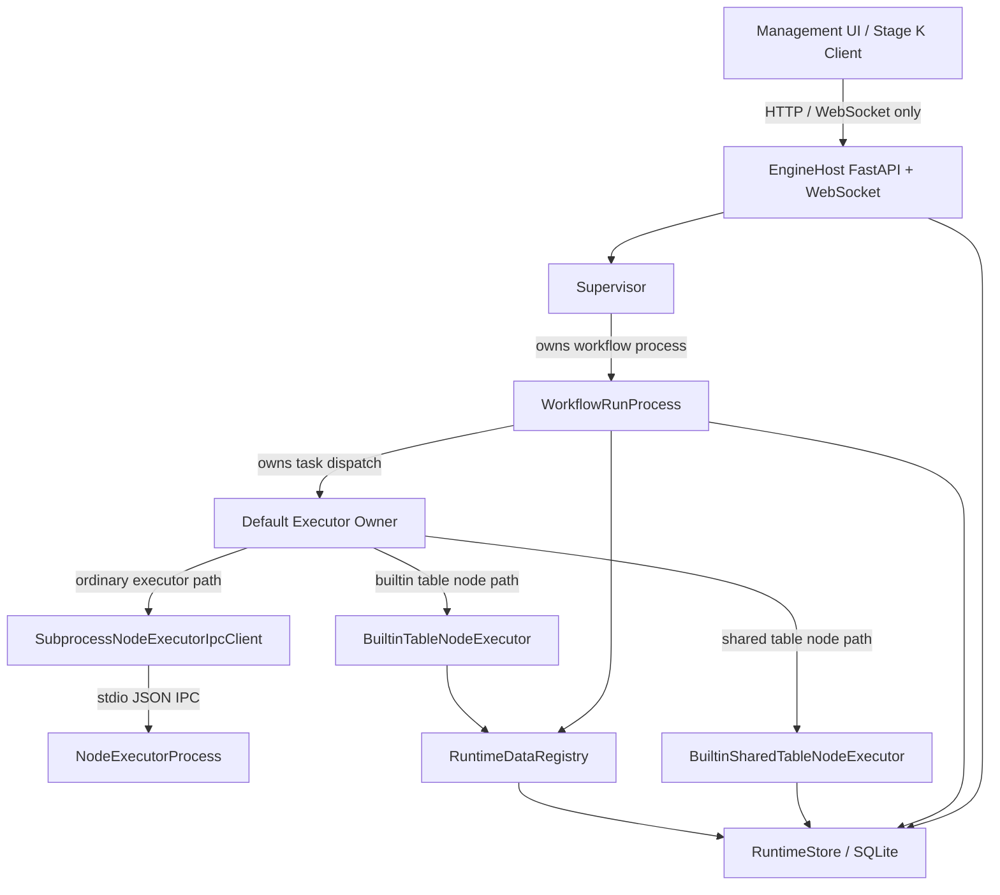

# FlowWeaver 阶段K：最小桌面UI与K.0前置收口计划

> 文档状态：阶段K实施前置基线
> 优先级：低于 `00_第一阶段技术接口与验收规范.md` 和 `01_第一阶段执行方案.md`
> 适用范围：阶段K.0到K.8
> 当前执行点：K.4 运行和节点状态 REST 恢复视图已完成，下一步 K.5 事件流和重连

## 1. 阶段K目标

阶段K对应第一阶段规范中的“最小桌面UI”。UI只作为 EngineHost 的客户端，通过 HTTP 和 WebSocket 访问后台，不直接读取 SQLite，不绕过 EngineHost、Supervisor、WorkflowRunProcess 或 RuntimeStore 的正式边界。

阶段K目标：

- UI可以连接本机 EngineHost
- UI可以查看工作流、运行记录、节点状态和事件
- UI可以启动和取消工作流运行
- UI可以查看 TableRef、SharedPublication 和审计摘要
- UI断开后后台继续运行
- UI重连后可通过 REST 恢复当前状态

K阶段后续UI技术栈固定为：

- UI路径：`Avalonia_UI/`
- UI框架：Avalonia
- 运行框架：.NET 10.0
- 开发语言：C#
- 架构模式：MVVM
- 后端：Python FastAPI EngineHost
- 通信：HTTP + WebSocket

技术边界：

- Avalonia UI只作为客户端，不嵌入或重写Python EngineHost
- UI不直接读取SQLite，不绕过FastAPI、Supervisor或RuntimeStore
- 后端继续使用现有Python 3.12运行与测试链路
- 仓内 `pyproject.toml` 已在K.1移除旧PySide6和pytest-qt依赖记录

阶段K暂不进入：

- 复杂节点画布
- Web管理端
- UI直接访问 SQLite
- 权限审批页面
- FULL / DEBUG 行级审计差分
- 插件沙盒和外部系统权限
- 多用户、远程部署和分布式调度

## 2. K阶段执行顺序

| 小步 | 执行方向 | 主要产出 | 暂不进入 |
| --- | --- | --- | --- |
| K.0a | A-J总体收口 | 第一阶段架构与验收基线文档 | 运行时代码实现 |
| K.0b | 默认正式路径烟雾测试 | EngineHost正式路径测试和后端缺口清单 | UI绕过后端缺口 |
| K.0c | UI API契约补齐 | UI所需只读摘要接口和事件过滤 | UI控件实现 |
| K.1 | Avalonia_UI工程骨架 | `Avalonia_UI`、net10.0、C#、MVVM主窗口与连接配置 | 复杂布局和业务编辑 |
| K.2 | UI API Client | C# HTTP/WebSocket客户端封装和统一响应模型 | 控件中直接写请求逻辑 |
| K.3 | 工作流列表与运行入口 | 工作流列表、运行按钮、基础错误提示 | 工作流画布 |
| K.4 | 运行和节点状态 | Run列表、停止按钮、NodeRun状态和进度 | 节点调试器 |
| K.5 | 事件流和重连 | WebSocket事件流、断线重连、REST补状态 | 长期离线缓存 |
| K.6 | 日志和审计最小视图 | RuntimeEvent和AuditEvent只读视图 | 权限审批页面 |
| K.7 | 数据摘要视图 | TableRef和SharedPublication摘要 | 完整大表编辑 |
| K.8 | 阶段验收 | Avalonia UI通过HTTP/WS工作并可重连恢复 | 后续阶段功能 |

## 3. K.0a：第一阶段架构与验收基线固化

### 3.1 产出

K.0a只做文档与验收基线固化，不修改运行时代码。

产出包括：

- A-J完成矩阵
- 进程所有权图
- WorkflowRun、NodeRun、Executor状态流
- TableRef、SharedPublication、ReadLease数据流
- 权限声明、句柄、执行检查和审计链路
- 当前明确不支持的能力清单
- 第一阶段验收基线

### 3.2 A-J完成矩阵

| 阶段 | 当前状态 | 已固化能力 | 仍不进入 |
| --- | --- | --- | --- |
| A | 已完成 | 项目配置、Pydantic协议、枚举、MessagePack、错误模型、协议测试 | 新技术栈 |
| B | 已完成 | SQLAlchemy模型、Alembic迁移、SQLite元数据、RuntimeStore CRUD | 外部数据库 |
| C | 已完成 | FastAPI入口、统一响应、Workflow/Run API、WebSocket骨架 | Web管理端 |
| C.5 | 已完成 | 包名统一、revision/hash、EngineHost bootstrap、本地token、事件持久化、API鉴权、基础租约、CI检查 | 多实例集群 |
| D | 已完成 | Supervisor、WorkflowRunProcess、DAG、NodeRun初始化、READY恢复、终态识别、心跳、取消、失联识别 | 自动复杂恢复 |
| D+ | 已完成 | 进程所有权和生命周期边界、默认路径前置收口 | 多机调度 |
| E | 已完成 | NodeTask/NodeExecutor、NodeTaskResult、迟到结果拒绝、heartbeat/progress、IPC、子进程往返 | 完整动态进程池 |
| F | 已完成 | RuntimeDataRegistry、TableRef、STAGING到PUBLISHED、节点失败清理、内置表节点 | 完整数据集仓库 |
| G | 已完成 | 长任务心跳、进度、异常退出、超时、取消令牌和协作取消边界 | 强制通用取消语义 |
| H | 已完成 | READY队列、输入引用、执行池、并发前置、失败策略、CONTINUE_INDEPENDENT、SKIP_DEPENDENTS保留不可用 | 默认开启高并发 |
| I | 已完成 | SharedPublication、InputSnapshot、ReadLease、共享表节点、主循环接入、租约释放、阶段验收 | 触发下游工作流 |
| J | 已完成 | 权限协议、Store、声明解析、句柄绑定、发布前检查、STANDARD审计、阶段验收 | UI审批、FULL行级差分、插件沙盒 |

### 3.3 进程所有权图



所有权原则：

- UI只拥有展示状态和用户操作，不拥有运行状态
- EngineHost拥有平台控制面和Supervisor
- Supervisor拥有WorkflowRunProcess子进程生命周期
- WorkflowRunProcess拥有单次运行的DAG状态控制
- NodeExecutorProcess拥有普通节点执行
- RuntimeStore拥有元数据事实源

### 3.4 WorkflowRun状态流

```text
PENDING
→ RUNNING
→ SUCCEEDED | FAILED | CANCELLED | ABORTED
```

已固化边界：

- 只有被当前进程所有权匹配的更新可以推进运行状态
- 终态运行会释放当前 run 未释放的 ReadLease
- CONTINUE_INDEPENDENT 下存在失败分支时，独立分支继续运行，结束后 WorkflowRun=FAILED 且 completion_reason=PARTIAL_FAILURE
- SKIP_DEPENDENTS 当前明确保留但不可用，显式配置会拒绝

### 3.5 NodeRun状态流

```text
PENDING
→ WAITING_DEPENDENCY | READY
→ QUEUED
→ RUNNING
→ LONG_RUNNING | CANCEL_REQUESTED
→ SUCCEEDED | FAILED | CANCELLED | TIMED_OUT | SKIPPED
```

已固化边界：

- READY由DAG依赖和上游结果推进
- QUEUED时创建NodeTask
- RUNNING时绑定executor_id
- 迟到、旧attempt、旧generation和executor不匹配结果会被拒绝
- 节点失败会清理本节点STAGING资源
- 超时节点进入TIMED_OUT并触发工作流失败或策略处理

### 3.6 Executor状态流

```text
EXECUTOR_READY
→ NODE_TASK_ACCEPTED
→ NODE_TASK_HEARTBEAT / NODE_TASK_PROGRESS
→ NODE_TASK_COMPLETED | NODE_TASK_FAILED
→ EXECUTOR_SHUTDOWN_REQUEST | process exit
```

已固化边界：

- IPC消息使用协议模型和序列化载荷
- 普通节点默认走NodeExecutorProcess子进程通道
- fault/delay节点已有内置执行器能力
- 内置表节点在WorkflowRunProcess默认路径中分流到BuiltinTableNodeExecutor并产出TableRef
- 共享表节点在WorkflowRunProcess默认路径中分流到BuiltinSharedTableNodeExecutor
- 正式子进程启动显式加载当前src路径，避免嵌入式Python误用旧安装包

### 3.7 TableRef数据流

```text
NodeExecutor
→ create STAGING TableRef
→ register STAGING
→ node success
→ publish PUBLISHED TableRef
→ NodeTaskResult.output_refs
→ downstream input_refs
```

已固化边界：

- STAGING只作为节点执行期间中间态
- PUBLISHED才作为下游稳定输入
- 节点失败和取消路径会清理本节点STAGING
- RuntimeDataRegistry负责注册、发布和按run/node查询

### 3.8 SharedPublication与ReadLease数据流

```text
Producer Workflow
→ PublishSharedTablesNode
→ SharedPublication(versioned members)
→ Consumer Workflow
→ ReadSharedTablesNode
→ InputSnapshot
→ ReadLease
→ fixed TableRef list
→ workflow terminal
→ release ReadLease
```

已固化边界：

- 第一阶段只支持LATEST和EXACT_VERSION
- 一次读取必须固定完整publication版本
- A发布V2不改变B当前run已固定的InputSnapshot
- workflow进入终态时释放当前run未释放ReadLease
- 不删除已发布真实数据，不做retention清理

### 3.9 权限与审计链路

```text
NodeTask config / input_refs
→ PermissionRequestModel
→ PermissionGrantModel
→ NodeTask.permission_handle_id
→ execution-time permission check
→ AuditEventModel(PERMISSION_CHECK)
```

已固化边界：

- 支持权限声明的内置NodeTask会在主循环创建前绑定permission_handle_id
- GenerateTestTableNode和FilterRowsNode发布NODE_OUTPUT前校验PUBLISH权限
- PublishSharedTablesNode发布SHARED_PUBLICATION前校验PUBLISH权限
- ReadSharedTablesNode读取SHARED_PUBLICATION前校验READ_SHARED权限
- 缺少或无效permission_handle_id会拒绝发布并记录denied审计事件
- 授权通过会记录granted审计事件
- 第一阶段不实现UI审批、FULL行级差分、外部系统统一权限和插件沙盒

### 3.10 当前明确不支持能力清单

- 复杂节点画布
- Web管理端
- UI直接访问SQLite
- 完整权限审批页面
- FULL / DEBUG 行级审计差分
- 外部文件、Web、Office、浏览器、串口等统一权限模型
- 插件沙盒和可信等级体系
- 分布式、多机和远程调度
- 跨数据库事务
- 完整DatasetStore
- 实时StreamRef
- 完整字段血缘图
- 复杂自动恢复继续执行
- SKIP_DEPENDENTS正式语义
- 触发下游工作流

### 3.11 第一阶段验收基线

第一阶段进入K.0b前的基线：

- A-J阶段提交已合入main并推送
- `ruff check src tests migrations` 通过
- `mypy` 通过
- `pytest -q` 全量通过
- 只允许保留已知StarletteDeprecationWarning
- 工作区只允许存在未跟踪架构参考文档和`.tmp/`

K.0b正式烟雾测试基线：

- 启动默认EngineHost
- token鉴权成功
- 创建或读取workflow
- 启动run
- 查询WorkflowRun和NodeRun
- 监听WebSocket事件
- 查询RuntimeEvent
- 运行表节点并产生TableRef
- 发布和读取SharedPublication
- 查询AuditEvent
- cancel请求可用
- UI/客户端断开并重连后可恢复当前状态

若K.0b发现正式路径缺口，优先修后端组合根，不允许在UI层绕过。

## 4. K.0b：默认正式路径烟雾测试

K.0b必须走正式路径，不使用测试专用Executor注入。

当前状态：已完成最小正式路径烟雾测试与后端组合根修正。

执行链路：

```text
启动默认EngineHost
→ token鉴权成功
→ 创建或读取workflow
→ 启动run
→ 查询NodeRun
→ 监听WebSocket事件
→ 查询RuntimeEvent
→ 运行表节点
→ 发布/读取SharedPublication
→ 查询审计
→ cancel
→ 断开并重连
```

验收：

- 控制面API可用：默认EngineHost可通过token鉴权、创建workflow并启动run
- WebSocket事件可用：可连接并接收正式运行产生的Workflow事件，断开后可重连
- RuntimeEvent可通过REST恢复
- 默认执行路径可跑第一阶段内置表节点链路：GenerateTestTableNode -> FilterRowsNode
- 默认执行路径可完成PublishSharedTablesNode和ReadSharedTablesNode
- TableRef、SharedPublication、ReadLease和AuditEvent均由正式路径落库
- 后端缺口已在K.0阶段修正，不在UI绕过

K.0b发现并修正的后端缺口：

- 默认EngineHost原先没有注册第一阶段内置节点定义，已补默认NodeRegistry
- 嵌入式Python子进程原先可能加载site-packages旧包，已改为显式加载当前src路径
- WorkflowRunProcess默认执行器原先未执行内置表节点真实产物链路，已补BuiltinTableNodeExecutor分流
- ReadSharedTablesNode原先未在读取前执行READ_SHARED权限检查，已补STANDARD审计链路

K.0b后留给K.0c的接口缺口：

- 审计、TableRef、SharedPublication的只读REST摘要接口
- RuntimeEvent按workflow_run_id、node_run_id、event_type过滤
- cancel长任务的完整交互验收仍需结合K阶段UI入口继续复核

## 5. K.0c：UI API契约复核与只读接口补齐

当前状态：已完成最小只读接口和事件过滤补齐。

已补齐或确认以下接口：

- `GET /api/v1/audit-events`
- `GET /api/v1/runs/{run_id}/table-refs`
- `GET /api/v1/shared-publications`
- `GET /api/v1/shared-publications/{share_name}/versions`
- `GET /api/v1/events` 支持 `workflow_run_id`、`node_run_id`、`event_type`、`after_sequence_number`、`limit`

已固化边界：

- 只读接口均走EngineHost HTTP API，不要求UI直连SQLite
- `audit-events` 第一版支持按 `workflow_run_id`、`node_run_id`、`event_type` 过滤
- `runs/{run_id}/table-refs` 第一版返回当前run产生的TableRef摘要
- `shared-publications` 第一版支持按 `share_name` 过滤和 `limit`
- `shared-publications/{share_name}/versions` 第一版返回指定share的版本列表
- `events` 已支持服务端过滤，避免UI只能拉全量后客户端筛选

暂不进入：

- 完整表数据浏览器
- 表格编辑
- 权限审批动作
- 管理端复杂筛选语言
- UI控件实现

## 6. K.1-K.8 Avalonia_UI 最小桌面UI

### K.1：Avalonia_UI工程骨架

范围：

- 使用现有 `Avalonia_UI/` 作为桌面UI工程路径
- 保持 `TargetFramework=net10.0`
- 保持 C# + Avalonia + CommunityToolkit.Mvvm 的 MVVM 基础结构
- 复核 `App.axaml`、`Program.cs`、`Views/`、`ViewModels/` 的最小启动链路
- 增加或收口 EngineHost 地址、token 和连接状态的配置模型
- 增加 health 检查入口

验收：

- `dotnet build Avalonia_UI/Avalonia_UI.sln` 可通过
- Avalonia UI可启动
- 可连接本机EngineHost
- 连接失败有明确错误
- 不引入UI直连SQLite或Python进程内调用

K.1 完成记录：

- `Avalonia_UI/` 作为仓内桌面UI工程纳入版本控制
- 保持 `TargetFramework=net10.0`、Avalonia、C# 和 CommunityToolkit.Mvvm
- 增加 `EngineHostConnectionSettings`、`ConnectionStatus` 和最小 health 检查服务
- 主窗口提供 EngineHost Base URL、token、连接检查按钮、状态和错误提示
- C# 测试覆盖 health URI 拼接、健康 envelope 解析和 HTTP 失败
- 为 Avalonia build/test 产物补 `.gitignore`
- 旧 PySide6 / pytest-qt 依赖已从 Python 依赖和 `uv.lock` 移除

K.1 验收结果：

- `dotnet build Avalonia_UI/Avalonia_UI.sln` 通过
- `dotnet test Avalonia_UI.Tests/Avalonia_UI.Tests.csproj --no-build` 通过
- `.\python312\python.exe -m ruff check src tests migrations` 通过
- `.\python312\python.exe -m mypy` 通过
- `.\python312\python.exe -m pytest -q` 通过，仅保留已知 StarletteDeprecationWarning

### K.2：UI API Client

范围：

- C# `HttpClient` 封装 EngineHost HTTP API
- C# `ClientWebSocket` 封装 RuntimeEvent WebSocket
- API统一响应 envelope、错误模型和DTO
- token注入、base URL配置和超时设置
- 请求错误、鉴权失败和断线错误模型

验收：

- 不在控件中直接写HTTP请求细节
- ViewModel只依赖接口或服务抽象
- 单元测试覆盖鉴权失败和连接失败

K.2 完成记录：

- 增加 `EngineHostApiClient`，封装 EngineHost REST API、统一响应 envelope、错误模型和 Bearer token 注入
- 增加 `HealthStatusDto`、`WorkflowDefinitionDto`、`WorkflowRunDto`、`WorkflowProcessDto`、`NodeRunDto`、`RuntimeEventDto`、`TableRefDto`、`SharedPublicationDto` 和 `AuditEventDto`
- 增加 RuntimeEvent WebSocket 客户端边界，固定 `/ws/v1/events?token=...`
- `EngineHostHealthClient` 改为复用 API Client
- C#测试覆盖 health、REST鉴权、无token拒绝、事件过滤查询、错误 envelope、RuntimeEvent解析和 WorkflowRun DTO字段名
- K.2不实现工作流列表UI、运行按钮、运行状态页面或事件视图

K.2 验收结果：

- `dotnet build Avalonia_UI/Avalonia_UI.sln` 通过
- `dotnet test Avalonia_UI.Tests/Avalonia_UI.Tests.csproj --no-build` 通过

### K.3：工作流列表与运行入口

范围：

- 工作流列表
- 刷新按钮
- 运行按钮
- 最小运行结果反馈

验收：

- 可从UI启动workflow run
- 不实现复杂workflow编辑器
- UI通过HTTP调用EngineHost，不直接创建本地运行状态

K.3 完成记录：

- 主窗口接入工作流列表、刷新按钮和运行按钮
- `MainWindowViewModel` 通过 `EngineHostApiClient` 拉取 workflow 列表并启动 run
- 启动运行后展示返回的 `workflow_run_id` 和 run `status`
- 增加 `WorkflowListItemViewModel` 作为列表展示模型
- 为 API Client 增加 `IEngineHostApiClient` 抽象，便于 ViewModel 测试
- C#测试覆盖刷新列表、保留选择、刷新失败、启动运行和无选择时禁用运行
- K.3不实现 Run列表、停止按钮、NodeRun状态、事件流或重连

K.3 验收结果：

- `dotnet build Avalonia_UI/Avalonia_UI.sln` 通过
- `dotnet test Avalonia_UI.Tests/Avalonia_UI.Tests.csproj --no-build` 通过

### K.4：运行和节点状态

范围：

- Run列表
- 停止按钮
- NodeRun状态、progress、current_stage

验收：

- 可取消运行
- 可通过REST刷新查看节点状态、progress和current_stage
- WebSocket事件合并、断线提示和重连恢复留到K.5

K.4 完成记录：

- 主窗口接入 Run 列表、Cancel 按钮和 NodeRun 列表
- `MainWindowViewModel` 通过 `EngineHostApiClient` 查询 runs、取消 selected run、查询 selected run 的 node runs
- Run 列表按当前 selected workflow 过滤；未选 workflow 时仍保留客户端调用全量 runs 的边界
- NodeRun 列表展示 `status`、`progress` 百分比和 `current_stage`
- 启动 workflow run 成功后会刷新 Run 列表并选中新建 run
- C#测试覆盖 Run 刷新、cancel 请求、无选择时禁用 cancel、NodeRun progress/current_stage 展示
- API Client 测试覆盖 `GET /api/v1/runs`、`GET /api/v1/runs/{run_id}/nodes` 和 `POST /api/v1/runs/{run_id}/cancel`
- K.4不实现 WebSocket RuntimeEvent 合并、断线重连、日志审计视图或 TableRef/SharedPublication 摘要

K.4 验收结果：

- `dotnet build Avalonia_UI/Avalonia_UI.sln` 通过
- `dotnet test Avalonia_UI.Tests/Avalonia_UI.Tests.csproj --no-build` 通过

### K.5：事件流与重连

范围：

- WebSocket接收RuntimeEvent
- 断线提示
- 重连后REST拉取当前状态

验收：

- UI断开后后台继续运行
- UI重连后状态可恢复
- WebSocket断开不会导致EngineHost运行中断

### K.6：日志和审计最小视图

范围：

- RuntimeEvent只读视图
- AuditEvent只读视图
- 基础过滤

验收：

- 可查询基础审计日志
- 不实现权限审批页面
- 只读视图使用K.0c补齐的REST API

### K.7：TableRef和SharedPublication摘要

范围：

- 当前run的TableRef摘要
- SharedPublication列表
- 指定share_name的版本列表和members摘要

验收：

- UI可查看输出引用和共享发布版本
- 不展示完整大表编辑能力
- 不加载完整表数据内容

### K.8：阶段K验收

验收：

- Avalonia UI通过HTTP和WebSocket工作
- Avalonia UI不直接访问SQLite
- Avalonia UI断开后后台继续运行
- Avalonia UI重连后可恢复状态
- K.0b正式路径烟雾测试通过
- `dotnet build Avalonia_UI/Avalonia_UI.sln` 通过
- 全量自动化测试通过

验收命令：

```powershell
.\python312\python.exe -m ruff check src tests migrations
.\python312\python.exe -m mypy
.\python312\python.exe -m pytest -q
```
