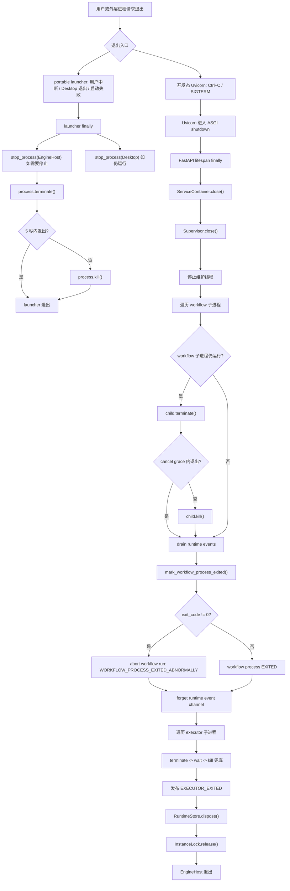
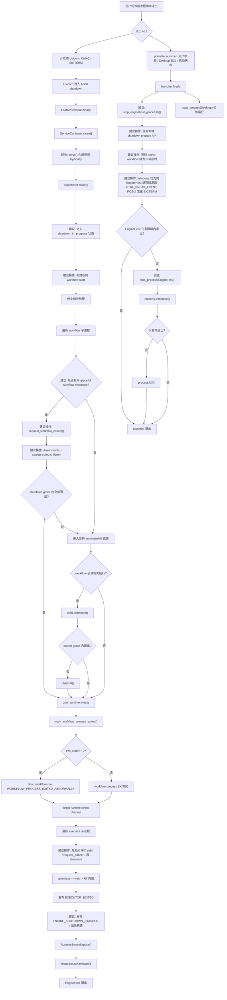
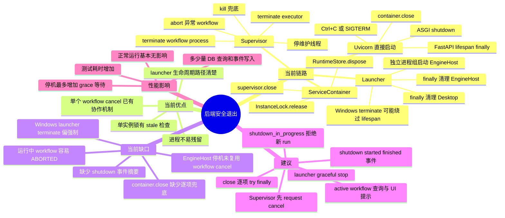

# FlowWeaver 后端安全退出链路与改进建议

> 记录日期：2026-07-04
> 适用范围：EngineHost、FastAPI lifespan、Supervisor、WorkflowRunProcess、NodeExecutor、portable launcher 的退出链路分析
> 当前执行点：只整理链路和建议，不修改运行代码

## 1. 结论摘要

当前后端已经具备一条可用的退出链路：

- 开发态通过 Uvicorn 启动时，`Ctrl+C` 或服务进程收到关闭信号后，Uvicorn 进入 ASGI shutdown。
- FastAPI `lifespan` 在退出阶段调用 `ServiceContainer.close()`。
- `ServiceContainer.close()` 关闭 `Supervisor`、释放 `RuntimeStore` 数据库引擎、释放单实例锁。
- `Supervisor.close()` 会终止仍由本次 EngineHost 管理的 WorkflowRunProcess 和 Executor 子进程，超时后强制 kill。
- portable launcher 退出时会清理它本次启动的 Desktop 和 EngineHost 子进程，避免进程残留。

但当前链路的语义更偏向“保证后端和子进程不残留”，不是“停机时让正在运行的 workflow 优雅取消并完整落库”。也就是说：

- 通过 API 取消单个 workflow 是协作式取消。
- EngineHost 自身退出时，`Supervisor.close()` 当前会直接终止 workflow 子进程，并把运行中的 run 标记为异常中止。
- portable launcher 在 Windows 上使用 `process.terminate()` 停止 EngineHost 时，可能绕过 FastAPI lifespan，无法保证 `container.close()` 一定完整执行。

## 2. 当前代码位置

| 模块 | 位置 | 当前职责 |
| --- | --- | --- |
| FastAPI app 生命周期 | `src/flowweaver/api/app.py` | `lifespan` 启动 supervisor，退出时关闭 container |
| 服务容器 | `src/flowweaver/engine/service_container.py` | 统一关闭 supervisor、runtime store、instance lock |
| 进程监督器 | `src/flowweaver/engine/supervisor.py` | 管理 workflow 子进程、executor 子进程、事件 drain 和异常 run 标记 |
| WorkflowRunProcess | `src/flowweaver/workflow_process/main.py` | 运行 workflow 主循环，识别 cancel 请求，关闭执行池和可复用 executor |
| NodeExecutor IPC Client | `src/flowweaver/node_executor/ipc_client.py` | 关闭 stdin，等待 executor 子进程退出，超时 terminate/kill |
| portable launcher | `tools/portable_launcher.py` | 启动 EngineHost/Desktop，退出时清理本次启动的进程 |
| 单实例锁 | `src/flowweaver/common/instance_lock.py` | 启动时落锁，正常关闭时删除锁文件 |

## 3. 当前完整退出流程

### 3.1 开发态 Uvicorn 直接启动

正式源码入口：

```powershell
.\python312\python.exe -m uvicorn --app-dir src flowweaver.api.app:create_default_app --factory --host 127.0.0.1 --port 8000
```

当前流程：

1. 用户在控制台按 `Ctrl+C`，或外层进程管理器向 Uvicorn 发送关闭信号。
2. Uvicorn 停止接收新连接，并进入 ASGI shutdown。
3. FastAPI 执行 `create_app()` 中的 `lifespan` 退出逻辑。
4. `lifespan` 的 `finally` 调用 `container.close()`。
5. `container.close()` 调用 `supervisor.close()`。
6. `supervisor.close()` 设置维护线程停止事件。
7. `supervisor.close()` 等待维护线程最多 2 秒。
8. `supervisor.close()` 遍历当前记录在 `_children` 中的 workflow 子进程。
9. 如果 workflow 子进程仍在运行：
   - 调用 `child.terminate()`。
   - 等待 `workflow_process_cancel_grace_seconds`，默认 5 秒。
   - 若仍未退出，调用 `child.kill()`。
   - 再等待最多 2 秒。
10. `supervisor.close()` drain 该 workflow process 的 runtime event jsonl。
11. `supervisor.close()` 调用 `_finish_workflow_process()`：
    - `exit_code == 0` 时标记 workflow process 为 `EXITED`。
    - `exit_code != 0` 时标记 workflow process 为 `FAILED`。
    - 非 0 退出会调用 `abort_workflow_run_for_process()`，将 workflow run 异常中止。
12. `supervisor.close()` 清理该 process 的 runtime event channel 内存索引。
13. `supervisor.close()` 遍历 `_executor_children` 中由 supervisor 直接管理的 executor 子进程。
14. 如果 executor 子进程仍在运行：
    - 调用 `terminate()`。
    - 等待 2 秒。
    - 若仍未退出，调用 `kill()`。
    - 再等待 2 秒。
15. `supervisor.close()` 发布 `EXECUTOR_EXITED` 事件。
16. `container.close()` 调用 `runtime_store.dispose()`，释放 SQLAlchemy engine。
17. `container.close()` 释放 `instance_lock`，删除 `runtime/enginehost.lock`。
18. Uvicorn 进程退出。

当前结果：

- EngineHost 进程正常退出。
- 正常经过 FastAPI lifespan 时，数据库连接池和单实例锁会释放。
- 仍在运行的 workflow process 会被终止。
- 仍在运行的 workflow run 当前会被标记为异常中止，而不是协作式取消完成。

### 3.2 portable launcher backend-only 退出

backend-only 入口当前由 launcher 启动 EngineHost，不启动 Desktop。

当前流程：

1. launcher 校验 host、port、便携目录和 EngineHost 文件布局。
2. launcher 确认端口可用。
3. launcher 调用 `start_enginehost_process()` 启动 EngineHost。
4. EngineHost 子进程使用独立进程组：
   - Windows：`CREATE_NEW_PROCESS_GROUP`
   - 非 Windows：`start_new_session=True`
5. launcher 轮询 `/api/v1/health`。
6. launcher 等待 `runtime/config/local_api_token` 出现。
7. launcher 输出 BaseUrl 和 token 文件路径，不输出 token 原文。
8. backend-only 模式下，launcher 进入等待循环：
   - 如果 EngineHost 自己退出，launcher 返回 EngineHost exit code。
   - 如果用户中断 launcher，launcher 捕获 `KeyboardInterrupt` 并返回 130。
9. launcher 的 `finally` 执行清理：
   - 如果 EngineHost 仍在运行并且 `should_stop_enginehost=True`，调用 `stop_process(enginehost_process)`。
   - `stop_process()` 先调用 `process.terminate()`。
   - 等待默认 5 秒。
   - 若仍未退出，调用 `process.kill()`。
   - 再等待默认 5 秒。
10. launcher 记录 `EngineHost stopped`。

当前结果：

- launcher 能确保本次启动的 EngineHost 不静默残留。
- 因 EngineHost 子进程独立进程组，用户中断 launcher 时，信号不会直接误伤 EngineHost；清理由 launcher 的 `finally` 统一执行。
- Windows 上 `process.terminate()` 更接近强制终止，不保证 EngineHost 进入 FastAPI lifespan shutdown。
- 如果 EngineHost 没机会执行 `container.close()`，数据库连接由操作系统回收，但单实例锁文件可能需要下次启动时通过 stale lock 检查恢复。

### 3.3 portable launcher Desktop 分支退出

Desktop 分支当前由 launcher 同时托管 EngineHost 和 Desktop。

当前流程：

1. launcher 启动 EngineHost。
2. launcher 等待 EngineHost health 和 token。
3. launcher 启动 Desktop。
4. launcher 等待 Desktop 退出，同时监控 EngineHost 是否提前退出。
5. Desktop 正常退出后：
   - 默认 `should_stop_enginehost=True`，launcher 清理 EngineHost。
   - 如果显式 `--keep-enginehost-on-desktop-exit`，Desktop 退出后保留本次 EngineHost。
6. 如果 Desktop 启动失败：
   - launcher 进入异常路径。
   - `finally` 停止本次 EngineHost。
7. 如果用户中断 launcher：
   - launcher 停止 Desktop。
   - launcher 停止 EngineHost。

当前结果：

- Desktop 缺失、Desktop 启动失败、Desktop 正常退出、用户中断时，都有明确的 EngineHost 生命周期策略。
- 默认策略是“组合入口退出即停止本次 EngineHost”。
- 显式 keep 参数只影响 Desktop 正常退出后的 EngineHost 是否保留，不影响启动失败和用户中断清理。

### 3.4 单个 workflow 的取消路径

这条路径不是 EngineHost 退出路径，但它是当前系统里最接近“优雅退出 workflow”的机制。

当前流程：

1. 客户端调用 `POST /api/v1/runs/{workflow_run_id}/cancel`。
2. API 路由调用 `supervisor.request_workflow_cancel(workflow_run_id)`。
3. `RuntimeStore.request_workflow_process_cancel()` 将对应 workflow process 标记为 `CANCEL_REQUESTED`，记录 `cancel_requested_at`。
4. WorkflowRunProcess 主循环或节点任务 supervision 逻辑轮询到取消请求。
5. 如果存在 in-flight node task：
   - 将 node run 标记为 `CANCEL_REQUESTED`。
   - 如果 executor 支持 `request_cancel()`，向 executor 发送取消请求。
6. 节点可协作返回 `CANCELLED`。
7. 如果超过 `cancel_grace_seconds` 仍未协作返回：
   - workflow process 关闭 executor。
   - 生成取消结果。
   - workflow run 进入 `CANCELLED`。
8. WorkflowRunProcess 正常退出，返回 exit code 0。
9. Supervisor sweep 到子进程退出后，标记 workflow process 为 `EXITED`。

当前结果：

- 单个 run 的取消语义较完整。
- 这条链路没有被 EngineHost 自身退出路径复用。
- 因此 EngineHost 停机时，运行中的 workflow 更容易进入 `ABORTED`，不是 `CANCELLED`。

## 4. 当前流程图



## 5. 当前流程图加建议分支

下面这张图复制当前主链路，并在关键节点加建议分支。建议分支不改变当前必须兜底强杀的能力，只是在强杀前插入“协作取消、等待、记录、拒绝新任务”等操作。



## 6. 建议操作矩阵

| 编号 | 建议 | 具体操作 | 对主程序影响 | 性能影响 | 风险 | 建议优先级 |
| --- | --- | --- | --- | --- | --- | --- |
| S1 | `ServiceContainer.close()` 做逐项兜底 | `supervisor.close()`、`runtime_store.dispose()`、`instance_lock.release()` 分别包裹，前一步失败也继续释放后续资源，最后统一记录异常 | 只影响退出路径，不改变正常业务流程 | 正常运行无影响；退出时多几次异常判断 | 需要决定异常日志位置，避免吞掉关键信息 | 高 |
| S2 | EngineHost 退出时先进入 `shutdown_in_progress` | 在容器或 supervisor 增加内存状态；开始关闭后拒绝新的 workflow start | 只影响停机窗口内的新请求；正常运行无影响 | 正常运行只增加一次轻量状态判断 | 需要 API 返回清晰错误码，如 `ENGINE_SHUTTING_DOWN` | 高 |
| S3 | `Supervisor.close()` 先协作取消 workflow | 对 `_children` 中仍运行的 process 先调用 `request_workflow_cancel()`，循环 drain events、sweep children，等待 `engine_shutdown_grace_seconds` | 停机时运行中的 workflow 更可能变 `CANCELLED` 而非 `ABORTED`；主业务语义更友好 | 只在停机时增加等待；最坏会拉长退出时间 | 长任务若不响应取消，仍需 terminate/kill 兜底 | 高 |
| S4 | launcher 增加 EngineHost graceful stop | 新增 `stop_enginehost_gracefully()`：先请求后端准备停机，再发可被 Uvicorn 捕获的软信号，最后再 terminate/kill | 只影响 launcher 托管退出；不影响直接 Uvicorn 启动 | 退出时增加 health/runs 轮询和等待 | Windows 信号行为需要真实 smoke 验证 | 高 |
| S5 | 运行中 workflow 提示或策略参数 | Desktop 退出前，如果存在 active workflow，可提示用户、默认等待、或要求 `--force` | 会改变用户关闭 Desktop 的体验；主程序 API 可保持不变 | 正常运行无影响；关闭时多一次查询 | 需要 UI/launcher 交互策略，不宜混进后端小修 | 中 |
| S6 | 增加 shutdown 事件 | 新增 `ENGINE_SHUTDOWN_STARTED`、`ENGINE_SHUTDOWN_FINISHED`，记录 active workflow 数、强杀数量、耗时 | 会扩展事件协议；客户端可选择忽略 | 极低，只在退出时写事件 | 需要协议模型和 UI 兼容确认 | 中 |
| S7 | executor 关闭前先协作取消 | 对 supervisor 直接管理的 executor，先关闭 stdin 或发送 cancel/exit envelope，再 terminate | 只影响退出路径和 executor 生命周期 | 退出时多一次 IPC 操作 | 当前直接管理 executor 和 workflow 内部 reusable executor 不是同一条路径，需区分 | 中 |
| S8 | 增加 active workflow 查询接口 | 提供本地鉴权接口给 launcher/UI 查询当前是否有运行中 workflow | API 面增加，但可只读、低风险 | 极低，一次数据库查询 | 要避免泄露敏感信息；仍需 token | 中 |
| S9 | 完整验收用例 | 增加 supervisor close graceful cancel、launcher active workflow shutdown、Windows CTRL_BREAK 真实 smoke | 不影响主程序 | 测试耗时增加 | Windows 真实信号测试可能不稳定，需要分层测试 | 高 |

## 7. 推荐分阶段落地

### 7.1 第一小步：不改变用户体验，只增强退出可靠性

目标：

- 确保 `container.close()` 中任一资源关闭失败，不影响锁和数据库释放。
- 不改变 launcher 行为。
- 不改变 workflow 停机语义。

建议操作：

1. 调整 `ServiceContainer.close()` 为逐项关闭。
2. 增加单元测试：模拟 `supervisor.close()` 抛错时，`runtime_store.dispose()` 和 `instance_lock.release()` 仍被调用。

影响：

- 对主程序正常运行无影响。
- 性能无影响。
- 风险最低。

### 7.2 第二小步：EngineHost 停机时协作取消 workflow

目标：

- EngineHost 正常 shutdown 时，优先复用当前 workflow cancel 机制。
- 超时后仍保留当前 terminate/kill 兜底。

建议操作：

1. 增加配置项，例如 `engine_shutdown_grace_seconds`，默认可先设为 5 到 10 秒。
2. `Supervisor.close()` 开始时设置 shutdown 状态。
3. 对 active workflow process 调用 `request_workflow_cancel()`。
4. 在 grace 窗口内循环：
   - drain runtime events。
   - sweep exited children。
   - 判断 `_children` 是否清空。
5. 超时后进入当前 terminate/kill 分支。
6. 增加测试：
   - 可协作取消的 workflow 在 EngineHost shutdown 后变 `CANCELLED`。
   - 不响应取消的 workflow 在超时后仍变 `ABORTED`，且无子进程残留。

影响：

- 对主程序正常处理请求的性能基本无影响。
- 停机耗时可能增加，最多增加一个 grace 窗口。
- 运行中 workflow 的状态语义会从“直接 ABORTED”改为“优先 CANCELLED”，这是用户可见变化，需要在文档中说明。

### 7.3 第三小步：launcher 从强制停止升级为优雅停止

目标：

- portable launcher 停止 EngineHost 时，尽量让 Uvicorn/FastAPI lifespan 有机会执行。
- Windows 上避免直接 `TerminateProcess` 成为第一选择。

建议操作：

1. 新增 `stop_enginehost_gracefully()`，只用于 EngineHost，不替换通用 `stop_process()`。
2. graceful stop 顺序：
   - 调用本地鉴权 shutdown prepare API，设置后端停机状态并触发 workflow cancel。
   - 轮询 active workflow 状态，最多等待配置的 grace 秒数。
   - Windows：对 EngineHost 独立进程组发送 `CTRL_BREAK_EVENT`。
   - 非 Windows：发送 `SIGTERM`。
   - 再等待 Uvicorn 退出。
   - 超时后回落到当前 `terminate()` / `kill()`。
3. 增加 smoke：
   - backend-only 中断后，EngineHost health 不可达。
   - 有运行中 workflow 时，协作节点能落到 `CANCELLED`。
   - 不协作节点仍被兜底清理。

影响：

- 对主程序正常运行无影响。
- 对 launcher 退出耗时有影响，取决于 grace 配置。
- Windows 信号路径需要重点验证；如果不稳定，可以保留 prepare API + terminate 兜底。

### 7.4 第四小步：用户可见策略和 UI 提示

目标：

- 避免用户关闭 Desktop 时误中断重要 workflow。

建议操作：

1. UI 或 launcher 查询 active workflow。
2. 如果 active workflow 数大于 0：
   - 显示提示。
   - 提供“等待完成”、“取消并退出”、“强制退出”三种策略。
3. `--keep-enginehost-on-desktop-exit` 继续作为高级路径保留。

影响：

- 会改变 Desktop 关闭体验。
- 对后端主程序影响较小，但需要新增只读查询接口或复用现有 runs API。
- 性能影响极低，主要是一次查询。

## 8. 建议后的目标语义

理想状态不是取消强制兜底，而是形成三层退出保障：

1. 协作层：先拒绝新 workflow，通知运行中 workflow cancel。
2. 等待层：在有限 grace 时间内 drain events、sweep children、等待正常退出。
3. 强制层：超时后 terminate/kill，保证进程不残留。

这样可以同时满足两个目标：

- 用户数据和 workflow 状态尽量可解释。
- 后端退出仍然有上限时间，不会被坏节点无限拖住。

## 9. 思维导图



## 10. 最小验收清单

若后续进入实现，建议至少覆盖以下验收：

| 验收项 | 期望 |
| --- | --- |
| 直接 Uvicorn `Ctrl+C` | `container.close()` 完整执行，锁释放，health 不可达 |
| `supervisor.close()` 遇到运行中可取消 workflow | workflow run 最终 `CANCELLED`，workflow process `EXITED` |
| `supervisor.close()` 遇到不响应取消 workflow | 超时后 terminate/kill，workflow run `ABORTED`，无子进程残留 |
| launcher backend-only 中断 | 本次 EngineHost 退出，日志脱敏，无 token 原文 |
| launcher Desktop 正常退出 | 默认停止 EngineHost；keep 参数时保留 EngineHost |
| launcher Desktop 启动失败 | EngineHost 被清理 |
| Windows 真实 smoke | `CTRL_BREAK_EVENT` 或替代 soft stop 能让 EngineHost 尽量进入 shutdown；失败时兜底 kill |
| 重启同一 runtime | stale lock 能恢复；正常退出后无误判锁 |

## 11. 当前不建议混入的小步

- 不建议在同一小步引入后台服务、系统托盘或自动重启。
- 不建议把 Desktop 关闭确认、后端 shutdown API、Supervisor cancel 改造和发布包 smoke 全部揉在一次修改里。
- 不建议取消 terminate/kill 兜底；安全退出必须有时间上限。
- 不建议让 UI 直接管理 Python 子进程；当前架构仍应保持 launcher 或外层入口托管 EngineHost。

## 12. 本机实测关闭耗时

测试时间：2026-07-04 14:20-14:24，Windows，本仓库 `python312/python.exe`。

测试口径：

- `关闭耗时`：后端 health 已经可用后，从发出关闭动作开始，到被测进程实际退出为止。
- `启动到 health`：只作为环境参考，不计入关闭耗时。
- 本轮为空闲 EngineHost，没有运行中的 workflow。
- `health 不可达`检查使用 0.3s urlopen timeout，因此该确认值主要受探测 timeout 影响，没有放入汇总表。

### 12.1 汇总表

| 场景 | 轮数 | 关闭动作 | 启动到 health 平均值 | 关闭耗时平均值 | 关闭耗时范围 | 退出码 | 是否触发 kill 兜底 | 锁文件结果 | 结论 |
| --- | ---: | --- | ---: | ---: | ---: | --- | --- | --- | --- |
| 直接启动 EngineHost | 5 | `CTRL_BREAK_EVENT` | 1427.2 ms | 169.8 ms | 147.0-211.0 ms | 3 | 否 | 已释放 | 能走到应用清理路径；耗时约 0.15-0.21 秒 |
| 直接启动 EngineHost | 5 | `process.terminate()` | 1673.4 ms | 7.6 ms | 6.8-8.5 ms | 1 | 否 | 残留 stale lock | 很快，但绕过应用清理路径 |
| portable launcher backend-only | 3 | 对 launcher 发 `CTRL_BREAK_EVENT` | 1448.6 ms | 452.7 ms | 384.8-502.0 ms | 130 | 否 | EngineHost lock 残留 | launcher 能退出并记录 stopped，但子 EngineHost 是 terminate 停止 |

### 12.2 明细表

| 场景 | 轮次 | 启动到 health | 关闭耗时 | 退出码 | 锁文件 |
| --- | ---: | ---: | ---: | ---: | --- |
| direct / `CTRL_BREAK_EVENT` | 1 | 1497.8 ms | 164.3 ms | 3 | 已释放 |
| direct / `CTRL_BREAK_EVENT` | 2 | 1416.5 ms | 148.5 ms | 3 | 已释放 |
| direct / `CTRL_BREAK_EVENT` | 3 | 1408.4 ms | 211.0 ms | 3 | 已释放 |
| direct / `CTRL_BREAK_EVENT` | 4 | 1407.1 ms | 178.4 ms | 3 | 已释放 |
| direct / `CTRL_BREAK_EVENT` | 5 | 1406.1 ms | 147.0 ms | 3 | 已释放 |
| direct / `terminate()` | 1 | 1406.5 ms | 7.9 ms | 1 | 残留 |
| direct / `terminate()` | 2 | 2317.8 ms | 6.8 ms | 1 | 残留 |
| direct / `terminate()` | 3 | 1407.2 ms | 7.3 ms | 1 | 残留 |
| direct / `terminate()` | 4 | 1418.0 ms | 8.5 ms | 1 | 残留 |
| direct / `terminate()` | 5 | 1817.7 ms | 7.6 ms | 1 | 残留 |
| launcher backend-only / `CTRL_BREAK_EVENT` | 1 | 1503.2 ms | 471.3 ms | 130 | 残留 |
| launcher backend-only / `CTRL_BREAK_EVENT` | 2 | 1403.2 ms | 384.8 ms | 130 | 残留 |
| launcher backend-only / `CTRL_BREAK_EVENT` | 3 | 1439.5 ms | 502.0 ms | 130 | 残留 |

### 12.3 额外观察

测试 launcher 时曾先用 stdout 文本作为 ready 判定。由于 stdout 重定向到文件后存在缓冲，测试脚本超时并 kill 了 launcher 父进程；此时子 EngineHost 残留，需要手工停止。这个现象说明：

- launcher 正常收到中断时，`finally` 能执行并停止 EngineHost。
- launcher 父进程如果被硬杀，`finally` 不会执行，EngineHost 可能残留。
- 当前 portable 链路的安全退出仍依赖 launcher 父进程能正常处理信号；后续建议增加更明确的 EngineHost soft-stop 能力，减少对父进程 `finally` 的依赖。

本轮测试产物：

| 类型 | 路径 |
| --- | --- |
| direct timing | `.tmp/shutdown-timing-direct-20260704-142017` |
| launcher timing | `.tmp/shutdown-timing-launcher-20260704-142338` |

## 13. 修复后复测结果

修复内容：portable launcher 停止 EngineHost 时，先发送中断信号，让 Uvicorn/FastAPI lifespan 执行 `container.close()`；如果 grace 时间内没有退出，再回退到原有 `terminate/kill` 兜底。

测试时间：2026-07-04 14:33，Windows，本仓库 `python312/python.exe`。

| 场景 | 轮数 | 关闭动作 | 启动到 health 平均值 | 关闭耗时平均值 | 关闭耗时范围 | 退出码 | 是否触发 kill 兜底 | 锁文件结果 | 结论 |
| --- | ---: | --- | ---: | ---: | ---: | --- | --- | --- | --- |
| portable launcher backend-only | 3 | 对 launcher 发 `CTRL_BREAK_EVENT` | 1466.7 ms | 639.8 ms | 577.2-673.6 ms | 130 | 否 | 已释放 | 修复后能走 EngineHost 应用清理路径 |

### 13.1 修复后明细

| 场景 | 轮次 | 启动到 health | 关闭耗时 | 退出码 | 锁文件 |
| --- | ---: | ---: | ---: | ---: | --- |
| launcher backend-only / `CTRL_BREAK_EVENT` | 1 | 1518.6 ms | 668.6 ms | 130 | 已释放 |
| launcher backend-only / `CTRL_BREAK_EVENT` | 2 | 1437.1 ms | 577.2 ms | 130 | 已释放 |
| launcher backend-only / `CTRL_BREAK_EVENT` | 3 | 1444.5 ms | 673.6 ms | 130 | 已释放 |

### 13.2 修复前后对比

| 指标 | 修复前 | 修复后 |
| --- | ---: | ---: |
| portable launcher 平均关闭耗时 | 452.7 ms | 639.8 ms |
| portable launcher 关闭耗时范围 | 384.8-502.0 ms | 577.2-673.6 ms |
| 正常 launcher 中断后 EngineHost lock | 残留 | 已释放 |
| 是否保留强制兜底 | 是 | 是 |

结论：修复后正常关闭会多花约 0.2 秒，但换来完整应用清理和锁释放；对主程序运行期性能没有影响，只影响退出阶段。

本轮复测产物：

| 类型 | 路径 |
| --- | --- |
| fixed launcher timing | `.tmp/shutdown-timing-launcher-fixed-20260704-143332` |
