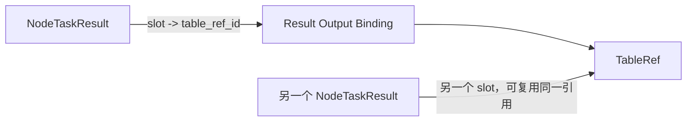
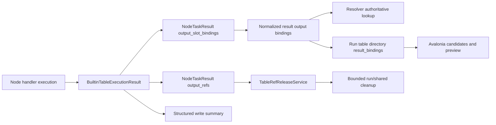

# 2026-07-12 当前阶段：阶段 Q 第一版未收口项源码审计与执行方案

> 文档状态：已执行完成，阶段 Q 第一版边界已冻结
> 编写日期：2026-07-12
> 原始对账基线：`main` / `origin/main`，提交 `7d659723`
> 执行完成基线：生产代码提交 `3b673b3b`；本次文档冻结提交见 Git 历史
> 审计范围：阶段 Q 的节点表流转、运行表目录、配置字、手动后台运行、共享表、内存表和 Avalonia 对应入口
> 文档目的：以当前源码为准，区分已经完成的主线、第一版仍需收口的契约和性能问题、以及明确留给后续阶段的完整化能力，并给出可独立测试、提交、推送和停止的执行顺序
> 当前操作说明：第 1 至 29 节保留执行前审计和设计依据；第 0 节是执行后的当前事实，优先级高于后文历史描述

## 0. 2026-07-12 执行完成记录

### 0.1 批次与提交

严格顺序 `1A -> 6A -> 2A -> 4A -> 2B -> 4B -> 1B -> 3 -> 5 -> 6B -> 7` 已执行：

| 批次 | 提交 | 最终状态 |
| --- | --- | --- |
| Q-CLOSE-1A | `b81c2c8a` | 输出槽位解析以结果 binding 为事实源 |
| Q-CLOSE-6A | `e7501719` | 内存表无排序分页、计数和 schema 查询不再复制整表 |
| Q-CLOSE-2A | `a4caca55` | 节点表存储能力声明与真实 reader 对齐 |
| Q-CLOSE-4A | `57c169d3` | 建立表节点显式执行结果 |
| Q-CLOSE-2B | `96d12b6c` | Save/Write 节点槽位、配置和批读取契约对齐 |
| Q-CLOSE-4B | `aac7b472` | 显式写入结果进入节点 summary |
| Q-CLOSE-1B | `9945349d` | 运行表结果 binding 目录与 Avalonia 候选贯通 |
| Q-CLOSE-3 | `79f11f59` | 配置字只承诺真实有效字段，兼容字段不再编辑 |
| Q-CLOSE-5 | `04fe638c` | run 表清理具备 keyset、数量预算、时间预算和续跑 |
| Q-CLOSE-6B | `3b673b3b` | EngineHost 级内存表行数软阈值只告警、不拒绝或驱逐 |
| Q-CLOSE-7 | 本次文档冻结提交 | 自动化、工程验收记录和状态文档收口 |

所有生产代码批次均先完成定向测试和静态检查，再使用独立中文提交推送 `main`。

### 0.2 第一版冻结边界

以下能力已形成一致事实：

- 节点定义、Avalonia 编辑配置、节点真实执行、NodeTaskResult 和运行表目录使用同一槽位与结果 binding 契约。
- SaveMemory/SaveRun 的通用输出目标真实执行；SaveRun 使用批读取并稳定输出 `out/transit`。
- WriteSelected/WriteBack 稳定输出 `status`，真实目标表存在时同时输出 `target` binding。
- 配置字发送前过滤、主程序最终过滤、真实日志等级、current run 动态覆盖和节点 ACK 已贯通。
- 运行表清理和共享表清理保持有界、可续跑，并复用统一释放保护。
- 内存表分页成本已收口，超过软阈值只产生 summary warning 和按表去重的 run-scoped warning。

阶段 Q 第一版不承诺定时后台、通用外部 SQL 执行、真实跳转/子工作流、内存快照或页面级 MVVM；这些继续按第 27 节独立立项。

### 0.3 最终自动化

| 验证组 | 结果 |
| --- | --- |
| Q7 后端三组定向矩阵 | 全部通过 |
| 后端全量 | 718 通过，2 跳过 |
| Ruff | `src tests migrations` 通过 |
| mypy | 489 个源码文件通过 |
| Avalonia solution build | 0 错误；3 条既有 MSTest 建议警告 |
| Avalonia 全量 | 587 通过，0 跳过 |
| `git diff --check` | 通过 |

后端仅保留 `fastapi.testclient` 的既有 Starlette/httpx 弃用警告。本次未修复与阶段 Q 无关的 MSTest 分析器建议。

### 0.4 十一步 UI 工程验收记录

本轮没有启动可见桌面窗口或声称完成真实鼠标点击；验收使用已编译的 Avalonia API、service、ViewModel、command、XAML 结构测试和真实后端集成路径，可重复验证同一用户操作链。

如发布流程另有“可见窗口逐项点击”要求，可在不修改源码的发布 smoke 中复跑；它不改变本次冻结的协议、自动化和代码完成判断。

| 步骤 | 结果 | 主要工程证据 |
| --- | --- | --- |
| 1. 创建起点、循环体、判断和出口节点 | 通过 | `WorkflowDefinitionEditSaveAndRunLoopUsesCurrentRevision`、工作流定义校验集 |
| 2. 建立 enabled 串行循环 | 通过 | `LoopRegionBridgeAppliesDraftMarksDirtyAndValidatesBackend`、`ReadsEnabledLoopRegionWithFixedProtocolFields` |
| 3. 保存重载后保留区域和 `loop_id` | 通过 | `UpsertAddsLoopAndPreservesUnrelatedDocumentFields`、draft reader/patcher 全量测试 |
| 4. 两轮循环和轮次节点可查看 | 通过 | `test_enabled_loop_runtime_runs_two_iterations_and_releases_exit`、`SelectionLoadsLoopsThenIterationsThenDetails` |
| 5. 选择上游运行内 SQL 表输入 | 通过 | `TableBindingBridgeBuildsDeclaredSlotsAndAppliesOnlyBindingFields`、table input resolver 定向集 |
| 6. 输出命名内存表和运行内 SQL 表 | 通过 | builtin table memory 定向集、output target/context 定向集 |
| 7. 修改业务字段不清除表绑定 | 通过 | `TableBindingBridgeBuildsDeclaredSlotsAndAppliesOnlyBindingFields` 和 draft patcher 保留测试 |
| 8. 预览显示物理来源、逻辑结果、槽位和持久性 | 通过 | `RefreshTableRefsBuildsDataPreviewStatesAndTableOptions`、目录 projection 集成测试 |
| 9. 后台运行离开详情后仍可回看 | 通过 | `ManualAndBackgroundRunsReuseDetailsAndTablePreviewPaths`、后台列表分页 API 测试 |
| 10. 重试生成新 run | 通过 | `RetrySelectsNewRunFromOriginalRevision`、retry API 测试 |
| 11. 终态 run 有界清理并保留 blocker | 通过 | `TerminalRunCleanupContinuesUntilCompleted`、250 refs 续跑、shared/lease blocker 集成测试 |

配置字十步路径由 `FlowWeaver_RUNTIME-OPTIONS-2_节点反馈日志与动态切换执行计划.md` 的完成记录覆盖；共享表 V1/V2、固定版本、成员预览、租约阻断和安全清理由 `FlowWeaver_SHARED-TABLE-1_共享表UI与生命周期收口执行计划.md` 的完成记录覆盖。

### 0.5 工作区纪律

未跟踪的 `2026-07-11_当前阶段程序判断.md` 始终未被修改、暂存或提交。它继续由用户单独决定保留、更新或删除。

## 1. 总体结论

阶段 Q 当前已经不是“等待批量接入节点”或“配置字尚未落实”的阶段。当前主线已经形成可运行闭环：

```text
工作流草稿
-> 真实串行循环
-> 节点表输入输出槽位
-> 内存表 / 运行内 SQL 表
-> 运行表目录与分页预览
-> 手动后台运行管理
-> 共享表发布、读取、预览与安全回收
-> 配置字节点发送前过滤、真实日志等级和当前 run 动态切换
```

当前剩余工作不应继续按“41 个节点全部重做”推进，而应按以下四层处理：

1. 先修复已经存在的槽位解析事实源不一致。
2. 立即优化内存表分页和批读取基础设施，避免后续节点改为批读取后反复复制整表。
3. 先建立统一节点执行结果，再迁移少数声明和执行不一致的节点，随后建立目录查询投影并收口配置字声明。
4. 最后处理运行表有界清理、内存表软告警、人工 UI 验收和状态文档冻结。

推荐执行顺序固定为：

```text
Q-CLOSE-1A 输出槽位解析事实源
-> Q-CLOSE-6A 内存表分页与计数优化
-> Q-CLOSE-2A 节点存储能力声明收紧
-> Q-CLOSE-4A 显式节点执行结果骨架
-> Q-CLOSE-2B Save/Write 节点执行契约迁移
-> Q-CLOSE-4B 表写入结果摘要贯通
-> Q-CLOSE-1B 运行表结果绑定目录
-> Q-CLOSE-3 配置字有效字段收口
-> Q-CLOSE-5 运行表有界清理
-> Q-CLOSE-6B 内存表软上限告警
-> Q-CLOSE-7 人工验收与阶段冻结
```

这个顺序有四个明确原因：

- `Q-CLOSE-6A` 必须早于 `Q-CLOSE-2B`，否则 SaveRun 改为批读取后，MEMORY 输入可能按页反复复制整表。
- `Q-CLOSE-4A` 必须早于 `Q-CLOSE-2B`，避免 Save/Write 节点先按旧返回结构修改一次，再被统一执行结果重构一次。
- `Q-CLOSE-1B` 放在输出生产者契约稳定后执行，目录关系表和 Avalonia 候选只投影已经正确产生的结果。
- `Q-CLOSE-6B` 与分页优化拆开，软告警通过执行结果进入 summary，不让 provider 依赖运行日志和前端状态。

其中 `Q-CLOSE-1A`、`Q-CLOSE-6A`、`Q-CLOSE-2A` 和 `Q-CLOSE-4A` 是基础批次。它们完成前，不建议继续批量扩展节点表方案，也不建议启动外部 SQL 通用执行。

## 2. 当前基线与文档状态校正

### 2.1 当前 Git 基线

审计时的仓库状态：

- `main` 与 `origin/main` 对齐。
- 当前提交为 `7d659723`，提交说明为“文档: 收口共享表管理状态”。
- 工作区已有一个未跟踪文件：`docs/阶段Q_表流转与后台运行/2026-07-11_当前阶段程序判断.md`。
- 该未跟踪文件不属于本文，不应在后续批次中被顺带修改、暂存或提交。

### 2.2 7 月 11 日旧快照中已经过期的判断

`2026-07-11_当前阶段程序判断.md` 的对账基线是 `87bdbdf6`。从该提交到当前 `7d659723`，已经连续完成两组主线：

1. `RUNTIME-OPTIONS-2`：节点反馈发送前过滤、主程序和节点真实日志等级、current run overlay、动态 controller、活动节点更新与 ACK、Avalonia 运行中配置入口。
2. `SHARED-TABLE-1`：共享表固定存储边界、统一 TableRef 释放保护、轻量目录、节点可视化配置、成员预览、生命周期判定、手动清理和有界自动清理。

因此以下旧判断已经不能继续作为当前状态：

- “节点本体尚未直接接收配置字”已经过期；`NodeTaskModel` 已携带 resolved feedback policy 和版本。
- “`log_level` 没有真实消费点”已经过期；workflow process 和 node executor 已有 run-scoped 日志过滤。
- “运行中配置字动态切换尚未实现”已经过期；requested/applied version、活动节点 update/applied IPC 和 ACK 已贯通。
- “共享表生命周期只保存 retention JSON”已经过期；当前已有 `expires_at`、资格判定、手动清理和 worker。

本文不改写旧快照，而是在当前 HEAD 上重新给出判断。

### 2.3 当前验证记录

本次是文档和源码静态审计，没有重新运行全量测试。当前 HEAD 最近的已提交完成记录为：

| 验证组 | 最近记录 |
| --- | --- |
| 后端全量 | 694 通过，2 跳过 |
| Ruff | `src tests migrations` 通过 |
| mypy | 486 个源码文件通过 |
| Avalonia solution build | 0 警告，0 错误 |
| Avalonia 全量 | 581 通过 |
| 共享表定向集 | 后端 90、workflow process 3、Avalonia 40 通过 |
| 配置字第二阶段矩阵 | 后端 211、Avalonia 全量 545 通过 |

这些数字用于说明已有主线具备自动化基础，不等于本文列出的新收口批次已经测试通过。

### 2.4 判断原则

后续执行统一使用以下判断原则：

1. 当前源码和当前测试优先于旧计划中的历史状态描述。
2. 已有协议没有端到端消费时，不能只按“字段已经存在”判断完成。
3. UI 声明可选但执行器运行时拒绝，属于当前契约问题，不属于未来增强。
4. 定时调度、外部 SQL、复杂控制流、页面级 MVVM 等未承诺的能力，不计为当前回归。
5. 一个批次只解决一个职责问题，不把行为修复、代码搬迁和长期架构改造混成一个提交。

## 3. 当前主线边界

### 3.1 已经完成的能力

| 主线 | 当前状态 | 主要事实 |
| --- | --- | --- |
| 真实循环 | 已完成第一版 | 串行、`row` 输入、真实继续和结束、轮次记录、监视与恢复保护已接入 |
| 默认节点注册 | 已完成批量提取 | 当前 41 个定义；22 个声明输入表槽位，24 个声明输出表槽位 |
| 普通纯表节点 | 已完成批量接入 | 低风险纯表转换节点共用输入解析、输出目标和批处理 helper |
| 运行表目录 | 已有可用主链 | 后端 SQL 分页、来源节点、表类型、持久性和 rows 分页已接入 Avalonia |
| 手动后台运行 | 已完成第一版 | `background_manual` 复用普通 WorkflowRun、workflow process、结果查看、重试、取消和手动表清理 |
| 配置字 | 第二阶段已完成 | 节点发送前过滤、主程序最终过滤、真实日志、current run 动态覆盖和节点 ACK 已贯通 |
| 共享表 | 第一版已完成 | RUNTIME_SQL 发布/读取、固定版本、动态配置、成员预览、手动和自动生命周期已贯通 |
| Avalonia 功能拆分 | 已有明显进展 | 后台管理、循环监视、表绑定等已有独立 ViewModel 或状态模型 |

### 3.2 节点覆盖的准确口径

当前 41 个默认节点中，只有真实消费或产出通用表的节点才需要 `input_table_slots` / `output_table_slots`。以下类型不能因为没有通用表槽位就直接判为遗漏：

- 控制信号节点。
- 文件或外部副作用节点。
- 插件包装节点。
- 共享表专用节点，其输入成员选择和发布配置由专用编辑器管理。
- 只输出状态表、但目标写入语义仍由节点业务配置管理的节点。

但“并非所有节点都需要槽位”不等于现有声明全部正确。当前已确认的具体问题包括：

- `LookupMatchedFieldNameNode` 和 `SaveMemoryTableNode` 对 UI 宣称可选择 `EXTERNAL_SQL`，执行器实际只支持 `MEMORY/RUNTIME_SQL`。
- `SaveMemoryTableNode` 已声明通用输出槽位，Avalonia 会写 `output_targets`，处理器却仍以旧 `table_name` 为真实来源。
- `SaveRunTableNode` 有 `out/transit` 输出端口和真实两张输出引用，但缺少通用输入/输出表槽位声明。
- `WriteSelectedColumnsNode` 和 `WriteBackTableNode` 真实写入时会返回状态表和目标表，结果绑定逻辑却只登记 `status`。

这些是小范围契约收口，不是重新批量修改 41 个节点。

### 3.3 当前明确不完整但不阻塞第一版的能力

| 能力 | 当前边界 | 分类 |
| --- | --- | --- |
| 后台触发 | 只支持 `manual`、`background_manual` | 后续调度阶段 |
| 运行记录删除 | 当前没有删除 WorkflowRun 记录的 API | 后续保留策略阶段 |
| 外部 SQL 通用执行 | 可登记和预览，普通表节点不通用读取或写入 | 独立数据源阶段 |
| 复杂循环 | 不支持嵌套、重叠、并行和非 `row` 模式 | 独立控制流阶段 |
| 内存预览快照 | 尚未生成 runtime SQL 稳定快照 | 独立内存快照阶段 |
| 启动时一次性 run override | 当前只能启动后 PUT current run overlay | 后续运行入口增强 |
| 页面级 MVVM | 多数页面仍绑定根 ViewModel | 后续 Avalonia 架构阶段 |

### 3.4 Avalonia 当前架构边界

当前 `Avalonia_UI/ViewModels/MainWindowViewModel*.cs` 约 404 个文件、12,352 行；根 `MainWindowViewModel.cs` 为 91 行。根文件已经更像组合入口，但 `WorkflowPage`、`DataPage`、`DataPreviewPage`、`RunMonitorPage`、`LogsPage` 和 `SettingsPage` 仍以 `MainWindowViewModel` 为 `x:DataType`。

因此当前准确判断是：

- partial-file 拆分已经很深。
- 高风险功能状态已经有局部独立 ViewModel。
- 页面级 ViewModel 迁移尚未开始。
- 页面迁移属于架构债务，不阻塞阶段 Q 当前功能收口。
- 后续页面迁移前应先建立共享前端 session/context，再从 `LogsPage` 等低耦合页面单页试点。

## 4. 当前已完成更新的源码证据

### 4.1 配置字已经落实

当前真实链路为：

```text
WorkflowDefinition.runtime_options
-> resolved runtime feedback policy
-> NodeTask 策略快照和版本持久化
-> node executor 发送前 gate
-> workflow process Event / Log 最终 gate
-> current run overlay requested/applied version
-> 活动节点 update/applied IPC
-> Avalonia 当前 run 编辑入口
```

主要证据：

- `src/flowweaver/protocols/node_task.py:30` 已有 `runtime_feedback_policy`。
- `src/flowweaver/protocols/node_task.py:31` 已有 `runtime_options_version`。
- `src/flowweaver/node_executor/runtime_feedback_gate.py:18` 已有节点反馈闸门。
- `src/flowweaver/workflow_process/runtime_logger.py:27` 已有 workflow run-scoped logger。
- `src/flowweaver/node_executor/runtime_logger.py:14` 已有 node task logger。
- `src/flowweaver/api/routes_run_runtime_options.py:54` 已有 current run overlay 替换接口。
- `src/flowweaver/protocols/enums.py:142`、`:143` 已有节点配置更新和 ACK 消息。
- `src/flowweaver/workflow_process/runtime_options_controller.py:148` 已有动态轮询和应用 controller。

因此 RUNTIME-OPTIONS-2 的三个原缺口都已经完成，不应再次立项重复实现。

### 4.2 共享表第一版已经落实

当前真实链路为：

```text
RUNTIME_SQL TableRef
-> SharedPublication 固定版本
-> InputSnapshot + ReadLease
-> 共享成员分页目录和数据预览
-> 生命周期资格判定
-> 手动 cleanup / 有界 worker cleanup
-> TableRefReleaseService 统一释放保护
```

主要事实：

- 新 publication 只接受 `RUNTIME_SQL`。
- run cleanup 和 shared cleanup 复用 `TableRefReleaseService`。
- 物理释放前先 claim，活动 SharedPublication、ReadLease 和 TableLease 都会阻止误删。
- catalog、version、member 使用分页接口，已消除 publication -> members N+1。
- cleanup worker 同时受 publication、TableRef 和 monotonic 时间预算约束。
- 清理后保留 publication 和 member 元数据，只释放可回收表资源。

因此共享表不是当前未完成主线。本文后续只复用它已经建立的释放和预算模式，不重做共享表生命周期。

## 5. 未收口项优先级总表

优先级定义：

- P0：现有协议或 UI 与执行行为不一致，可能导致选错表、无法解析或用户配置不生效。
- P1：第一版可运行，但结果解释、资源上限或产品声明仍不完整。
- P2：发布验收和架构完整化，不应阻塞前述契约修复。

| 编号 | 优先级 | 未收口项 | 当前影响 | 推荐批次 |
| --- | --- | --- | --- | --- |
| F1 | P0 | `output_slot_bindings` 未成为解析事实源 | 已保存的槽位关系可能无法被下游选择器解析 | Q-CLOSE-1A |
| F2 | P0 | 运行表目录仍把槽位当作 TableRef 属性 | 同一 TableRef 多结果/多槽位关系无法准确表达 | Q-CLOSE-1B |
| F3 | P0 | 少数节点声明、UI 配置和执行器不一致 | UI 可选但运行拒绝，或用户改了 `output_targets` 但节点仍读旧字段 | Q-CLOSE-2 |
| F4 | P1 | `strict_validation`、`ttl_seconds` 可编辑但无执行消费者 | UI 和预设看起来有效，真实运行无对应行为 | Q-CLOSE-3 |
| F5 | P1 | `TableOutputWriteResult` 没进入最终 summary | 写入模式、影响行数和真实目标在运行摘要丢失 | Q-CLOSE-4 |
| F6 | P1 | run 表清理一次遍历并回传全部结果 | 大 run 可能长时间占用单个 API 请求并放大响应 | Q-CLOSE-5 |
| F7 | P1 | memory 分页读取仍复制整表 | 小页读取的成本仍与整表行数成正比 | Q-CLOSE-6 |
| F8 | P2 | 人工 UI 验收和状态文档未统一冻结 | 自动化完成与用户路径完成之间缺少最终证据 | Q-CLOSE-7 |

## 6. F1：输出槽位解析事实源未贯通

### 6.1 当前源码事实

`NodeTaskResultModel.output_slot_bindings` 已经存在并持久化：

- `src/flowweaver/nodes/builtin_table_result_metadata.py:36` 生成结果槽位绑定。
- `src/flowweaver/engine/runtime_node_task_record_mappers.py:122` 写入 `output_slot_bindings_json`。
- `src/flowweaver/engine/runtime_node_task_record_mappers.py:147` 从数据库恢复绑定。

但输入解析器拿到上游成功结果后，只把 `result.output_refs` 交给匹配函数：

- `src/flowweaver/workflow_process/table_input_resolver.py:47` 取得上游成功结果。
- `src/flowweaver/workflow_process/table_input_resolver.py:53` 调用 `_matching_table_refs()`。
- `src/flowweaver/workflow_process/table_input_resolver.py:55` 只传 `output_refs`。
- `src/flowweaver/workflow_process/table_input_resolver.py:120` 再从 `opaque_handle.output_slot`、`output_name` 或 `logical_table_id` 猜槽位。

常规 TableRef 构造并不写这些猜测字段：

- `src/flowweaver/engine/runtime_table_refs.py:47` 的 runtime SQL handle 只有数据库路径和表名。
- `src/flowweaver/engine/memory_table_refs.py:40` 的 memory handle 只有 memory table ID。

现有单元测试通过手工向 handle 注入槽位掩盖了真实链路问题：

- `tests/unit/test_table_input_resolver.py:56` 手工构造 `opaque_handle={"output_slot": "rules_table"}`。
- 测试 fake result 只有 `output_refs`，没有 `output_slot_bindings`。

### 6.2 正确责任边界

槽位不是 TableRef 的固有属性。正确关系是：



`TableRef` 只负责表身份、存储位置、schema、能力和生命周期。`output_slot` 表示某次节点结果如何暴露该引用，必须属于结果关系。

禁止通过以下方式修复：

- 给 `TableRefModel` 增加全局唯一 `output_slot` 字段。
- 继续向 provider 私有 `opaque_handle` 注入工作流槽位。
- 把 `logical_table_id` 当成槽位名称。
- 让 Avalonia 根据节点类型猜输出引用顺序。

### 6.3 推荐解析规则

新结果使用以下规则：

1. 如果 `result.output_slot_bindings` 非空，它是权威事实源。
2. selector 指定 `output_slot` 时，先按 binding 得到唯一 `table_ref_id`，再校验 role、storage kind、logical ID 和 READ 能力。
3. binding 中的 table ref ID 必须存在于同一结果的 `output_refs`，否则结果模型或持久化入口拒绝。
4. 一个 TableRef 可以绑定多个 slot；多个 slot 指向同一 ref 是合法的。
5. selector 指定的 slot 不存在时返回明确“不匹配”，不得退回 logical ID 猜测。
6. 只有旧结果的 `output_slot_bindings` 为空时，才允许现有 handle/logical ID 兼容回退。
7. 兼容回退应有单独测试和可识别代码路径，不能继续作为新结果主路径。

### 6.4 必须补的端到端场景

```text
上游节点真实运行
-> 生成普通 RUNTIME_SQL 或 MEMORY TableRef，handle 不含 output_slot
-> NodeTaskResult 持久化 output_slot_bindings
-> 下游 config.input_sources 指定 source node + output_slot
-> workflow process 从持久化结果唯一解析 TableRef
-> 下游节点成功读取真实数据
```

测试不能再手工给 TableRef 塞 `opaque_handle.output_slot`。

## 7. F2：运行表目录的槽位关系模型不正确

### 7.1 当前源码事实

运行表目录当前以 TableRef 为一行：

- `src/flowweaver/engine/runtime_models.py:170` 的 `RunTableDirectoryEntry` 只有 TableRef 和创建来源节点实例。
- `src/flowweaver/engine/runtime_table_ref_queries.py:103` 只联接 `DataRefRecord` 和 `NodeRunRecord`。
- `src/flowweaver/api/table_ref_responses.py:100` 仍从 `opaque_handle` 推断单个 `output_slot`。
- `src/flowweaver/api/routes_run_tables.py:117` 直接把推断结果返回目录。
- `src/flowweaver/api/runtime_loop_responses.py:66` 的循环表响应也使用同样推断。

Avalonia 同样只接收一个槽位：

- `Avalonia_UI/Api/EngineHostDtos.cs:812` 的 `TableRefDto.OutputSlot` 是单值。
- `Avalonia_UI/Models/NodeTableBindingCandidateBuilder.cs:180` 按 `source node + output slot` 聚合最近表。
- `Avalonia_UI/ViewModels/TableRefListItemViewModel.cs:29` 只保存一个 `OutputSlot`。

现有 API 测试也手工向 TableRef handle 写入 `output_slot`：

- `tests/integration/test_api.py:1946`、`:1956` 使用测试 helper 注入槽位。

### 7.2 为什么不能只把 binding 复制回 TableRef

同一个 TableRef 可能：

- 被一个结果同时绑定到多个槽位。
- 被 pass-through 节点再次作为输出引用。
- 在不同节点结果中以不同槽位暴露。
- 物理创建者与当前逻辑输出节点不同。

因此目录必须区分：

| 概念 | 含义 |
| --- | --- |
| `created_by_node_run_id` | 真正创建该物理 TableRef 的节点运行 |
| `result binding node_run_id` | 某次节点结果把该 ref 暴露为输出的节点运行 |
| `output_slots` | 该结果中指向该 ref 的一个或多个槽位 |

### 7.3 推荐目录契约

建议新增结果绑定摘要，而不是继续扩大单个 `output_slot`：

```json
{
  "table_ref_id": "table-1",
  "source_node_run_id": "physical-node-run",
  "source_node_instance_id": "physical-node",
  "result_bindings": [
    {
      "node_run_id": "logical-node-run",
      "node_instance_id": "logical-node",
      "output_slots": ["out", "preview"]
    }
  ],
  "output_slot": null
}
```

兼容规则：

- `result_bindings` 是新前端和新调用方的权威字段。
- 只有整个目录项恰好存在一个逻辑 result binding 且只有一个 slot 时，兼容字段 `output_slot` 才返回该值。
- 多结果或多槽位时 `output_slot=null`，不能随意选择第一个。
- 旧记录没有 result binding 时，可从 legacy handle 提供单个兼容槽位，但必须标记为兼容路径，不写回 TableRef。

### 7.4 推荐持久化方式

不建议每次目录分页都扫描 `output_slot_bindings_json`。推荐新增规范化关系表：

```text
node_task_result_output_bindings
- result_id
- task_id
- node_run_id
- output_slot
- table_ref_id
```

约束和索引：

- 主键或唯一键：`result_id + output_slot`。
- 索引：`table_ref_id`。
- 索引：`node_run_id + output_slot`。
- 写 NodeTaskResult 时与 JSON 字段在同一事务写入。
- 迁移脚本从既有 `output_slot_bindings_json` 回填。
- 现有 JSON 字段继续用于协议模型兼容，本阶段不删除。

目录分页取得一页 TableRef 后，使用一次集合查询加载本页所有 result bindings，禁止按表逐条查询。

### 7.5 Avalonia 迁移规则

- `TableRefDto` 增加 `ResultBindings`。
- `NodeTableBindingCandidateBuilder` 按每个 result binding 和 slot 展开候选。
- 数据预览分别显示“物理创建来源”和“逻辑输出槽位”；第一版可把多个逻辑绑定合并成紧凑文本。
- 旧 EngineHost 缺少 `result_bindings` 时继续读取兼容 `output_slot`。
- 不把 result binding 列表持久化进 workflow draft，只把用户最终选择的稳定 selector 写入。

## 8. F3：节点槽位声明、UI 配置和执行器不一致

### 8.1 存储能力声明错位

`src/flowweaver/nodes/default_table_slots.py:9` 定义的通用 readable kinds 包含：

```text
RUNTIME_SQL, MEMORY, EXTERNAL_SQL
```

但执行器只支持：

- `src/flowweaver/nodes/table_node_io.py:20`：`RUNTIME_SQL`、`MEMORY`。
- `src/flowweaver/nodes/table_node_context_read.py:112`：只返回 memory 或 runtime SQL provider，其他类型报错。
- `src/flowweaver/nodes/table_lookup_matched_field_nodes.py:50`：Lookup 两个输入也只允许 memory/runtime SQL。

当前实际声明 EXTERNAL_SQL 的节点只有：

| 节点 | 槽位 |
| --- | --- |
| `LookupMatchedFieldNameNode` | `in`、`lookup` |
| `SaveMemoryTableNode` | `in` |

Avalonia 在 `NodeTableInputBindingViewModel.cs:51` 按声明过滤候选，因此会向用户展示执行器必然拒绝的选项。

推荐修复：

1. 把“节点执行可读存储类型”提取为后端单一常量，定义和执行器共同引用。
2. 默认值改为 `RUNTIME_SQL + MEMORY`。
3. 将来某个节点真实支持 EXTERNAL_SQL 时，由该节点显式声明，不扩大默认值。
4. 外部 SQL provider 通用执行另立阶段，不在本批为修下拉项而扩散依赖。

### 8.2 SaveMemory 通用输出配置未成为执行事实源

当前 `SaveMemoryTableNode`：

- 注册表已声明 `out` 和 `memory` 输出表槽位。
- Avalonia 应用表绑定时会写 `config.output_targets`。
- `src/flowweaver/nodes/table_save_nodes.py:34` 仍只从旧 `table_name` 读取真实目标名称。
- `src/flowweaver/nodes/table_save_nodes.py:44` 直接创建 memory table，没有消费 `output_targets`。

因此用户可以在通用输出区域选择一个逻辑表名，同时旧业务配置保留另一个 `table_name`，最终节点使用后者。

推荐规则：

- 新工作流以 `output_targets` 为权威。
- 旧 `table_name` 仅在没有 `output_targets` 时作为兼容输入。
- 两者同时存在且语义冲突时，使用新结构并在验证结果中给出兼容警告，不能静默使用旧字段。
- `out` 继续是输入 TableRef 的 pass-through。
- `memory` 只允许新建或覆盖 memory 目标。
- handler 返回的实际写入结果用于生成 binding 和 summary，不再重新解析配置猜结果顺序。

### 8.3 SaveRun 缺少声明且仍全表读取

当前 `SaveRunTableNode`：

- 注册表有 `in` 输入端口和 `out/transit` 输出端口。
- 没有 `input_table_slots` 和 `output_table_slots`。
- 处理器已真实返回 `out/transit` 两个绑定。
- `src/flowweaver/nodes/table_save_nodes.py:83` 使用 `read_all_rows()`，再一次性创建 memory table。

推荐第一版收口：

1. 增加 `in` 输入表槽位，只允许 memory/runtime SQL。
2. 增加 `out` pass-through 和 `transit` memory 输出槽位。
3. 新配置使用 `output_targets.transit`；旧 `transit_name/save_memory` 只作为兼容入口。
4. 将实现改为 `iter_row_batches()`，不再先读完整表。
5. `save_memory=false` 且没有新 transit target 时保持旧 pass-through 行为。
6. 新 transit target 与 `save_memory=false` 同时出现时返回明确冲突或以显式新 target 为准并给出迁移警告，不能静默忽略。

### 8.4 两个写入节点的目标表没有独立槽位

`WriteSelectedColumnsNode` 和 `WriteBackTableNode` 在真实运行内写入时都返回：

```text
[status_ref, target_ref]
```

源码证据：

- `src/flowweaver/nodes/table_write_selected_nodes.py:105`。
- `src/flowweaver/nodes/table_write_back_nodes.py:111`。

但 `src/flowweaver/nodes/builtin_table_node_types.py:40` 把它们放在统一 `STATUS_OUTPUT_NODE_TYPES`，`builtin_table_result_metadata.py:47` 因此只给第一个 ref 绑定 `status`，第二张目标表未绑定。

推荐第一版收口：

- 两个节点增加通用 `in` 输入表槽位，只允许 memory/runtime SQL。
- 输出端口声明为 `status` 和可选 `target`。
- 没有真实写入时只绑定 `status`。
- 真实写入时绑定 `status -> status_ref`、`target -> target_ref`。
- 节点特有的写入模式、确认、字段映射和外部目标仍留在节点 config，不塞入主程序通用表策略。
- 在节点业务配置尚未完整映射到通用 `output_targets` 前，不给这两个节点展示会被忽略的通用输出目标编辑器。
- 目录和下游 selector 通过真实 result binding 识别 `target`，不按 `output_refs[1]` 猜测。

### 8.5 节点契约不变量

Q-CLOSE-2 完成后必须建立以下测试不变量：

1. 注册表声明允许的 storage kind 必须是 handler 真实支持集合的子集。
2. 声明通用输出槽位的节点必须消费通用输出目标配置，或有明确的兼容适配器。
3. `output_slot_bindings` 的每个 ref 必须属于 `output_refs`。
4. 节点返回多个业务输出时，每个可供下游选择的输出都必须有稳定槽位。
5. 节点特有业务配置不进入主程序通用协议。
6. 旧工作流没有新表绑定字段时继续使用原默认行为。

## 9. F4：配置字仍有两个无执行消费者字段

### 9.1 当前源码事实

以下字段仍存在于可编辑工作流模型和 Avalonia：

- `src/flowweaver/workflow/definition.py:68`：`diagnostics.ttl_seconds`。
- `src/flowweaver/workflow/definition.py:75`：`strict_validation`。
- `Avalonia_UI/Views/Windows/RuntimeOptionsEditorWindow.axaml` 仍显示对应控件。
- `Avalonia_UI/Models/WorkflowDefinitionDraftRuntimeOptionsPatcher.cs` 仍主动写回这两个字段。

但固定运行反馈协议只包含当前真正可执行的反馈字段：

- `src/flowweaver/protocols/runtime_feedback.py:14` 至 `:32` 不包含 strict validation 或 TTL。
- current run overlay 同样不包含这两个字段。
- `runtime_feedback_policy_from_options()` 不传输这两个字段。

全仓搜索显示，阶段 Q 的 `strict_validation` 和 runtime diagnostics `ttl_seconds` 只参与模型、预设、保存和测试，没有真实执行消费者。

### 9.2 推荐第一版决策

本阶段不为了保住两个开关而临时实现宽松校验或诊断清理服务。推荐：

1. 后端模型继续接受旧 JSON 字段，保证旧 workflow revision 可加载。
2. Avalonia 不再把它们作为可编辑、可生效开关展示。
3. patcher 读取旧值时保留兼容数据，但新编辑不主动生成或修改。
4. `background_fast`、`diagnostic` 预设不再设置看似有效的 TTL 数值。
5. 文档明确标为“兼容读取字段，不属于当前反馈协议”。
6. current run overlay 继续拒绝这两个字段。

如果未来确实需要：

- 宽松校验必须单独定义哪些错误可降级、降级后如何记录，不能用一个布尔值绕过 StrictModel。
- 诊断 TTL 必须单独定义清理对象、时间基准、保留保护、worker 和审计，不能复用共享表 retention，也不能删除业务输出。

### 9.3 启动时一次性 override 的边界

当前 `WorkflowRunStartRequest` 只包含 run mode、trigger source 和 target node，见 `src/flowweaver/api/api_models.py:44`。如果以后提供“本次运行从第一个节点开始使用临时配置”的产品入口，必须把 overlay 与 WorkflowRun 创建放在同一事务，并在 `Supervisor.start_workflow_process()` 前持久化。

当前 UI 承诺的是“运行中动态切换”，现有 PUT 路径已经满足，因此该增强不进入 Q-CLOSE-3 的硬完成条件。

## 10. F5：丰富写入结果没有进入最终 summary

### 10.1 当前源码事实

`TableOutputWriteResult` 已经能表达：

- 输出槽位。
- 目标类型和目标表。
- TableRef ID。
- create / overwrite。
- 影响行数。
- 目标是否已存在。

证据：`src/flowweaver/nodes/table_node_output_target_models.py:17` 至 `:36`。

但 `write_table_output_target()` 在 `src/flowweaver/nodes/table_node_io.py:120` 只返回 `result.table_ref`，把丰富结果丢弃。随后 `BuiltinTableNodeRunner` 在 `src/flowweaver/nodes/builtin_table_runner.py:80` 只生成基础输出引用摘要。

因此运行详情目前无法从统一 summary 判断：

- 实际写的是新表还是已有表。
- 使用 create 还是 overwrite。
- 每个槽位影响多少行。
- 用户配置的目标与真实落点是否一致。

### 10.2 推荐内部执行结果

建议增加显式内部模型，例如：

```text
BuiltinTableExecutionResult
- output_refs
- output_writes
- summary_details
```

规则：

- `publish_primary_table_output()` 返回显式执行结果，不再只返回 refs。
- `BuiltinTableNodeRunner` 统一把结果转换为 `NodeTaskResultModel`。
- 现有基础 summary 键保持兼容，并新增 `writes` 数组。
- 每个 write 项直接来自 `TableOutputWriteResult.to_summary()`。
- output slot bindings 优先来自执行结果，不重新解析 task config 猜顺序。
- 状态类和资源类节点可以返回没有 `output_writes` 的执行结果。
- 不使用 thread-local、context 隐藏 collector 或 runner 事后查询 provider 的 side-channel。

目标 summary 形态：

```json
{
  "output_ref_count": 2,
  "outputs": [],
  "writes": [
    {
      "output_slot": "saved_table",
      "target_type": "new_runtime_sql",
      "write_mode": "create",
      "affected_rows": 100
    }
  ]
}
```

### 10.3 性能边界

- 不为了生成 summary 再次读取表数据。
- 不再次调用 `count_rows()`；影响行数使用写入过程中已有 counter。
- summary 只保存小型结构化元数据，不保存 rows、schema 全量副本或配置原文。
- 配置字 sanitization 继续对 summary 做 payload 限长、metrics 过滤和脱敏。

## 11. F6：运行表清理正确但没有预算

### 11.1 当前源码事实

`src/flowweaver/api/run_table_cleanup.py:12` 的当前行为是：

1. `list_table_refs_by_workflow_run()` 一次加载 run 的全部 TableRef。
2. 在一个同步 API 请求中逐个调用 `TableRefReleaseService.release()`。
3. 收集全部 cleaned、skipped、failed。
4. 把完整 cleaned TableRef 对象返回给 Avalonia。

正确性已经由 `TableRefReleaseService` 保护：

- 外部存储不会物理删除。
- SharedPublication 和 TableLease 会阻止释放。
- 物理删除前有 RELEASABLE claim。

问题只在性能和请求生命周期：大 run 会让一个 DELETE 请求持续很久，并放大查询、provider 调用和响应 payload。

### 11.2 推荐有界清理契约

保留现有 endpoint 语义，内部改为有界服务：

```text
cleanup run table refs
-> keyset 查询一小批候选
-> 受 max_table_refs 限制
-> 受 monotonic time budget 限制
-> 每张表继续调用 TableRefReleaseService
-> 返回 COMPLETED 或 RETRY_PENDING
```

建议响应只包含：

- `workflow_run_id`。
- `outcome`：`COMPLETED` / `RETRY_PENDING`。
- 本批 processed、cleaned、skipped、failed 计数。
- `cleaned_table_ref_ids`，不返回完整 TableRef/schema。
- 有界 skipped/failed issue 列表。
- `next_cursor` 或 continuation token。
- `has_more`。

### 11.3 查询和 UI 规则

- Store 新增按 `(created_at, table_ref_id)` 的 keyset 分页，不先加载全量列表。
- 单次 API 默认最多处理固定小批量，例如 50 个 TableRef，并有服务器侧时间预算。
- Avalonia 异步续跑，支持取消；每批完成后只更新计数，最终刷新一次目录。
- selected run 或连接变化时取消后续请求，旧响应不得覆盖当前状态。
- 中断后用户可以重新触发；已 RELEASED 的 ref 会被幂等跳过或从候选查询排除。
- 不新增第二套释放判断，所有实际释放仍调用 `TableRefReleaseService`。

### 11.4 不在本批实现

- 不自动删除 WorkflowRun、NodeRun、NodeTaskResult 或 RuntimeEvent 记录。
- 不增加定时 run retention worker。
- 不把 run 表清理放入运行配置字。
- 不删除仍被共享版本或活动租约引用的数据。

## 12. F7：内存表分页仍复制整表

### 12.1 当前源码事实

`MemoryTableProvider` 当前：

- `count_rows()` 调用 `_load_table()`，先复制 schema 和全部 rows，再取长度。
- `read_rows()` 调用 `_load_table()`，即使只读一页也先复制全部 rows。
- 随后又执行 `list(table.rows)`，无排序时也产生额外列表。

证据：

- `src/flowweaver/engine/memory_table_provider.py:116`。
- `src/flowweaver/engine/memory_table_provider.py:119`。
- `src/flowweaver/engine/memory_table_provider.py:134` 至 `:139`。
- `src/flowweaver/engine/memory_table_provider.py:167` 至 `:177`。

因此读取 20 行页面时，时间和临时内存仍与整表大小成正比。

### 12.2 推荐读取策略

无排序时：

1. 在锁内取得表对象并校验存在。
2. 直接切片 `rows[offset:offset+limit]`。
3. 只复制该页和所选列。
4. 释放锁后返回页面副本。

有排序时：

1. 在锁内复制排序所需的完整行快照。
2. 释放锁后排序。
3. 再切片和投影。
4. 文档和 API 明确“memory order_by 需要全表成本”。

其他方法：

- `count_rows()` 在锁内直接 `len(table.rows)`。
- `get_schema()` 只复制 schema，不复制 rows。
- replace 继续使用先构造新表、锁内一次替换的原子方式。

### 12.3 软上限建议

建议增加 EngineHost 级 `memory_table_soft_row_limit`，第一版只做告警，不拒绝、不驱逐：

- 默认建议 100,000 行，部署可配置。
- 只按已有 row count 判断，不做昂贵的深度字节估算。
- 每张表超过阈值只记录一次 run-scoped warning，并进入节点 summary warning。
- 不把阈值放入节点配置字。
- 不在 provider 内静默删除最旧表。

自动释放需要明确引用存活和 workflow process 所有权，不能仅凭行数做 LRU。本阶段继续使用：

- workflow process 退出释放进程内 memory rows。
- 用户手动 run cleanup 释放可回收 memory TableRef。
- 需要长期查看的数据使用 RUNTIME_SQL 或后续显式快照。

### 12.4 可确定验证的性能测试

不要使用容易受机器影响的绝对耗时断言。建议使用计数型测试：

- 构造 10,000 行 `CountingRow`。
- 无排序读取 20 行时，只允许访问约 `20 * 选中列数` 个字段。
- `count_rows()` 不复制或访问每行字段。
- 有排序时允许全表访问，并验证结果正确。
- limit=0 不复制任何 row。
- 并发 replace 与 read 返回替换前或替换后的完整页，不返回混合状态。

## 13. 性能与低耦合硬边界

| 边界 | 执行要求 |
| --- | --- |
| 槽位归属 | 槽位属于 NodeTaskResult 与 TableRef 的关系，不进入 TableRef 核心模型或 provider handle |
| 目录查询 | 一页目录最多增加固定次数集合查询，不按 TableRef 做 N+1 |
| 节点能力 | UI 候选只来自后端节点声明，声明必须不超过真实执行能力 |
| 节点配置 | 节点特有写入、确认和外部副作用设置继续留在节点 config |
| 数据平面 | IPC、事件、目录和 summary 不传整表 rows |
| 写入摘要 | 使用写入过程中已有 counter，不为观测再次读取表 |
| 清理复用 | run cleanup、shared cleanup 继续共用 TableRefReleaseService |
| 清理预算 | 单次 API 和 worker 都必须有数量与时间上限 |
| 内存分页 | 无排序页读取成本与 page size 成正比，不与整表大小成正比 |
| 内存排序 | 明确承认全表成本，不伪装为低成本分页 |
| 兼容路径 | 旧字段只在新结构缺失时回退，不能与新结构并列争夺事实源 |
| 前端状态 | 新分页、续跑、缓存和取消状态进入小 ViewModel/service，不继续堆入根 VM |
| 后台执行 | 所有触发继续创建普通 WorkflowRun 并复用 workflow process |
| 配置字边界 | 配置字只控制反馈、日志和诊断，不改变表数据和节点业务结果 |

## 14. 目标架构



这条目标链保持三个核心事实源分离：

- NodeTaskResult 负责某次执行输出了什么、各槽位指向什么。
- TableRef 负责表身份、provider、schema、能力和生命周期。
- 节点定义负责编辑期允许哪些输入和输出，不替代运行结果。

## 15. 执行总览与依赖

| 批次 | 目标 | 依赖 | 可独立停止 |
| --- | --- | --- | --- |
| Q-CLOSE-1A | resolver 直接消费结果槽位绑定 | 当前 HEAD | 是 |
| Q-CLOSE-6A | memory 无排序分页、count 和 schema 不复制整表 | 1A，仅为串行顺序 | 是，形成分页性能基础 |
| Q-CLOSE-2A | 收紧已确认错误的存储能力声明 | 6A | 是，形成声明边界 |
| Q-CLOSE-4A | 建立显式节点执行结果并保留写入结果 | 2A | 是，形成执行结果骨架 |
| Q-CLOSE-2B | 迁移 Save/Write 节点配置、批读取和输出 binding | 4A、6A | 是，形成节点执行契约 |
| Q-CLOSE-4B | 使用显式执行结果统一写入 summary | 2B、4A | 是，形成运行解释里程碑 |
| Q-CLOSE-1B | 规范化结果绑定并迁移目录/UI | 1A、2B、4B | 是，形成槽位目录里程碑 |
| Q-CLOSE-3 | 隐藏无消费者配置字字段，保留旧 JSON 兼容 | 1B | 是，形成产品声明里程碑 |
| Q-CLOSE-5 | run 表清理增加分页、时间预算和续跑 | 1B | 是，形成清理性能里程碑 |
| Q-CLOSE-6B | 增加低耦合软上限告警，不拒绝或驱逐数据 | 4B、6A | 是，形成内存告警边界 |
| Q-CLOSE-7 | 人工 UI 验收、状态文档更新、阶段冻结 | 以上全部批次 | 否，最终收口 |

严格顺序建议按 `1A -> 6A -> 2A -> 4A -> 2B -> 4B -> 1B -> 3 -> 5 -> 6B -> 7`。该顺序先解决批读取基础成本，再稳定输出生产者，最后建立查询投影和 UI 消费，避免阶段性性能倒退与重复改造。

## 16. Q-CLOSE-1A：输出槽位解析事实源

### 16.1 目标

让下游选择器直接使用上游已持久化的 `output_slot_bindings`，不依赖 TableRef handle。

### 16.2 主要修改范围

- `src/flowweaver/protocols/node_task.py`
- `src/flowweaver/workflow_process/table_input_resolver.py`
- `tests/unit/test_table_input_resolver.py`
- `tests/unit/test_protocol_serialization.py`
- `tests/integration/test_workflow_process_main.py`

文件列表是当前候选范围；执行时以职责边界为准，不顺带修改目录 API。

### 16.3 实施步骤

1. 给 NodeTaskResult 增加 binding 值属于 `output_refs` 的模型校验。
2. 扩展测试 fake result，真实包含 `output_slot_bindings`。
3. resolver 把完整 result 或 refs + bindings 一起传入匹配函数。
4. bindings 非空时先按 slot 缩小到唯一 ref ID。
5. 再执行 READ、role、storage kind、logical ID 过滤。
6. bindings 为空时保留独立 legacy fallback。
7. 增加真实 workflow process E2E，不向 handle 注入槽位。

### 16.4 定向验证

```powershell
.\python312\python.exe -m pytest tests\unit\test_table_input_resolver.py tests\unit\test_protocol_serialization.py -q
.\python312\python.exe -m pytest tests\integration\test_workflow_process_main.py -q
.\python312\python.exe -m ruff check src\flowweaver\workflow_process\table_input_resolver.py src\flowweaver\protocols\node_task.py tests\unit\test_table_input_resolver.py
.\python312\python.exe -m mypy src\flowweaver
```

### 16.5 验收

- 新结果在 handle 没有槽位时仍可按 slot 解析。
- binding 指向不在 `output_refs` 的 ID 会被拒绝。
- 同一 ref 可绑定多个 slot。
- bindings 非空但 slot 不存在时不回退 logical ID。
- 旧结果 bindings 为空时保持兼容。
- 默认 CURRENT 未配置路径不回归。

### 16.6 中文提交建议

`后端: 贯通节点输出槽位解析`

### 16.7 停止条件

- 为了通过测试需要给新 TableRef 写 `opaque_handle.output_slot`。
- resolver 需要扫描整个 run 的所有 TableRef。
- 新校验导致旧空 binding 记录无法加载。

## 17. Q-CLOSE-1B：运行表结果绑定目录

### 17.1 目标

让运行表目录和 Avalonia 使用显式 result binding，准确表达多结果、多槽位和 pass-through。

### 17.2 主要修改范围

- 新 Alembic migration
- `src/flowweaver/engine/db_node_task_models.py`
- `src/flowweaver/engine/runtime_node_task_record_mappers.py`
- `src/flowweaver/engine/runtime_node_task_store.py`
- `src/flowweaver/engine/runtime_table_ref_queries.py`
- `src/flowweaver/engine/runtime_models.py`
- `src/flowweaver/api/table_ref_responses.py`
- `src/flowweaver/api/routes_run_tables.py`
- `src/flowweaver/api/runtime_loop_responses.py`
- `Avalonia_UI/Api/EngineHostDtos.cs`
- `Avalonia_UI/Models/NodeTableBindingCandidateBuilder.cs`
- `Avalonia_UI/ViewModels/TableRefListItemViewModel.cs`
- 对应 runtime store、API 和 Avalonia 测试

### 17.3 实施步骤

1. 新增规范化 result output binding 表和索引。
2. 迁移既有 JSON binding，保留原 JSON 列。
3. NodeTaskResult 持久化事务同时写 JSON 和关系行。
4. 目录一页 TableRef 后一次集合查询加载全部绑定。
5. API 增加 `result_bindings`，保留受限兼容 `output_slot`。
6. 循环表响应不再自行从 handle 猜槽位，复用同一 binding projection。
7. Avalonia DTO 和候选 builder 迁移到 result bindings。
8. 旧 API 响应没有新字段时保留兼容读取。

### 17.4 定向验证

```powershell
.\python312\python.exe -m pytest tests\integration\test_runtime_store.py tests\integration\test_api.py -q
dotnet test Avalonia_UI.Tests\Avalonia_UI.Tests.csproj --no-restore --filter "EngineHostApiClientTests|NodeTableBindingCandidateBuilderTests|MainWindowViewModelDataTests|DataPreviewSelectionStateTests"
.\python312\python.exe -m ruff check src tests migrations
.\python312\python.exe -m mypy src\flowweaver
```

### 17.5 验收

- 一张表被两个节点结果 pass-through 时返回两个 result binding。
- 一个结果的两个 slot 指向同一 ref 时不丢失。
- `output_slot` 只在唯一无歧义时返回。
- 目录分页只增加固定次数 SQL，不按表查询。
- Avalonia 候选使用逻辑结果节点，不误用物理创建节点。
- workflow draft 不保存 table_ref ID 或 result binding DTO。

### 17.6 中文提交建议

`前后端: 收口运行表结果槽位目录`

### 17.7 停止条件

- 目录需要把槽位写回 DataRefRecord。
- 为了避免迁移而在每页扫描当前 run 全部结果 JSON。
- API 在多 binding 时静默选择一个槽位。
- Avalonia 为具体节点类型写候选分支。

## 18. Q-CLOSE-2：节点槽位声明与执行对齐

### 18.1 目标

只处理已确认的不一致节点，建立声明、编辑配置、执行结果三者一致的不变量。

本批拆成两个可独立测试和提交的子批次：

- `Q-CLOSE-2A` 只处理存储能力声明，不修改 Save/Write 节点返回结构。
- `Q-CLOSE-2B` 在 `Q-CLOSE-4A` 和 `Q-CLOSE-6A` 完成后，迁移 Save/Write 节点的配置、批读取和输出 binding。

### 18.2 主要修改范围

- `src/flowweaver/nodes/default_table_slots.py`
- `src/flowweaver/nodes/default_table_lookup_merge_definitions.py`
- `src/flowweaver/nodes/default_write_definitions.py`
- `src/flowweaver/nodes/table_node_io.py`
- `src/flowweaver/nodes/table_save_nodes.py`
- `src/flowweaver/nodes/table_write_selected_nodes.py`
- `src/flowweaver/nodes/table_write_back_nodes.py`
- `src/flowweaver/nodes/builtin_table_node_types.py`
- `src/flowweaver/nodes/builtin_table_result_metadata.py`
- Avalonia 表绑定模型和相关测试，仅在兼容适配确实需要时修改

### 18.3 Q-CLOSE-2A：声明收紧

1. 统一节点执行可读 storage kinds 常量。
2. 收紧 Lookup 和 SaveMemory 的 EXTERNAL_SQL 声明。

### 18.4 Q-CLOSE-2B：执行迁移

1. SaveMemory 以 `output_targets` 为新事实源，旧 `table_name` 兼容回退。
2. SaveRun 增加输入和 `out/transit` 表槽位，使用批读取。
3. SaveRun 新配置使用 `output_targets.transit`，旧字段兼容。
4. WriteSelected/WriteBack 增加输入表槽位和可选 `target` 输出端口。
5. 两个写入节点真实写入时登记 `target` binding。
6. 增加注册表能力矩阵和旧工作流兼容测试。

`Q-CLOSE-2B` 不得早于 `Q-CLOSE-6A`，因为当前 MEMORY 分页会在每个批次复制整表；也不得早于 `Q-CLOSE-4A`，否则节点返回结构会重复迁移。

### 18.5 定向验证

```powershell
.\python312\python.exe -m pytest tests\integration\test_api.py -q -k "node_definitions"
.\python312\python.exe -m pytest tests\integration\test_builtin_table_nodes.py -q -k "lookup_matched or save_memory or save_run or write_selected or write_back"
.\python312\python.exe -m pytest tests\unit\test_table_output_targets.py tests\integration\test_table_node_context.py -q
dotnet test Avalonia_UI.Tests\Avalonia_UI.Tests.csproj --no-restore --filter "NodeTableBindings|WorkflowNodeTableBindings|MainWindowViewModelWorkflow"
```

### 18.6 验收

- UI 不再给三个现有槽位提供 EXTERNAL_SQL。
- SaveMemory 修改通用目标后，实际表名和类型与 UI 一致。
- SaveRun 不全量 `read_all_rows()`。
- WriteSelected/WriteBack 的目标表可通过 `target` 选择。
- 未真实写入时不存在伪造 target binding。
- 旧 `table_name/transit_name/save_memory` 工作流继续运行。
- 未给控制、插件和共享节点机械添加通用槽位。

### 18.7 中文提交建议

- `Q-CLOSE-2A`：`前后端: 收紧节点表存储能力声明`
- `Q-CLOSE-2B`：`节点: 对齐保存与写入槽位契约`

### 18.8 停止条件

- 为支持 EXTERNAL_SQL 需要修改全部 table node reader。
- 通用输出 UI 写入的字段仍被 handler 忽略。
- 节点特有写入规则被搬到 workflow process。
- 为了追求“41 个全覆盖”给无表语义节点增加空槽位。

## 19. Q-CLOSE-3：配置字有效字段收口

### 19.1 目标

让 UI 和预设只承诺当前真实执行的固定运行反馈字段，同时保持旧 workflow JSON 可加载。

### 19.2 主要修改范围

- `src/flowweaver/workflow/definition.py`
- `src/flowweaver/workflow/runtime_options.py`
- `Avalonia_UI/Views/Windows/RuntimeOptionsEditorWindow.axaml`
- `Avalonia_UI/Models/RuntimeOptionsDraftReader.cs`
- `Avalonia_UI/Models/WorkflowDefinitionDraftRuntimeOptionsPatcher.cs`
- RuntimeOptions ViewModel、localization 和测试
- RUNTIME-OPTIONS 状态文档

### 19.3 实施步骤

1. 后端保留 compatibility-only 字段解析。
2. 预设停止写入非零 TTL。
3. Avalonia 隐藏或禁用 strict validation、TTL 控件。
4. patcher 对旧字段只保留，不主动生成或改写。
5. 增加旧 JSON round-trip 测试。
6. 增加 current run overlay 明确拒绝非反馈字段的测试。
7. 更新配置字有效字段清单。

### 19.4 定向验证

```powershell
.\python312\python.exe -m pytest tests\unit\test_runtime_options.py tests\integration\test_runtime_options_end_to_end.py tests\integration\test_api.py -q
dotnet test Avalonia_UI.Tests\Avalonia_UI.Tests.csproj --no-restore --filter "RuntimeOptions|WorkflowRunRuntimeOptions"
.\python312\python.exe -m ruff check src tests
.\python312\python.exe -m mypy src\flowweaver
```

### 19.5 验收

- 旧 revision 含两个字段时仍可读取和运行。
- 新 UI 不再让用户误以为 false strict 或 TTL 会生效。
- fixed runtime feedback protocol 不增加预留字段。
- current run overlay、节点任务和 ACK 协议不变化。
- 真实日志、progress、event 和动态切换测试不回归。

### 19.6 中文提交建议

`前后端: 收口配置字有效字段`

### 19.7 停止条件

- 为实现 `strict_validation=false` 开始绕过模型或工作流结构错误。
- TTL 清理开始删除业务输出、共享表或运行记录。
- 旧工作流因为删除字段而无法加载。

## 20. Q-CLOSE-4：表写入结果摘要贯通

### 20.1 目标

保留写入 helper 已经产生的丰富结果，让运行 summary 与真实输出槽位、目标和影响行数一致。

本批拆成两个子批次：

- `Q-CLOSE-4A` 先建立内部显式执行结果和兼容适配，不要求所有特殊节点同时迁移。
- `Q-CLOSE-4B` 在 `Q-CLOSE-2B` 完成后，使用真实写入结果统一生成 summary。

### 20.2 主要修改范围

- `src/flowweaver/nodes/table_node_output_target_models.py`
- `src/flowweaver/nodes/table_node_io.py`
- `src/flowweaver/nodes/builtin_table_runner.py`
- `src/flowweaver/nodes/builtin_table_result_metadata.py`
- 共用 `publish_primary_table_output()` 的 handler 类型标注
- `tests/integration/test_builtin_table_nodes.py`
- `tests/integration/test_table_node_context.py`

### 20.3 Q-CLOSE-4A：显式执行结果骨架

1. 增加显式 BuiltinTableExecutionResult。
2. `write_table_output_target()` 返回完整 write result。
3. primary output helper 聚合 refs 和 writes。
4. runner 统一生成 refs、bindings 和 summary。
5. 基础 `outputs` 保持兼容，新增 `writes`。

该骨架应允许尚未迁移的 handler 通过兼容适配继续返回旧结果，避免一次修改所有表节点。

### 20.4 Q-CLOSE-4B：摘要贯通

1. Save/Write 节点按 `Q-CLOSE-2B` 的实际执行结果补 custom summary details。
2. 写入目标、模式、影响行数和 output binding 使用同一执行结果生成。
3. 确认 runtime option sanitization 对新 summary 继续生效。

### 20.5 定向验证

```powershell
.\python312\python.exe -m pytest tests\integration\test_table_node_context.py tests\integration\test_builtin_table_nodes.py -q
.\python312\python.exe -m pytest tests\unit\test_runtime_options.py tests\integration\test_runtime_options_end_to_end.py -q
.\python312\python.exe -m ruff check src\flowweaver\nodes tests\integration\test_builtin_table_nodes.py
.\python312\python.exe -m mypy src\flowweaver
```

### 20.6 验收

- create、overwrite、新 memory、新 runtime SQL、已有目标均有准确 summary。
- affected rows 来自写入 counter，不额外扫描表。
- output slot binding 与 write result 使用同一事实源。
- summary 不包含 rows 或完整 schema。
- background_fast 的 payload 限长和脱敏仍有效。

### 20.7 中文提交建议

- `Q-CLOSE-4A`：`节点: 建立表节点显式执行结果`
- `Q-CLOSE-4B`：`节点: 贯通表写入结果摘要`

### 20.8 停止条件

- runner 为生成 summary 再次读取 provider。
- 通过全局 mutable collector 传递 write result。
- 为改 summary 改变节点业务输出或状态。

## 21. Q-CLOSE-5：运行表有界清理

### 21.1 目标

保持现有安全释放规则，为大 run 增加 keyset 分页、数量预算、时间预算和 UI 续跑。

### 21.2 主要修改范围

- `src/flowweaver/api/run_table_cleanup.py`
- `src/flowweaver/api/routes_run_tables.py`
- `src/flowweaver/api/api_models.py`
- `src/flowweaver/engine/runtime_table_ref_queries.py`
- `src/flowweaver/engine/runtime_table_ref_store.py`
- `Avalonia_UI/Api/EngineHostDtos.cs`
- `Avalonia_UI/Api/EngineHostApiClient.cs`
- `Avalonia_UI/Services/BackgroundRunService.cs`
- `Avalonia_UI/ViewModels/BackgroundRunManagementViewModel.cs`
- 对应 API、release 和 Avalonia 测试

### 21.3 实施步骤

1. 增加 keyset 候选查询。
2. cleanup service 接受 max refs、time budget 和 cursor。
3. 每个 ref 继续调用 TableRefReleaseService。
4. 响应改为紧凑 ID、计数和 continuation。
5. Avalonia 在同一用户命令内异步续跑并支持取消。
6. 最终完成或停止后刷新目录和缓存。
7. 增加大批量、共享引用、活动租约和 provider 失败测试。

### 21.4 定向验证

```powershell
.\python312\python.exe -m pytest tests\integration\test_table_ref_release.py tests\integration\test_api.py -q -k "release or cleanup_run_table_refs"
dotnet test Avalonia_UI.Tests\Avalonia_UI.Tests.csproj --no-restore --filter "BackgroundRunManagementViewModelTests|EngineHostApiClientTests|MainWindowViewModelWorkflowTests"
.\python312\python.exe -m ruff check src tests
.\python312\python.exe -m mypy src\flowweaver
```

### 21.5 验收

- 250 个 TableRef、单批 10 个时返回 RETRY_PENDING 并可续跑完成。
- 单次 provider 调用数不超过本批预算。
- 时间预算到达后不开始新的 ref。
- 完整 TableRef/schema 不再出现在 cleanup 响应。
- SharedPublication 和 TableLease 保护不回归。
- UI 切换 run 后旧续跑请求不能刷新新 run。

### 21.6 中文提交建议

`前后端: 增加运行表有界清理`

### 21.7 停止条件

- 新清理服务复制 TableRefReleaseService 的 blocker 逻辑。
- cursor 依赖内存索引或全量列表位置。
- API 为了完成全部清理取消数量或时间上限。
- UI 把全部清理结果对象长期保存在根 ViewModel。

## 22. Q-CLOSE-6：内存表分页复制与软告警

### 22.1 目标

先让无排序分页、row count 和 schema 查询不再复制整张内存表，再独立增加不改变业务结果的软告警边界。

这两部分必须拆开：分页优化是现有批读取链路的基础设施，不依赖运行摘要；软告警需要借助显式执行结果进入 summary，因此放到后续执行。

### 22.2 主要修改范围

`Q-CLOSE-6A`：

- `src/flowweaver/engine/memory_table_provider.py`
- `src/flowweaver/engine/memory_table_rows.py`
- `tests/integration/test_memory_table_provider.py`
- 受影响的 table node 和 data API 测试

`Q-CLOSE-6B`：

- `src/flowweaver/common/config.py`
- provider/runner 选项注入的最小必要路径

### 22.3 Q-CLOSE-6A：分页和计数优化

1. 拆出锁内 lookup，不再让 `_load_table()` 默认深复制整表。
2. count/schema 使用专用轻量路径。
3. 无排序只复制当前页。
4. 排序只做一次全表快照，锁外排序。
5. limit=0 直接返回。
6. 增加计数型复杂度测试和并发 replace/read 测试。

`Q-CLOSE-6A` 完成后，`iter_row_batches()` 才能从“每页复制整表”收口为“每页只复制当前批次”，因此它必须早于 `Q-CLOSE-2B`。

### 22.4 Q-CLOSE-6B：软上限告警

1. 增加单一 EngineHost 级 row 软阈值，第一版只告警，不拒绝、不驱逐。
2. 阈值使用独立、不可变的 limits 配置传入内存表写入边界，不把完整 EngineConfig 注入 provider。
3. provider 只负责数据和行数，不直接依赖 run logger、summary 或 Avalonia 状态。
4. 节点执行层使用 `Q-CLOSE-4B` 的写入结果生成一次性 run-scoped warning 和 summary warning。
5. 明确行数阈值只是低成本运行告警，不代表真实内存字节上限。

### 22.5 定向验证

```powershell
.\python312\python.exe -m pytest tests\integration\test_memory_table_provider.py tests\integration\test_table_node_context.py tests\integration\test_data_api_provider_routing.py -q
.\python312\python.exe -m pytest tests\integration\test_builtin_table_nodes.py -q -k "memory"
.\python312\python.exe -m ruff check src\flowweaver\engine\memory_table_provider.py src\flowweaver\engine\memory_table_rows.py tests\integration\test_memory_table_provider.py
.\python312\python.exe -m mypy src\flowweaver
```

### 22.6 验收

- 10,000 行表读取 20 行无排序页面时不访问其余行字段。
- count 不复制 rows。
- schema 不复制 rows。
- 排序结果和多字段排序语义不回归。
- replace/read 不返回半旧半新页面。
- 超软阈值只告警，不拒绝、不自动删除。
- runtime SQL 和 external provider 不受影响。

### 22.7 中文提交建议

- `Q-CLOSE-6A`：`后端: 优化内存表分页读取`
- `Q-CLOSE-6B`：`后端: 增加内存表软上限告警`

### 22.8 停止条件

- 为减少复制返回内部 row dict 引用给调用方。
- 在锁内执行全表排序或 JSON 序列化。
- 软阈值变成静默硬拒绝或自动驱逐。
- 为内存表优化修改 TableRef 核心协议。

## 23. Q-CLOSE-7：人工验收与阶段冻结

### 23.1 目标

在所有契约和性能批次完成后，执行真实用户路径验收，更新过期状态文档，并冻结阶段 Q 第一版边界。

### 23.2 自动化验证矩阵

后端定向集：

```powershell
.\python312\python.exe -m pytest tests\unit\test_table_input_resolver.py tests\unit\test_table_output_targets.py tests\unit\test_runtime_options.py -q
.\python312\python.exe -m pytest tests\integration\test_builtin_table_nodes.py tests\integration\test_table_node_context.py tests\integration\test_memory_table_provider.py -q
.\python312\python.exe -m pytest tests\integration\test_workflow_process_main.py tests\integration\test_runtime_store.py tests\integration\test_api.py tests\integration\test_table_ref_release.py tests\integration\test_runtime_options_end_to_end.py -q
```

后端全量和静态检查：

```powershell
.\python312\python.exe -m pytest -q
.\python312\python.exe -m ruff check src tests migrations
.\python312\python.exe -m mypy src\flowweaver
```

Avalonia：

```powershell
dotnet build Avalonia_UI\Avalonia_UI.sln --no-restore
dotnet test Avalonia_UI.Tests\Avalonia_UI.Tests.csproj --no-restore
```

### 23.3 阶段 Q 十一步人工 UI 验收

1. 创建起点、循环体、判断和出口节点。
2. 在循环区域 UI 中建立 enabled 串行循环。
3. 保存并重新加载，确认区域和节点 `loop_id` 不丢失。
4. 运行两轮循环，确认运行监视显示两轮和每轮节点。
5. 给纯表节点选择上游运行内 SQL 表作为输入。
6. 输出另存为命名内存表和运行内 SQL 表。
7. 修改节点业务字段，确认表绑定未被清除。
8. 在数据预览中确认物理来源、逻辑结果节点、输出槽位和持久性。
9. 启动后台运行，关闭工作流详情后仍可从运行列表查看结果。
10. 重试后台运行并确认生成新 run。
11. 对终态运行执行有界清理，确认已释放表不可读取，受共享或租约保护的表仍可用。

### 23.4 补充人工路径

配置字：

- 长运行中切换 workflow 和单节点 overlay。
- 确认 requested/applied version 和节点 ACK 追平。
- 确认日志/progress 改变但 output refs、表数据和终态不变。

共享表：

- 发布 V1、V2，消费端固定版本不漂移。
- 从共享成员进入现有数据预览。
- 活动租约阻止清理，释放后可清理旧版本，latest 保留。

### 23.5 文档收口

应更新状态而不重写稳定设计边界：

- `阶段Q_表流转与后台运行总览.md`。
- `阶段Q_后续执行计划.md`。
- `阶段Q_后端大文件解耦方案.md` 中已完成的契约缺口。
- 节点实现状态文档中 SaveRun/Write 节点的真实槽位状态。
- 配置字文档中的 compatibility-only 字段说明。

对未跟踪的 `2026-07-11_当前阶段程序判断.md`，必须由用户单独决定保留为历史快照、更新后提交或删除；Q-CLOSE-7 不得静默处理。

### 23.6 中文提交建议

`文档: 冻结阶段Q第一版边界`

## 24. 每批提交、推送与工作区纪律

### 24.1 每批开始前

```powershell
git status --short --branch
git log --oneline HEAD..origin/main --max-count=10
```

- HEAD 落后远端时先同步并重新核对本批文件。
- 存在其他任务改动时不覆盖、不回退、不混入提交。
- 同一目标文件出现来源不明改动时先停下核对。
- 每批只暂存本批文件。
- 不纳入 `2026-07-11_当前阶段程序判断.md`。

### 24.2 每批结束前

1. 运行本批定向测试。
2. 运行相关 Ruff/mypy 或 Avalonia 测试。
3. 执行 `git diff --check`。
4. 查看 `git diff --stat` 和逐文件 diff。
5. 使用本文建议的中文提交信息。
6. 推送当前分支后再进入下一批。
7. 不使用强制推送。

### 24.3 批次提交表

| 批次 | 中文提交建议 |
| --- | --- |
| Q-CLOSE-1A | `后端: 贯通节点输出槽位解析` |
| Q-CLOSE-6A | `后端: 优化内存表分页读取` |
| Q-CLOSE-2A | `前后端: 收紧节点表存储能力声明` |
| Q-CLOSE-4A | `节点: 建立表节点显式执行结果` |
| Q-CLOSE-2B | `节点: 对齐保存与写入槽位契约` |
| Q-CLOSE-4B | `节点: 贯通表写入结果摘要` |
| Q-CLOSE-1B | `前后端: 收口运行表结果槽位目录` |
| Q-CLOSE-3 | `前后端: 收口配置字有效字段` |
| Q-CLOSE-5 | `前后端: 增加运行表有界清理` |
| Q-CLOSE-6B | `后端: 增加内存表软上限告警` |
| Q-CLOSE-7 | `文档: 冻结阶段Q第一版边界` |

## 25. 里程碑与停止点

### M1：解析与分页基础里程碑

完成：Q-CLOSE-1A、6A。

可以停止并交付：

- 上游结果槽位到下游 selector 已真实贯通。
- 不再依赖新 TableRef handle 猜槽位。
- memory count、schema 和无排序分页不再复制整表。
- 现有批读取节点不会为每一页重复复制完整 MEMORY 表。

### M2：节点执行契约里程碑

完成：Q-CLOSE-2A、4A、2B、4B。

可以停止并交付：

- UI 可选项不超过执行器能力。
- Save/Write 特殊节点的真实输出可解释。
- 节点输出 binding 与写入摘要来自同一显式执行结果。

### M3：目录与产品声明里程碑

完成：Q-CLOSE-1B、3。

可以停止并交付：

- 目录能表达多结果和多槽位。
- Avalonia 使用逻辑结果 binding 构造表候选。
- 配置字 UI 只承诺真实有效字段。

### M4：清理与告警边界里程碑

完成：Q-CLOSE-5、6B。

可以停止并交付：

- 大 run 清理不会无限占用单次请求。
- 内存表超过软阈值只产生有界告警，不拒绝或自动驱逐数据。

### M5：阶段 Q 第一版冻结

完成：Q-CLOSE-7。

只有此时才建议把阶段 Q 标为“第一版完整收口”。

## 26. 阶段 Q 第一版完成定义

必须同时满足：

- 新 NodeTaskResult 的槽位解析不依赖 TableRef handle。
- result binding 可持久化、分页查询，并支持一 ref 多结果/多槽位。
- 目录和 Avalonia 使用 result binding 构造候选。
- Lookup/SaveMemory 不再宣称通用 EXTERNAL_SQL 执行能力。
- SaveMemory/SaveRun 的新通用输出配置会真实影响执行。
- WriteSelected/WriteBack 的目标表有稳定 `target` binding。
- 配置字有效字段与 UI、预设和协议一致。
- TableOutputWriteResult 进入最终 summary，且不额外扫表。
- run cleanup 受数量和时间预算约束，可续跑。
- memory 无排序分页只复制当前页。
- 后端全量、Ruff、mypy、Avalonia build/test 通过。
- 阶段 Q 人工 UI 验收有记录。
- 每个批次独立中文提交并推送。
- 工作区未混入其他任务文件。

## 27. 明确后续独立立项

以下内容不进入本执行序列：

### 27.1 后台调度完整化

- 定时触发。
- 事件触发。
- 调度并发和错过补偿策略。
- 自动运行记录保留和删除。

### 27.2 外部 SQL 完整化

- 普通节点通用读取 EXTERNAL_SQL。
- 外部数据库真实写入。
- 事务、权限、确认、备份和恢复。
- 外部快照或版本固定语义。

### 27.3 控制流完整化

- 真实条件边和跳转。
- 真实子工作流。
- 嵌套、重叠、并行循环。
- 非 row 输入模式。
- 循环出口最后一轮或汇总输出协议。

### 27.4 内存表完整化

- 显式 RUNTIME_SQL 预览快照。
- 引用存活分析和自动释放。
- 基于真实使用数据调整软上限。
- 更完整的过滤和排序索引方案。

### 27.5 Avalonia 页面级 MVVM

- 共享 frontend session/context。
- `LogsPage` 单页 ViewModel 试点。
- Data、RunMonitor、Workflow 等页面分阶段迁移。
- 最终缩小根 MainWindowViewModel 的页面状态所有权。

## 28. 主要源码证据索引

| 结论 | 主要路径 |
| --- | --- |
| 结果槽位已生成 | `src/flowweaver/nodes/builtin_table_result_metadata.py` |
| 结果槽位已持久化 | `src/flowweaver/engine/runtime_node_task_record_mappers.py` |
| resolver 忽略 binding | `src/flowweaver/workflow_process/table_input_resolver.py` |
| runtime/memory handle 无槽位 | `src/flowweaver/engine/runtime_table_refs.py`、`memory_table_refs.py` |
| 目录从 handle 猜槽位 | `src/flowweaver/api/table_ref_responses.py`、`runtime_loop_responses.py` |
| 目录当前只联接创建节点 | `src/flowweaver/engine/runtime_table_ref_queries.py` |
| EXTERNAL_SQL 声明错位 | `src/flowweaver/nodes/default_table_slots.py` |
| 执行 reader 只支持两类 | `src/flowweaver/nodes/table_node_context_read.py` |
| SaveMemory/SaveRun 旧配置执行 | `src/flowweaver/nodes/table_save_nodes.py` |
| 写入节点第二张输出 | `src/flowweaver/nodes/table_write_selected_nodes.py`、`table_write_back_nodes.py` |
| rich write result | `src/flowweaver/nodes/table_node_output_target_models.py` |
| runner 丢失 rich result | `src/flowweaver/nodes/table_node_io.py`、`builtin_table_runner.py` |
| fixed feedback protocol | `src/flowweaver/protocols/runtime_feedback.py` |
| 配置字无消费者字段 | `src/flowweaver/workflow/definition.py`、`runtime_options.py` |
| 动态 overlay 已完成 | `src/flowweaver/api/routes_run_runtime_options.py`、`workflow_process/runtime_options_controller.py` |
| run cleanup 无预算 | `src/flowweaver/api/run_table_cleanup.py` |
| 统一释放保护 | `src/flowweaver/engine/table_ref_release.py` |
| 共享 worker 预算前例 | `src/flowweaver/engine/shared_publication_cleanup_worker.py` |
| memory 全表复制 | `src/flowweaver/engine/memory_table_provider.py` |
| 后台只支持手动触发 | `src/flowweaver/api/workflow_run_start.py` |
| 页面仍绑定根 VM | `Avalonia_UI/Views/Pages/*.axaml` |

## 29. 最终判断

当前阶段最重要的不是继续增加未来能力，而是让已经存在的三类事实完全一致：

```text
节点定义声明
== 用户编辑配置
== 节点真实执行和 NodeTaskResult
```

阶段 Q 第一版的执行重点应是：

```text
先修槽位关系事实源
-> 立即修复内存分页基础成本
-> 先建立统一执行结果，再迁移少数节点契约
-> 再建立目录投影并对齐配置字声明
-> 最后处理有界清理和内存软告警
-> 人工验收后冻结
```

完成这一序列后，再启动定时后台、外部 SQL、复杂控制流、内存快照或页面级 MVVM，后续主线会建立在稳定契约上，而不是继续放大当前的隐式推断和双重配置来源。
