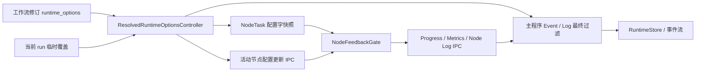

# FlowWeaver RUNTIME-OPTIONS-2：节点反馈、真实日志与动态切换执行计划

> 文档状态：已执行完成
> 编写时间：2026-07-11 18:21 +08:00
> 对账基线：`main` / `origin/main`，提交 `87bdbdf62933b1a63397ac623555aaeb7c3e7bca`
> 前置依据：`FlowWeaver_RUNTIME-OPTIONS-0_配置字与调试开关边界方案.md`
> 前置实现：`FlowWeaver_RUNTIME-OPTIONS-1_配置字执行计划.md`
> 本阶段目标：完成节点发送前过滤、主程序与节点真实日志等级、当前 run 动态配置字覆盖
> 完成日期：2026-07-11

## 1. 立项时执行结论（历史基线）

本计划启动时，配置字已经可以在 workflow process 内限制 runtime event、progress、metrics、summary、error 和诊断 payload，并识别出三个需要在 2A 至 2I 闭环的明确缺口：

1. 节点执行器仍可能先生成并发送反馈，主程序收到后才丢弃。
2. `telemetry.log_level` 已有模型、预设和 UI，但尚无真实的 workflow 日志通道。
3. 配置字在运行启动时被解析为静态字典，当前 run 无法在运行中切换。

三个缺口存在依赖关系，推荐顺序为：

```text
节点任务携带静态配置字快照
-> 节点发送前反馈闸门
-> 主程序与节点结构化日志
-> 当前 run 临时覆盖持久化和 API
-> workflow process 动态配置控制器
-> 活动节点配置更新 IPC
-> Avalonia 当前 run 配置入口
```

本计划不要求逐个修改 41 个默认节点。高频反馈过滤应收口在 node executor 和 workflow process 的统一边界；只有真正需要写运行日志的节点才逐步改用统一 logger。

如果当前只要求减少后台数据库事件和日志占用，可在完成 RUNTIME-OPTIONS-2D 后形成“静态降噪”里程碑。运行中动态切换属于独立增强，不应阻塞静态工作流配置字和单节点覆盖投入使用。

## 2. 当前代码事实

### 2.1 已完成

- `WorkflowDefinitionModel.runtime_options` 已支持工作流整体配置和节点覆盖。
- 已有 `normal`、`background_fast`、`diagnostic` 预设。
- `resolve_runtime_options_by_node()` 已生成每个节点的 resolved options。
- `RuntimeOptionsEventSink` 已按节点和工作流过滤 runtime events。
- `NodeTaskManager` 已按节点限制 progress 开关和 progress 间隔。
- `NodeTaskResultModel.summary` 和 `error` 已在主程序接收端过滤、脱敏和限长。
- 普通运行、`preview_to_node` 和手动后台运行共用 workflow process。
- 节点子进程把任务执行放入 worker thread，IPC 主循环可以继续接收取消等控制消息。

### 2.2 当前缺口

- `NodeTaskModel` 没有 resolved runtime options 字段。
- `NodeTaskRecord` 没有配置字快照和配置版本字段。
- node executor 在构造 progress IPC 前不知道配置字。
- `IPCMessageType` 没有节点日志和配置字更新消息。
- `EventType` 没有 workflow / node 结构化日志事件。
- `RuntimeOptionsEventSink` 在构造时复制静态 options 字典。
- `NodeTaskManager` 在构造时复制静态 options 字典。
- `WorkflowRunRecord` 没有当前 run 临时覆盖或应用版本。
- Avalonia 运行详情只能读取工作流修订中的配置摘要，不能编辑当前 run 覆盖。

### 2.3 当前日志事实

当前后端没有统一使用 `logging.getLogger()`、`setLevel()` 或 run-scoped logging handler。`log_level` 只参与模型、预设、合并和 UI 展示，没有真实消费点。

节点进程的 stderr 当前主要用于 IPC 输入错误和进程级异常。该通道属于基础设施安全输出，不应直接受工作流配置字关闭。

## 3. 硬边界

### 3.1 配置字只控制运行反馈

配置字可以控制：

- runtime event 数量和等级。
- progress 是否发送和发送间隔。
- workflow / node 运行日志等级。
- metrics、summary、error 和诊断 payload 的记录强度。
- payload 限长和字段脱敏。

配置字不得控制：

- 节点成功、失败、取消和超时状态。
- `output_refs`、`output_slot_bindings` 和 TableRef 身份。
- 当前表、内存表、运行内 SQL 表和外部写入结果。
- 文件改名、插件调用和其他节点业务副作用。
- heartbeat、任务完成消息和必要失败信息。

### 3.2 节点过滤和主程序过滤同时保留

节点侧过滤用于减少：

- IPC 消息数量。
- JSON 序列化成本。
- workflow process 接收和分派成本。
- 节点高频日志与 progress 带来的后台占用。

主程序侧过滤仍是最终权威边界，用于：

- 防止旧节点、插件或异常执行器绕过节点过滤。
- 过滤主程序自己产生的调度事件和日志。
- 统一执行脱敏、payload 限长和关键事件保护。
- 处理当前 run 动态覆盖尚未送达节点时的时间窗口。

### 3.3 日志等级只作用于 run-scoped 日志

以下日志不受工作流配置字控制：

- EngineHost 启动和关闭。
- 数据库损坏、迁移失败和 supervisor 安全错误。
- IPC 协议损坏和进程无法启动。
- 无法关联 `workflow_run_id` 的系统日志。

以下日志受配置字控制：

- 带 `workflow_run_id` 的 workflow process 运行日志。
- 带 `node_run_id` / `task_id` 的节点运行日志。
- 节点业务诊断和插件包装器捕获的可分类日志。

不能通过修改全局 root logger 等级实现工作流配置字。多个 workflow run 可以同时使用不同日志等级，必须按运行上下文过滤。

### 3.4 动态切换只覆盖当前 run

运行中切换：

- 不修改 `WorkflowRevision.definition`。
- 不修改工作流草稿，也不触发草稿 dirty 状态。
- 不影响同一工作流的其他 run。
- 不回溯删除已经持久化的事件和日志。
- 从新版本被主程序或节点确认应用后生效。
- 当前 run 结束后自动失效。

### 3.5 配置字字段集合封闭

本阶段不为配置字预留通用扩展能力，不增加动态 schema、插件命名空间、`extra` 字典或自定义字段透传。

RUNTIME-OPTIONS-2 只管理当前已经明确需要控制的运行反馈：

- `log_level`
- `event_level`
- `event_rate_limit_per_second`
- `progress_enabled`
- `progress_interval_seconds`
- `capture_error_context`
- `include_metrics`
- `payload_byte_limit`
- `redact_columns`
- `mask_policy`

边界说明：

- `profile` 只是以上固定字段的预设入口，不作为节点协议中的独立能力。
- `version` 和 `strict_validation` 只服务工作流配置保存与校验，不下发给节点。
- `ttl_seconds` 保持旧工作流 JSON 兼容，但本阶段不实现清理任务，也不进入 current run 动态覆盖。
- 后续节点特有设置直接进入该节点的 `config_schema` 和业务 `config`。
- 节点特有设置不得借“配置字扩展”重新进入主程序运行反馈协议。
- 如未来出现新的全局运行反馈需求，必须重新立项评估，不在当前模型中提前占位。

## 4. 目标架构



目标行为：

```text
节点产生反馈
-> NodeFeedbackGate 按当前 task 配置字预过滤
-> 允许的反馈通过 IPC
-> workflow process 按当前 run 配置再次过滤
-> 允许的事件和日志写入 RuntimeStore 并推送 UI
```

## 5. 协议与模型方案

### 5.1 固定运行反馈协议模型

建议新增：

```text
src/flowweaver/protocols/runtime_feedback.py
```

工作流可编辑配置模型继续保留在 `workflow/definition.py`。协议层只增加节点与主程序实际消费的固定传输模型：

- `ResolvedRuntimeFeedbackPolicyModel`
- `RuntimeFeedbackPolicyOverrideModel`

`ResolvedRuntimeFeedbackPolicyModel` 只包含 3.5 节列出的十个反馈字段，不包含 profile、版本、严格校验、TTL、UI 状态或节点业务设置。

`workflow/runtime_options.py` 负责把工作流配置和节点覆盖解析为固定传输策略。`protocols/node_task.py` 只依赖该传输策略，不反向依赖 workflow definition，也不直接携带完整可编辑配置模型。

第一版模型保持封闭，不提供任意字典扩展点。

### 5.2 NodeTask 配置字快照

`NodeTaskModel` 新增：

```python
runtime_feedback_policy: ResolvedRuntimeFeedbackPolicyModel | None = None
runtime_options_version: int = 0
```

语义：

- `runtime_feedback_policy` 是已经合并完成的节点最终反馈策略，不是覆盖层。
- `runtime_options_version=0` 表示只使用工作流修订启动快照。
- 大于 0 表示当前 run 临时覆盖版本。
- 字段独立于节点业务 `config`。
- 旧任务记录缺少字段时按 current-compatible 默认值处理。

需要给 `node_tasks` 增加：

```text
runtime_feedback_policy_json TEXT NULL
runtime_options_version INTEGER NOT NULL DEFAULT 0
```

NodeTask 配置字必须持久化，不能只放入提交 IPC。恢复、重试、超时和任务结果校验都需要知道任务实际使用的配置版本。

### 5.3 当前 run 临时覆盖模型

新增协议模型：

```python
class WorkflowRunRuntimeOptionsOverlayModel(StrictModel):
    workflow: RuntimeFeedbackPolicyOverrideModel | None = None
    node_overrides: dict[str, RuntimeFeedbackPolicyOverrideModel] = Field(default_factory=dict)
```

current run overlay 只能覆盖固定运行反馈字段，不能携带 profile、strict validation、TTL 或任意节点业务参数。

合并顺序固定为：

```text
system defaults
-> workflow revision workflow options
-> workflow revision node override
-> current run workflow override
-> current run node override
```

这样 current run 的工作流覆盖可以紧急降低所有节点反馈，current run 的节点覆盖仍可为某个节点保留诊断级别。

### 5.4 配置版本

每次替换 current run overlay：

- `requested_version` 加 1。
- API 返回新版本但不直接承诺节点已应用。
- workflow process 更新内存 controller 后写入 `applied_version`。
- 新任务直接携带 `applied_version`。
- 活动任务收到更新并确认后，更新该任务记录的 `runtime_options_version`。
- 小于当前版本的重复或乱序消息必须忽略。

## 6. 反馈过滤矩阵

| 反馈类型 | 节点侧预过滤 | 主程序最终过滤 | 不允许过滤 |
| --- | --- | --- | --- |
| heartbeat | 否 | 否 | 必须保留 |
| task accepted | 否 | 否 | 必须保留 |
| progress | 是 | 是 | 否 |
| metrics | 是 | 是 | 否 |
| node log | 是 | 是 | ERROR 仍需保留最小错误信息 |
| workflow log | 不适用 | 是 | 系统级错误不走配置字 |
| task result summary | 第一版不在节点侧裁剪 | 是 | 结果状态和引用必须保留 |
| task result error | 可后续预裁剪 | 是 | 错误码和必要消息必须保留 |
| task completed / failed | 否 | 否 | 必须保留 |
| workflow / node 关键生命周期事件 | 不适用 | 不过滤 | 必须保留 |

第一版节点侧优先过滤高频 progress、metrics 和 node log。每个任务只有一个最终 result，先继续由主程序统一裁剪，避免过早复制两套复杂结果清理逻辑。

## 7. 真实日志方案

### 7.1 结构化日志协议

新增：

```text
IPCMessageType.NODE_TASK_LOG
EventType.WORKFLOW_LOG
EventType.NODE_LOG
```

建议日志 payload：

```json
{
  "level": "INFO",
  "message": "loaded input table",
  "logger_name": "flowweaver.nodes.filter",
  "node_instance_id": "filter_001",
  "task_id": "task_001",
  "context": {
    "row_count": 1200
  }
}
```

约束：

- `message` 必须是短文本。
- 结构化数据放入 `context`。
- `context` 继续受 metrics、脱敏和 payload byte limit 控制。
- 日志不得携带整表 rows、二进制内容或未截断的外部程序输出。
- `log_level` 和 `event_level` 分别控制日志与普通 runtime event，不能互相替代。

### 7.2 主程序日志入口

建议新增：

```text
src/flowweaver/workflow_process/runtime_logger.py
```

提供 run-scoped `WorkflowRuntimeLogger`：

- 构造时绑定 `workflow_run_id`、`process_id` 和配置 controller。
- 通过 `RuntimeEventSink` 写出 `WORKFLOW_LOG`。
- 每条日志按当前 controller 读取等级。
- 不修改 Python root logger。
- 主程序必要失败仍使用不可过滤的生命周期事件和系统日志。

### 7.3 节点日志入口

建议新增：

```text
src/flowweaver/node_executor/runtime_logger.py
src/flowweaver/node_executor/runtime_feedback_gate.py
```

提供 task-scoped `NodeTaskLogger`：

- 绑定 `task_id`、`node_run_id`、`node_instance_id`。
- 每次写日志时读取该 task 的最新配置 controller。
- 低于 `log_level` 的日志不创建 IPC envelope。
- 允许的日志通过 `NODE_TASK_LOG` 发送。
- 节点不得用 `print()` 代替运行日志。

外部程序节点：

- 可由包装器捕获 stdout/stderr，并按行数、字节数和等级映射限制。
- 无结构化等级时，stdout 默认按 INFO，stderr 默认按 WARN 或 ERROR。
- 无法阻止第三方程序自己产生输出，只能减少捕获、转发和持久化。
- 外部程序若支持控制协议，可在后续把动态 log level 继续下发给外部程序本体。

## 8. 当前 run 覆盖存储与 API

### 8.1 数据库记录

建议新增表：

```text
workflow_run_runtime_options
```

字段：

| 字段 | 说明 |
| --- | --- |
| `workflow_run_id` | 主键并关联当前 run |
| `requested_version` | API 最新请求版本 |
| `applied_version` | workflow process 已采用版本 |
| `overlay_json` | 当前 run 完整临时覆盖 |
| `requested_at` | API 接受时间 |
| `applied_at` | workflow process 应用时间 |

无记录等价于：

```text
requested_version = 0
applied_version = 0
overlay = empty
```

活动节点实际应用版本继续记录在 `NodeTaskRecord.runtime_options_version`，不再建立第二张节点应用表。

### 8.2 API

新增：

```text
GET /api/v1/runs/{workflow_run_id}/runtime-options
PUT /api/v1/runs/{workflow_run_id}/runtime-options
```

PUT 请求使用完整替换语义，避免 PATCH 中 `null`、缺失字段和恢复默认值的歧义：

```json
{
  "expected_version": 2,
  "overlay": {
    "workflow": {
      "telemetry": {
        "log_level": "WARN",
        "progress_enabled": false
      }
    },
    "node_overrides": {
      "node_001": {
        "telemetry": {
          "log_level": "DEBUG"
        }
      }
    }
  }
}
```

清空 overlay 也通过 PUT 空对象完成。

API 规则：

- 仅允许 `PENDING` 或 `RUNNING` 的 run 更新。
- `CANCEL_REQUESTED` 和终态 run 返回 409。
- `expected_version` 不匹配返回 409，并返回当前版本。
- 节点覆盖键必须属于当前 run 的工作流修订。
- API 校验通过后只更新 requested version，不假装已经应用。
- API 不修改 workflow revision 和 workflow definition。
- GET 返回保存配置、current run overlay、effective summary、requested/applied version 和活动任务版本摘要。

## 9. 动态应用机制

### 9.1 共享配置控制器

建议新增：

```text
src/flowweaver/workflow_process/runtime_options_controller.py
```

`ResolvedRuntimeOptionsController` 职责：

- 持有当前 run 的 revision options、run overlay 和版本。
- 预计算 workflow options 与按节点 resolved options。
- 通过线程安全快照一次性替换整份配置。
- 事件和日志读取只访问内存，不访问数据库。
- 暴露 `workflow_options()`、`options_for_node()` 和 `version`。

改造：

- `RuntimeOptionsEventSink` 改为读取 controller，不再复制字典。
- `NodeTaskManager` 改为读取同一个 controller。
- 新建 NodeTask 时写入当前节点配置快照和 controller version。
- 现有静态构造入口保留兼容适配，便于小步迁移测试。

### 9.2 workflow process 轮询

第一版复用现有 workflow process 心跳循环：

- 使用 monotonic deadline 独立控制 run runtime options 轮询，默认最小间隔 2 秒。
- 繁忙调度循环即使连续执行多个 cycle，也不能在 deadline 前重复查询。
- 版本不变时不解析 JSON、不重建节点映射。
- 版本变化时校验、合并并原子替换 controller。
- 主程序应用后更新 `applied_version`。
- 产生不可过滤的 `RUNTIME_OPTIONS_APPLIED` 事件。
- 更新失败时保留上一版本，记录不可过滤警告，但不改变工作流业务状态。

这个方案的生效延迟上限约为一个 workflow process heartbeat interval。只有确认需要更低延迟时，才增加 EngineHost 到 workflow process 的独立控制通道。

### 9.3 活动节点更新

新增 IPC：

```text
NODE_TASK_RUNTIME_OPTIONS_UPDATE
NODE_TASK_RUNTIME_OPTIONS_APPLIED
```

更新 payload：

```json
{
  "task_id": "task_001",
  "runtime_options_version": 3,
  "runtime_feedback_policy": {}
}
```

应用规则：

- workflow process 遍历 execution pool 的 in-flight tasks。
- 对低于 controller version 的任务发送最新完整快照，不发送增量 patch。
- node executor 按 task 保存线程安全配置 controller。
- 小于等于当前 task version 的消息幂等忽略。
- 应用成功后发送 ACK。
- workflow process 收到 ACK 后更新 NodeTaskRecord 的配置和版本。
- 节点完成与配置更新竞态时，以任务终态优先，不回退结果。
- 不支持动态更新的执行器继续由主程序最终过滤，并在运行详情标记 `unsupported`。

当前 node executor 已经在 worker thread 中执行任务，stdin 主循环仍可接收控制消息，因此可以沿用现有 cancel request 的控制模式。

### 9.4 生效语义

动态更新的准确承诺：

- 主程序：`applied_version` 更新后生效。
- 新任务：创建时直接使用最新 `applied_version`。
- 活动任务：收到 `NODE_TASK_RUNTIME_OPTIONS_APPLIED` 后生效。
- 已经发送或持久化的事件：不回溯处理。
- 外部程序本体：只有支持自身控制协议时才保证内部 logger 同步；否则只保证包装器转发过滤。

## 10. Avalonia 方案

现有工作流配置字窗口继续编辑工作流修订，不承担动态 run 覆盖。

新增独立“本次运行反馈”入口，建议放在运行监视和后台运行详情中：

- 只在选择活动 run 时可编辑。
- 显示工作流修订配置摘要。
- 显示 current run 临时覆盖。
- 显示 requested version、applied version 和节点应用状态。
- 支持工作流级临时覆盖。
- 支持选择节点并设置 current run 节点覆盖。
- 支持清空 current run overlay。
- 不修改 `WorkflowDefinitionDraftJson`。
- 不把工作流草稿标记为 dirty。
- 不提供第二套业务配置编辑入口。

建议新增：

```text
Avalonia_UI/Models/WorkflowRunRuntimeOptions*.cs
Avalonia_UI/Services/WorkflowRunRuntimeOptionsService.cs
Avalonia_UI/ViewModels/WorkflowRunRuntimeOptionsViewModel.cs
Avalonia_UI/Views/Windows/WorkflowRunRuntimeOptionsWindow.axaml
```

根 `MainWindowViewModel` 只保留选择 run 和打开窗口的桥接，不继续堆入动态配置字段和请求状态。

## 11. 可执行实施批次

### RUNTIME-OPTIONS-2A：固定运行反馈协议模型

目标：建立封闭的运行反馈传输模型，把可编辑工作流配置与 NodeTask 协议隔离，不改变运行行为。

主要文件：

```text
src/flowweaver/protocols/runtime_feedback.py                 新增
src/flowweaver/workflow/runtime_options.py                  修改
tests/unit/test_workflow_process_dag.py                      修改
tests/unit/test_runtime_options.py                           修改
```

任务：

- 新增固定 `ResolvedRuntimeFeedbackPolicyModel` 和固定 override 模型。
- 增加 workflow runtime options 到 transport policy 的显式 mapper。
- 不移动完整 `RuntimeOptionsModel`，不让 NodeTask 依赖 workflow definition。
- 不增加动态字段、插件命名空间或任意字典。
- 确认工作流 JSON 格式、默认值和校验结果不变。
- 不修改数据库和 UI。

验收：

- 旧 workflow JSON round-trip 不变。
- transport policy 只包含十个明确反馈字段。
- runtime options 单元测试全部通过。
- 不产生业务行为差异。

提交信息：

```text
后端: 固定运行反馈协议边界
```

### RUNTIME-OPTIONS-2B：NodeTask 静态配置快照与持久化

目标：节点任务携带启动时的 resolved options，并可恢复和重试。

主要文件：

```text
src/flowweaver/protocols/node_task.py                        修改
src/flowweaver/engine/db_node_task_models.py                 修改
src/flowweaver/engine/runtime_node_task_record_mappers.py    修改
src/flowweaver/workflow/runtime_feedback_policy.py           新增
src/flowweaver/workflow_process/node_task_lifecycle.py       修改
src/flowweaver/workflow_process/node_tasks.py                修改
migrations/versions/20260711_0021_node_task_runtime_feedback.py 新增
tests/unit/test_protocol_serialization.py                    修改
tests/integration/test_runtime_store.py                      修改
tests/integration/test_node_task_manager.py                  修改
```

任务：

- 增加 NodeTask 固定反馈策略和配置版本字段。
- 增加数据库迁移和 mapper。
- 创建任务时写入该节点 resolved options。
- 增加最小 `RuntimeFeedbackPolicyProvider` 接口和静态实现。
- `NodeTaskManager` 依赖 provider 接口，不依赖未来动态 controller 具体类型。
- 旧记录缺失字段时使用兼容默认值。
- 不把配置字写进 `config_json`。

验收：

- NodeTask 协议和数据库 round-trip 一致。
- 重试任务保留正确配置快照。
- 默认配置下节点行为不变。

提交信息：

```text
后端: 持久化节点运行配置字快照
```

### RUNTIME-OPTIONS-2C：节点发送前反馈过滤

目标：高频 progress 和 metrics 在节点进程内先过滤。

主要文件：

```text
src/flowweaver/node_executor/runtime_feedback_gate.py        新增
src/flowweaver/node_executor/process_state.py                修改
src/flowweaver/node_executor/process_runtime.py              修改
src/flowweaver/node_executor/process_envelopes.py            修改
tests/unit/test_node_executor_process.py                     修改或新增
tests/unit/test_node_executor_ipc_client.py                  修改
```

任务：

- 为每个 task 建立反馈 gate。
- 在 progress envelope 构造前检查开关和间隔。
- `include_metrics=false` 时不序列化 metrics。
- heartbeat、accepted、completed、failed 不进入过滤逻辑。
- 主程序现有过滤保持不变。

验收：

- `background_fast` 不产生 progress IPC。
- progress interval 在节点侧限频。
- heartbeat 和最终结果始终到达。
- bypass 或旧执行器的 progress 仍会被主程序过滤。

提交信息：

```text
节点: 增加运行反馈发送前过滤
```

### RUNTIME-OPTIONS-2D：主程序与节点真实日志等级

目标：让 `log_level` 控制真实 run-scoped 结构化日志。

主要文件：

```text
src/flowweaver/protocols/enums.py                            修改
src/flowweaver/protocols/ipc_messages.py                    修改
src/flowweaver/protocols/runtime_logs.py                     新增
src/flowweaver/workflow_process/runtime_logger.py            新增
src/flowweaver/node_executor/runtime_logger.py               新增
src/flowweaver/node_executor/process_runtime.py              修改
src/flowweaver/workflow/runtime_option_sanitization.py       修改
tests/unit/test_runtime_options.py                           修改
tests/unit/test_node_executor_ipc_client.py                  修改
tests/integration/test_workflow_process_main.py              修改
```

任务：

- 增加 workflow / node log 事件和 node log IPC。
- 增加等级比较和独立 log 过滤。
- 主程序与节点 logger 绑定 run / task 上下文。
- 复用现有脱敏和 payload 限长。
- 不修改 root logger 全局等级。
- 保留系统安全日志和关键失败事件。

验收：

- WARN 配置不记录 DEBUG / INFO run log。
- 单节点 DEBUG 覆盖不影响其他节点。
- 两个并行 run 的日志等级互不干扰。
- ERROR 最小错误信息始终保留。
- 日志不会携带整表或超限 payload。

提交信息：

```text
后端: 接通运行配置字日志等级
```

### RUNTIME-OPTIONS-2E：current run 覆盖存储与 API

目标：允许为当前活动 run 保存版本化临时覆盖，但暂不动态应用。

主要文件：

```text
src/flowweaver/engine/db_workflow_run_runtime_options.py     新增
src/flowweaver/engine/runtime_workflow_run_options_store.py  新增
src/flowweaver/engine/runtime_store.py                       修改
src/flowweaver/api/api_models.py                             修改
src/flowweaver/api/routes_run_runtime_options.py             新增
src/flowweaver/api/app.py                                    修改
migrations/versions/20260711_0022_workflow_run_runtime_options.py 新增
tests/integration/test_runtime_store.py                      修改
tests/integration/test_api.py                                修改
```

任务：

- 增加 run overlay 表、模型和 store。
- 增加 GET / PUT API。
- 使用 expected version 乐观并发。
- 校验 run 状态和节点实例 ID。
- 确认工作流修订完全不变。

验收：

- 新 run 无 overlay 时返回版本 0。
- PUT 后 requested version 递增。
- 版本冲突返回 409。
- 终态 run 拒绝修改。
- 清空 overlay 可恢复修订配置。

提交信息：

```text
后端: 增加运行中配置字覆盖接口
```

### RUNTIME-OPTIONS-2F：主程序动态配置控制器

目标：current run 覆盖开始影响主程序和新调度节点。

主要文件：

```text
src/flowweaver/workflow_process/runtime_options_controller.py 新增
src/flowweaver/workflow_process/process_runtime_options.py    修改
src/flowweaver/workflow_process/process_loop.py               修改
src/flowweaver/workflow_process/node_tasks.py                 修改
src/flowweaver/workflow/runtime_options_event_sink.py         修改
tests/unit/test_runtime_options.py                            修改
tests/integration/test_workflow_process_main.py               修改
```

任务：

- 建立共享 controller。
- event sink 和 task manager 改为动态读取。
- 心跳循环检测 requested version。
- 原子切换内存快照。
- 更新 applied version。
- 新任务携带最新版本。
- 增加不可过滤的配置应用事件。

验收：

- 修改 run overlay 后主程序事件过滤在一个 heartbeat 内变化。
- 更新后的新任务携带最新配置版本。
- 配置更新不改变工作流状态和输出。
- process 恢复后重新加载最新版本。
- 非法或损坏覆盖保留上一有效版本并给出明确错误。

提交信息：

```text
后端: 动态应用当前运行配置字
```

### RUNTIME-OPTIONS-2G：活动节点配置更新 IPC

目标：正在执行的节点无需重启即可更新反馈 gate 和日志等级。

主要文件：

```text
src/flowweaver/protocols/enums.py                            修改
src/flowweaver/protocols/ipc_messages.py                    修改
src/flowweaver/node_executor/base.py                         修改
src/flowweaver/node_executor/ipc_client_types.py             修改
src/flowweaver/node_executor/ipc_client_messages.py          修改
src/flowweaver/node_executor/ipc_client_local.py             修改
src/flowweaver/node_executor/ipc_client_subprocess.py        修改
src/flowweaver/node_executor/process_state.py                修改
src/flowweaver/node_executor/process_runtime.py              修改
src/flowweaver/workflow_process/executor_pool.py             修改
src/flowweaver/workflow_process/ipc_events.py                修改
tests/unit/test_node_executor_ipc_client.py                  修改
tests/integration/test_workflow_process_main.py              修改
```

任务：

- 增加 update / applied 消息。
- 增加可更新执行器协议或 capability。
- 向 in-flight tasks 推送最新完整快照。
- 节点 controller 原子更新并 ACK。
- ACK 后更新 NodeTaskRecord 版本。
- 处理任务完成、取消和更新竞态。
- 不支持能力时回退为主程序最终过滤。

验收：

- local 和 subprocess executor 都能更新。
- 长运行节点切换 progress / log level 后立即停止对应反馈。
- 乱序和重复版本幂等。
- 节点终态不会被迟到配置消息改写。
- 不支持动态更新的执行器不导致工作流失败。

提交信息：

```text
节点: 支持运行中反馈配置更新
```

### RUNTIME-OPTIONS-2H：Avalonia 当前 run 配置入口

目标：从运行详情安全编辑当前 run 临时覆盖。

主要文件：

```text
Avalonia_UI/Api/IEngineHostApiClient.cs                      修改
Avalonia_UI/Api/EngineHostApiClient.cs                       修改
Avalonia_UI/Api/EngineHostDtos.cs                            修改
Avalonia_UI/Models/WorkflowRunRuntimeOptions*.cs             新增
Avalonia_UI/Services/WorkflowRunRuntimeOptionsService.cs     新增
Avalonia_UI/ViewModels/WorkflowRunRuntimeOptionsViewModel.cs 新增
Avalonia_UI/Views/Windows/WorkflowRunRuntimeOptionsWindow.axaml 新增
Avalonia_UI/ViewModels/MainWindowViewModel.*.cs              仅桥接
Avalonia_UI/Localization/zh-Hans.json                        修改
Avalonia_UI/Localization/en-US.json                          修改
Avalonia_UI.Tests/*RuntimeOptions*.cs                        修改或新增
```

任务：

- 接入 GET / PUT API。
- 独立显示修订配置、run overlay 和 effective summary。
- 显示 requested / applied version。
- 显示活动节点是否已经应用。
- 支持清空 current run overlay。
- 终态 run 只读。
- 不修改 workflow draft。

验收：

- 活动普通、预览和后台 run 都可打开入口。
- 修改 current run 不产生 workflow revision。
- 版本冲突可刷新并重新提交。
- 主程序已应用、节点待确认和全部应用状态可区分。
- 终态 run 不显示可执行保存命令。

提交信息：

```text
前端: 增加运行中配置字控制
```

### RUNTIME-OPTIONS-2I：端到端验收与文档收口

目标：证明三个缺口全部闭环，并更新旧状态文档。

任务：

- 增加普通、预览和后台运行集成场景。
- 对比默认配置和 background_fast 的 IPC / runtime event 数量。
- 验证主程序与节点日志等级。
- 验证 current run 动态切换和恢复。
- 验证业务输出与节点状态不受影响。
- 更新 RUNTIME-OPTIONS-0、1 的状态说明，不改原设计边界。
- 在当前阶段判断文档中记录完成版本和验证结果。

提交信息：

```text
文档: 收口运行配置字动态执行状态
```

## 12. 验证矩阵

### 12.1 后端定向测试

```powershell
.\python312\python.exe -m pytest tests\unit\test_runtime_options.py tests\unit\test_protocol_serialization.py tests\unit\test_node_executor_ipc_client.py -q
.\python312\python.exe -m pytest tests\integration\test_runtime_store.py tests\integration\test_node_task_manager.py -q
.\python312\python.exe -m pytest tests\integration\test_workflow_process_main.py tests\integration\test_api.py tests\integration\test_runtime_options_end_to_end.py -q
```

### 12.2 后端静态检查

```powershell
.\python312\python.exe -m ruff check src tests migrations
.\python312\python.exe -m mypy src\flowweaver
```

### 12.3 Avalonia 验证

```powershell
dotnet test Avalonia_UI.Tests\Avalonia_UI.Tests.csproj --filter "RuntimeOptions|WorkflowRunRuntimeOptions|EngineHostApiClient|MainWindowViewModelWorkflow|MainWindowViewModelRuns"
dotnet test Avalonia_UI.Tests\Avalonia_UI.Tests.csproj
```

### 12.4 必测场景

| 场景 | 期望 |
| --- | --- |
| 旧工作流无配置字 | 行为与当前兼容 |
| background_fast 静态运行 | 节点不发送 progress，数据库事件减少 |
| 单节点 diagnostic 覆盖 | 只有目标节点保留 DEBUG 和完整诊断 |
| 主程序 WARN | workflow DEBUG / INFO 日志不入库 |
| 节点 WARN | 节点 DEBUG / INFO 不创建 IPC |
| 两个并行 run 使用不同等级 | 互不干扰 |
| 运行中关闭 progress | 主程序先应用，活动节点 ACK 后停止发送 |
| 运行中提高单节点日志等级 | 只影响该 run 的目标节点 |
| 重启 workflow process | 恢复最新 run overlay 和版本 |
| 更新与节点完成竞态 | 节点终态正确，配置消息不覆盖结果 |
| 清空 run overlay | 回到工作流修订配置 |
| 动态修改配置字 | output refs、表数据和业务状态完全一致 |

### 12.5 人工验收

1. 创建包含长运行节点的工作流，并保存 normal 配置。
2. 启动普通运行，确认 progress 和 INFO 日志可见。
3. 在运行详情把 current run 改为 background_fast。
4. 确认 requested version 先变化，随后 applied version 追平。
5. 确认活动节点应用版本追平后停止 progress 和 INFO 日志。
6. 给单个节点临时改为 diagnostic，确认只有该节点恢复 DEBUG。
7. 确认节点最终结果、输出表和工作流状态不变。
8. 对手动后台 run 重复上述操作。
9. 清空 current run overlay，确认回到修订配置。
10. 保存的新工作流修订内容保持不变。

## 13. 性能边界

- event sink 和 node feedback gate 只读内存快照，不在每条事件上查询数据库。
- workflow process 使用 monotonic clock 独立限频查询 overlay version，默认最小间隔 2 秒，不能按调度循环次数查询。
- 版本不变时不反序列化 JSON。
- controller 使用整份不可变快照替换，不逐字段加锁。
- 节点过滤发生在 JSON envelope 创建前。
- node log 和外部输出必须有 payload byte limit。
- node log 复用现有 `event_rate_limit_per_second` 约束非关键日志，不新增日志限频配置字。
- 短时间内完全相同的重复日志优先聚合计数，不重复写入完整 payload。
- 日志接入后评估 `(workflow_run_id, sequence_number)` 和 `(node_run_id, sequence_number)` 复合索引。
- 记录单个 NodeTask 反馈策略快照大小和高轮次循环数据库增量，超过可接受范围后再评估版本引用，不提前复杂化。
- 动态更新只向当前 in-flight tasks 发送一次最新版本。
- 不为每个 progress 建立配置变更审计记录。
- 配置变化频率按人工操作设计，不支持高频自动抖动。

## 14. 耦合边界

- `protocols` 只保存协议和数据模型，不依赖 workflow process。
- 工作流可编辑 `RuntimeOptionsModel` 与固定 `ResolvedRuntimeFeedbackPolicyModel` 分离。
- `RuntimeFeedbackPolicyProvider` 是 event sink、NodeTaskManager 和动态 controller 之间的最小接口。
- workflow definition 保存静态配置，WorkflowRun 保存临时覆盖。
- NodeTask 保存 resolved snapshot，不保存业务覆盖语义。
- node executor 只执行反馈 gate，不查询 RuntimeStore。
- workflow process 是 run overlay 的应用者和最终过滤者。
- API 只校验和持久化 requested version，不直接修改进程内对象。
- Avalonia current run 编辑器不复用 workflow draft patcher。
- 默认节点不重复实现配置字判断。
- 插件和外部程序通过统一 logger / wrapper 接入，不直接写 RuntimeStore。
- 配置字不提供通用扩展字段；后续节点设置归节点 `config_schema` 和业务 `config`。

## 15. 风险与停止条件

| 风险 | 控制方式 |
| --- | --- |
| 配置字污染节点业务 config | 使用独立 NodeTask 字段和数据库列 |
| 全局 logger 串扰并行 run | 使用 run-scoped handler / filter |
| 节点过滤后丢失必要状态 | heartbeat、terminal result 和关键事件不可过滤 |
| API 更新但进程未应用 | 区分 requested / applied version |
| 活动节点部分应用 | 记录每个 NodeTask 的应用版本并展示 |
| 乱序 IPC 回退配置 | 只接受更高版本 |
| 动态更新改变业务结果 | 配置模型只含反馈字段，补输出一致性测试 |
| 旧执行器不支持更新 | capability 检测，回退主程序过滤 |
| 外部程序日志无法源头关闭 | 包装器限量过滤，协议支持后再下发 |
| workflow process 恢复丢配置 | overlay 持久化并在启动时重新加载 |

出现以下情况必须停止当前批次，不进入提交：

- 配置字被写入节点业务 `config`。
- 为动态配置修改了 workflow revision。
- 关闭 progress 导致 heartbeat、超时或取消失效。
- log level 通过修改全局 root logger 实现。
- 配置更新失败导致 workflow run 被错误标记失败。
- 动态更新改变 `output_refs`、表数据或节点终态。
- API 把 requested version 误报为已应用。
- 不支持新 IPC 的执行器没有回退路径。
- 同一个批次同时修改静态配置、动态协议和 UI，无法独立回退。

## 16. 回滚策略

| 批次 | 回滚方式 |
| --- | --- |
| 2A | 保留协议模型文件，恢复原导入路径 |
| 2B | 新字段保持可空和默认 0，运行时暂不消费 |
| 2C | 关闭节点 gate，继续使用主程序最终过滤 |
| 2D | 停止产生结构化 log 事件，保留模型和枚举 |
| 2E | 隐藏 API，数据库 overlay 记录不参与执行 |
| 2F | controller 固定在启动快照，不轮询新版本 |
| 2G | 停止发送 update IPC，活动节点继续静态快照 |
| 2H | 隐藏 current run 编辑入口，保留只读摘要 |

任何回滚都不得改变已运行工作流的业务状态和输出记录。

## 17. 里程碑与完成标准

### 里程碑 M1：静态低噪音闭环

完成 2A 至 2D：

- NodeTask 携带固定运行反馈策略。
- 节点发送前过滤生效。
- 主程序和节点真实 log level 生效。
- background_fast 的 IPC 和数据库事件数量明显下降。

M1 已经满足当前“减少后台事件和日志占用”的主要目标，可独立发布。

### 里程碑 M2：主程序动态切换

完成 2E 至 2F：

- current run overlay 可保存。
- 主程序和新任务在运行中切换。
- workflow revision 保持不可变。

### 里程碑 M3：活动节点动态切换

完成 2G 至 2H：

- 长运行节点可以接收配置更新并确认。
- Avalonia 可查看 requested / applied / node version。
- 普通、预览和后台 run 使用同一套入口和语义。

### 最终完成

完成 2I，并同时满足：

- 后端定向测试、全量相关测试、Ruff 和 mypy 通过。
- Avalonia 定向和全量测试通过。
- 十步人工验收完成并有记录。
- 默认和动态配置均不改变业务状态及数据输出。
- 旧工作流和旧任务记录兼容。
- 文档状态与当前代码一致。

## 18. 执行与提交规则

### 18.1 性能与低耦合推荐执行顺序

正式实施前先记录当前基线：

- normal 和 background_fast 各运行一次同一长任务工作流。
- 记录节点 progress IPC 数量。
- 记录 runtime event 行数和 payload 总字节数。
- 记录运行耗时和 `runtime_events` 数据库增长。
- 记录关键生命周期事件集合和最终业务输出。

推荐按以下阶段推进：

| 顺序 | 执行内容 | 进入下一阶段的条件 |
| --- | --- | --- |
| 1 | 2A 固定 transport policy，不移动完整可编辑配置模型 | 固定十字段映射和兼容测试通过 |
| 2 | 2B 持久化静态策略，并先建立 provider 接口 | NodeTask、数据库和重试 round-trip 通过 |
| 3 | 2C 节点发送前过滤 | background_fast 的 progress IPC 为 0，heartbeat 和结果不丢失 |
| 4 | 2D 接通真实日志 | 并行 run 日志等级不串扰，日志受现有限频和 payload 上限约束 |
| 5 | 执行 M1 性能闸门 | 静态降噪收益确认后才进入动态阶段 |
| 6 | 2E 保存 current run overlay | API 版本冲突、终态拒绝和 revision 不变测试通过 |
| 7 | 2F 只动态影响主程序和新任务 | monotonic 轮询限频生效，恢复测试通过 |
| 8 | 执行 M2 稳定性闸门 | 主程序动态切换稳定后才修改活动节点 IPC |
| 9 | 2G 更新活动节点，2H 再接 Avalonia | local / subprocess ACK、竞态和回退测试通过 |
| 10 | 2I 端到端验收和文档收口 | 自动化与人工验收全部完成 |

M1 性能闸门：

- `background_fast` 不产生 progress IPC。
- 关键生命周期事件数量和类型与 normal 保持一致。
- normal 默认配置增加 feedback gate 后，端到端运行耗时回归目标不超过 5%。
- background_fast 的 runtime event 行数和 payload 总字节数低于当前基线。
- event sink 和 node feedback gate 的单条反馈路径不访问数据库。
- 未增加任何预留型配置字字段。

M2 稳定性闸门：

- overlay version 查询频率不高于每个活动 run 每 2 秒一次。
- 版本未变化时不解析 overlay JSON。
- 动态更新不修改 workflow revision、节点业务 config、业务输出或终态。
- workflow process 恢复后可以重新应用最新有效版本。

2G 不得与 2F 合并实施。先证明主程序和新任务动态切换稳定，再增加活动节点控制消息，可以把数据库轮询问题和节点 IPC 竞态分开定位。

### 18.2 批次严格顺序

严格按以下顺序执行：

```text
2A -> 2B -> 2C -> 2D -> 2E -> 2F -> 2G -> 2H -> 2I
```

每个批次：

1. 开始前检查本地 HEAD、远端和工作区状态。
2. 只修改该批次列出的职责范围。
3. 先运行该批次定向测试。
4. 再运行 `git diff --check`。
5. 使用对应中文提交信息独立提交。
6. 推送后再进入下一批次。
7. 遇到当前代码与本文不一致时，先只读核对，再更新计划，不强行套用旧文件列表。
8. 不得以“后续扩展”为理由增加本计划未列出的配置字字段。

不得把 2A 至 2D 与动态切换批次合并成一个大提交。M1、M2、M3 都必须可以独立停止、验证和回滚。

## 19. 完成记录（2026-07-11）

### 19.1 批次提交

| 批次 | 提交 | 结果 |
| --- | --- | --- |
| 计划文档 | `5c71c69d` | 执行边界和顺序固定 |
| 2A | `50b1b594` | 固定运行反馈协议边界 |
| 2B | `98f21f19` | NodeTask 策略快照持久化 |
| 2C | `297f106a` | 节点发送前过滤 |
| 2D | `e5ff58e6` | 主程序与节点真实日志等级 |
| 2E | `efc78922` | current run overlay 存储与 API |
| 2F | `a817c1ff` | 主程序动态 controller |
| 2G | `8fbe2d96` | local / subprocess 活动节点更新与 ACK |
| 2H | `a242672b` | Avalonia current run 独立编辑入口 |
| 2I | 本次文档收口提交 | 端到端验收、状态文档和完成记录 |

所有批次均按 2A 至 2I 顺序执行，完成测试后使用独立中文提交并推送。

### 19.2 三个缺口的最终状态

| 原缺口 | 最终状态 | 主要证据 |
| --- | --- | --- |
| 节点侧发送前过滤 | 已落实 | `NodeTaskRuntimeFeedbackGate` 在 progress/log envelope 创建前过滤；normal/background_fast IPC 对比通过 |
| 主程序及节点真实日志等级 | 已落实 | workflow/node run-scoped logger、节点发送 gate 和主程序最终 event sink 均按等级过滤；动态 WARN -> diagnostic 测试通过 |
| 运行中的配置字动态切换 | 已落实 | current run overlay、requested/applied version、controller、活动节点 update/applied IPC、ACK 持久化和 Avalonia 入口全部贯通 |

配置字只影响反馈、日志和诊断数据，不改变节点业务 `config`、工作流 DAG、output refs、表数据或节点终态。

### 19.3 自动化验证结果

| 验证组 | 结果 |
| --- | --- |
| runtime options / protocol / node executor 单元测试 | 40 通过 |
| runtime store / node task manager 集成测试 | 81 通过 |
| workflow process / API / runtime options 端到端测试 | 90 通过 |
| 后端本阶段验证矩阵合计 | 211 通过 |
| Ruff | `src tests migrations` 通过 |
| mypy | 483 个源码文件通过 |
| Avalonia 文档过滤集 | 177 通过 |
| Avalonia 全量 | 545 通过 |
| `git diff --check` | 通过 |

全解决方案 `dotnet format --verify-no-changes` 仍会报告本阶段未修改文件中的既有空白问题；2H 新增和核心修改文件的定向 format 验证通过，本阶段没有顺带改动这些无关文件。

### 19.4 降噪实测

使用同一单节点 `DelayTestNode`、持续 0.04 秒、heartbeat/progress 间隔 0.005 秒，在本地真实 `RuntimeStore + LocalNodeExecutorIpcClient` 路径各运行一次：

| 指标 | normal | background_fast | 变化 |
| --- | ---: | ---: | ---: |
| 节点 IPC 总数 | 11 | 6 | 减少 45.5% |
| progress IPC | 5 | 0 | 减少 100% |
| runtime event 行数 | 10 | 5 | 减少 50% |
| runtime event payload 字节 | 1694 | 549 | 减少 67.6% |

两次运行的关键事件均保留 `WORKFLOW_STARTED`、`NODE_QUEUED`、`NODE_STARTED`、`NODE_FINISHED`、`WORKFLOW_FINISHED`，workflow/node 最终状态均为 `SUCCEEDED`，output refs 一致。该数字是短任务样本，用于证明过滤方向和相对收益，不作为跨机器固定性能承诺。

### 19.5 十步验收记录

本轮使用可重复的本地工程路径逐项核对：运行链路使用真实 RuntimeStore、workflow process 和 local node executor；窗口操作路径使用已编译的 Avalonia API/service/ViewModel/command。对应证据如下：

| 步骤 | 验收结果 | 自动化或工程证据 |
| --- | --- | --- |
| 1. 创建长运行 normal 工作流 | 通过 | `test_normal_and_background_fast_reduce_feedback_for_all_run_entries` |
| 2. 普通运行可见 progress 和低等级日志 | 通过 | normal 产生 progress；日志端到端和既有 node log 集成测试保留 DEBUG/INFO |
| 3. 在运行详情提交 current run 覆盖 | 通过 | Avalonia bridge/save command 测试；PUT 不修改 workflow draft |
| 4. requested 先变化、applied 随后追平 | 通过 | 动态 controller 和活动节点集成测试 |
| 5. 节点 ACK 后停止 progress/INFO | 通过 | 活动 Local 节点关闭 progress；动态日志 WARN gate 测试 |
| 6. 单节点切到 diagnostic | 通过 | 动态 WARN -> diagnostic 恢复 DEBUG/INFO；节点覆盖不影响其他策略测试 |
| 7. 结果、输出和终态不变 | 通过 | normal/background_fast 与 WARN/DEBUG 两组端到端输出一致 |
| 8. 手动后台 run 使用相同语义 | 通过 | `background_manual` 参数化端到端场景 |
| 9. 清空 overlay 恢复修订配置 | 通过 | 活动节点 ACK 版本 2 后 progress 恢复；Avalonia clear command 测试 |
| 10. workflow revision 保持不变 | 通过 | API、活动节点动态清空和 Avalonia 主窗口 bridge 均验证 revision/draft 不变 |

### 19.6 兼容和恢复

- 旧工作流缺失 `runtime_options` 时继续使用 current-compatible 默认策略。
- 旧 NodeTask 记录缺失新字段时迁移后读取为 `runtime_feedback_policy=None`、版本 0。
- workflow process 启动或恢复时加载持久化的最新有效 overlay；损坏 overlay 保留上一有效版本并记录不可过滤失败事件。
- 重复、乱序和迟到 update/applied 消息幂等；节点终态后不再改写任务反馈版本。
- 不支持活动更新能力的 executor 不使工作流失败，继续由主程序最终过滤。

### 19.7 仍明确延后的范围

- 动态配置字 schema、插件私有命名空间和任意扩展字段。
- TTL 自动清理、权限审计和业务输出自动删除。
- 外部程序本体的私有日志控制协议。
- 通过配置字改变节点计算、表输出、外部写入或其他业务行为。

本阶段未修改或纳入并行未提交的 `2026-07-11_当前阶段程序判断.md`；本节作为 RUNTIME-OPTIONS-2 的完成版本与验证记录。
