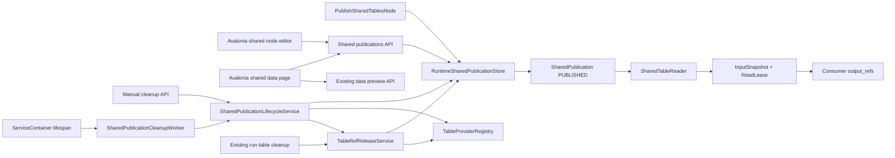

# FlowWeaver SHARED-TABLE-1：共享表 UI 与生命周期收口执行计划

> 文档状态：已执行完成
> 编写日期：2026-07-11
> 对账基线：`main` / `origin/main`，提交 `f636ba25`
> 当前依据：现有 `SharedPublication`、发布/读取共享表节点、Avalonia 数据页和通用节点配置编辑器
> 本阶段目标：把“共享表核心链路可运行”收口为“UI 可直接配置和预览、旧版本可安全手动清理并按保留期自动回收”
> 性能与耦合评审补充：2026-07-11，新增共享存储边界、统一释放保护和轻量目录查询两个前置批次
> 完成日期：2026-07-12

## 1. 执行结论

当前不需要重做共享表执行内核。以下主链路已经存在：

```text
生产工作流输出 TableRef
-> PublishSharedTablesNode 原子创建 SharedPublication
-> share_name 下生成递增 publication_version
-> ReadSharedTablesNode 按 LATEST / EXACT_VERSION 读取
-> InputSnapshot + ReadLease 固定本次运行版本
-> 下游节点继续消费普通 output_refs / output_slot_bindings
```

当前真正需要收口的是两个方向：

1. UI 操作便利性：字符串数组字段仍回退高级 JSON，共享表节点没有动态选择器，共享成员不能从发布列表直接进入数据预览。
2. 生命周期执行：`retention_seconds` 已能保存到 `retention_policy`，但尚未形成过期时间、清理资格、手动清理和自动清理闭环。

本计划拆成九个可独立测试、提交和回滚的批次：

```text
BASE-1 共享存储类型与统一 TableRef 释放保护
-> BASE-2 共享目录轻量查询与 N+1 收口
-> UI-1 通用字符串数组配置编辑
-> UI-2 共享表节点专用可视化编辑
-> UI-3 共享成员直接数据预览
-> LIFE-1 生命周期模型与只读判定
-> LIFE-2 手动清理 API 与 UI
-> LIFE-3 有界自动清理服务
-> CLOSE 端到端验收与文档收口
```

BASE-1 先修复现有 run cleanup 可能绕过共享引用的问题；BASE-2 先固定可分页、低负载的共享目录契约。UI 三批不启用自动生命周期；LIFE-1 只增加 publication 状态和判定，不删除数据；只有 LIFE-2 验证稳定后才允许 LIFE-3 自动执行。

## 2. 当前代码事实

### 2.1 已完成的后端能力

| 能力 | 当前实现位置 | 当前状态 |
| --- | --- | --- |
| 发布共享表节点 | `src/flowweaver/nodes/builtin_shared_table_execution.py` | 已支持一个或多个输入 TableRef 原子发布 |
| 读取共享表节点 | `src/flowweaver/nodes/builtin_shared_table_execution.py` | 已支持 `LATEST`、`EXACT_VERSION` 和成员筛选 |
| 固定版本读取 | `src/flowweaver/engine/shared_table_reader.py` | 已创建 `InputSnapshot` 和 `ReadLease` |
| 发布记录持久化 | `src/flowweaver/engine/runtime_shared_publication_store.py` | 已保存 share、版本、成员、来源 run 和 retention policy |
| 发布列表 API | `src/flowweaver/api/routes_shared_publications.py` | 已支持共享发布列表和按名称查询版本 |
| 读取租约释放 | `src/flowweaver/workflow_process/process_finalization.py` | workflow 终态时释放未释放 ReadLease |
| 表数据读取 API | `src/flowweaver/api/routes_data.py` | 已支持 detail、schema、summary 和 rows |

共享发布当前只校验成员属于生产 run 且为 `PUBLISHED_IMMUTABLE`，尚未限制 `storage_kind`。现有正式测试主要覆盖 `RUNTIME_SQL`。`MEMORY` 数据只存在于创建它的 workflow process 内，不能仅凭 TableRef 元数据承诺跨进程共享；`EXTERNAL_SQL` 也不能仅凭不可变标记保证外部数据内容固定。共享读取不会复制大表内容，而是传递已经登记的 TableRef 和版本元数据。

### 2.2 已完成的 Avalonia 能力

| 能力 | 当前实现位置 | 当前状态 |
| --- | --- | --- |
| 共享发布列表 | `Avalonia_UI/Views/Components/Data/SharedPublicationListView.axaml` | 可按共享名称和数量查询 |
| 共享版本列表 | 同上 | 可查看 publication version 和成员摘要 |
| API 客户端 | `Avalonia_UI/Api/EngineHostApiClient.cs` | 已支持发布列表和版本列表 |
| 节点目录 | 后端 schema + Avalonia 通用目录 | 已能显示发布共享表、读取共享表节点 |
| 高级 JSON | `Avalonia_UI/Views/Components/Workflow/WorkflowEditorView.axaml` | 可作为当前复杂配置兜底 |
| 专用编辑器扩展点 | `NodeEditorRegistry`、`NodeEditorResolver`、`BuiltinNodeEditors` | 基础类型已存在，但当前注册表为空且尚未接入共享表编辑器 |

### 2.3 当前明确缺口

1. `NodeConfigDraftBuilder` 只把 string、integer、number、boolean、enum 视为可编辑字段；`array<string>` 会生成 JSON fallback 警告。
2. `PublishSharedTablesNode.export_names` 是必填字符串数组，普通表单无法完成有效配置。
3. `ReadSharedTablesNode.selected_members` 是字符串数组，普通表单不能多选成员。
4. UI 不会根据当前 EngineHost 动态加载 share name、版本和成员供节点配置选择。
5. `SharedPublicationMemberListItemViewModel` 已有 `TableRefId`，但列表没有成员选择和预览命令。
6. `retention_seconds` 只保存为 JSON，没有可索引的 `expires_at`，也没有实际清理消费者。
7. 共享发布 API 只有只读列表，没有 cleanup preview、手动 cleanup 或生命周期详情。
8. 当前 run 表清理是按 workflow run 遍历 TableRef，不具备共享版本引用计数、最新版本保护和 ReadLease 竞态处理，不能直接复用于自动共享表清理。
9. 当前 publication 列表最多返回 1000 条记录，并为每条记录单独查询 members，形成 publication -> members N+1。
10. 当前列表响应总是携带全部 members，不适合作为节点编辑器的动态 share/version 目录。
11. 当前 run 表清理先调用 provider.drop_table，再把 TableRef 标记为 RELEASED；检查与物理删除之间没有 TableRef claim，可能与新 publication 创建竞态。

## 3. 本阶段目标边界

### 3.1 必须实现

- 第一版 SharedPublication 只接受 `RUNTIME_SQL`；MEMORY 和 EXTERNAL_SQL 必须由用户显式物化为 runtime SQL 后再发布。
- 所有 TableRef 释放路径共用一个 release guard/service，现有 run cleanup 不得绕过有效 SharedPublication、ReadLease 和 TableLease。
- 物理释放前原子 claim TableRef，阻止新 publication 在检查后继续引用待删除表。
- 共享名称、版本和成员使用摘要/分页接口，列表不再携带全部成员或逐条查询成员。
- 用户不打开高级 JSON，也能配置发布节点的导出名称。
- 用户可从 EngineHost 当前数据中选择共享名称、版本策略、精确版本和成员表。
- 用户可从共享发布页面直接预览成员表的数据。
- 后端能解释某个共享版本何时到期、是否允许清理以及被什么条件阻塞。
- 用户可先预检，再手动清理符合条件的旧共享版本。
- 设置了 `retention_seconds` 的非最新版本可由独立后台服务小批量自动清理。
- 清理过程保持幂等，EngineHost 中断后可以恢复，不会破坏活动读取。
- 清理后保留 SharedPublication、成员、来源 run 和版本元数据，只释放可安全回收的表资源。

### 3.2 明确不做

- 不实现多人协同编辑同一张表。
- 不允许共享版本原地修改。
- 不实现事件订阅、追加流、实时流或消息队列。
- 不在 PublishSharedTablesNode 内隐式复制 MEMORY 或 EXTERNAL_SQL 大表；物化必须是显式节点行为。
- 不新增插件私有共享表协议或动态共享 schema。
- 不把生命周期设置放入运行配置字；它属于共享表节点配置和 EngineHost 维护策略。
- 不新增 `DependencyPin`；第一版只使用现有 ReadLease、TableLease 和有效 publication 引用判断安全性。
- 不自动清理每个 `share_name` 的最新有效版本。
- 不删除外部 SQL 业务表；外部引用只能释放 FlowWeaver 自身元数据或标记为不可物理回收。
- 不把共享表生命周期策略写入 `Supervisor`；Supervisor 继续只负责 workflow process 和 executor 生命周期。
- 不以本计划为由推进 MainWindowViewModel 全量页面迁移。

## 4. 目标用户流程

### 4.1 生产工作流发布

```text
选择 PublishSharedTablesNode
-> UI 显示当前输入连接的稳定顺序
-> 后端确认所有输入均为 RUNTIME_SQL
-> 为每个输入填写唯一 export_name
-> 填写 share_name
-> 可选填写 retention_seconds
-> UI 在保存前校验输入数量和 export_names 数量一致
-> 工作流运行后创建新 publication version
```

MEMORY 或 EXTERNAL_SQL 输入不得由发布节点静默复制。用户需要先通过明确的物化节点产出 `RUNTIME_SQL / PUBLISHED_IMMUTABLE` TableRef，这样大表复制成本、失败位置和存储占用都可见。

### 4.2 消费工作流读取

```text
选择 ReadSharedTablesNode
-> UI 查询共享名称
-> 选择 LATEST 或 EXACT_VERSION
-> EXACT_VERSION 时查询并选择具体版本
-> 查询该版本的成员
-> 默认读取全部成员，或手动多选 selected_members
-> 保存配置
-> 运行时创建 InputSnapshot + ReadLease
```

UI 只编辑 workflow revision 中的节点业务配置，不把当前共享发布详情写入主程序全局状态，也不在 UI 中持久化运行时租约。

### 4.3 共享成员预览

```text
数据页选择 share_name
-> 选择 publication version
-> 选择 member
-> 使用 member.table_ref_id 调用现有 data API
-> 复用现有 schema / summary / rows 预览组件
```

共享成员已经释放时，UI 显示“版本元数据仍保留，表数据已释放”，不把释放状态误报为网络错误。

### 4.4 生命周期管理

```text
选择旧 publication version
-> 查询 cleanup preview
-> 显示 expires_at、是否最新、活动租约、阻塞原因、预计释放成员
-> 用户确认手动清理
-> 服务端事务内重新判定
-> claim 为 RELEASING
-> 逐成员幂等释放
-> publication 标记 RELEASED
```

自动清理复用同一套 evaluator 和 release command，不维护第二套清理规则。

## 5. 架构与责任边界



### 5.1 前端责任

- 通用 `array<string>` 编辑器只负责字段编辑和基础类型校验。
- 共享表专用编辑器负责动态 share/version/member 查询和节点语义校验。
- `NodeEditorRegistry` 负责按 node type 选择专用编辑器，未注册节点继续走通用 schema/JSON fallback；专用 View 使用 typed ViewModel + Avalonia DataTemplate/editor factory，不根据 `viewTypeName` 反射实例化。
- 共享数据页负责浏览、预览和发起清理请求，不直接访问数据库或删除物理表。
- 根 `MainWindowViewModel` 只保留页面组合、当前连接设置和现有数据预览桥接；新查询状态进入共享表子 ViewModel。本计划不把整个 SharedPublications 页面迁移作为 UI-2 的前置条件。

### 5.2 后端责任

- `RuntimeStore` 负责原子状态更新、查询和引用关系。
- `TableRefReleaseService` 负责所有 TableRef 的释放资格、原子 claim、provider 调用和最终状态；现有 run cleanup 与共享 cleanup 都必须复用它。
- `SharedPublicationLifecycleService` 负责清理资格、claim、释放编排和结果模型。
- `TableProviderRegistry` 负责根据 TableRef 的 provider/storage kind 执行物理释放。
- `SharedPublicationCleanupWorker` 只负责定时、小批量调用 lifecycle service。
- `ServiceContainer` 负责 worker 的启动和关闭，关闭顺序必须是 worker -> Supervisor -> RuntimeStore。
- `ServiceContainer.start()` / `close()` 必须幂等；某个子服务关闭失败时仍继续释放后续资源，最后汇总错误。
- `SharedTableReader` 负责原子获取可读 publication 并创建读取租约。
- `Supervisor` 不感知 retention、共享版本或 cleanup blocker。

### 5.3 性能边界

- 自动清理查询必须使用 `status + expires_at` 索引和 `LIMIT`，禁止每轮解析全部 `retention_policy_json`。
- share catalog、version list 和 member list 必须分离；目录列表只返回 `member_count`，成员按 publication 分页读取。
- `is_latest_published`、member count 和目录摘要必须使用集合查询、聚合或窗口函数，禁止逐 publication 查询。
- 列表接口不逐项加载活动租约详情；只有选中版本或 cleanup preview 才计算阻塞原因。
- cleanup preview 和 worker 对一组成员只执行一次批量 ReadLease、TableLease 和 publication 引用查询，禁止循环调用 `TableLeaseManager.active_read_count()`。
- worker 每轮同时受 publication 数、TableRef 数和时间预算限制，不能只限制 publication 数。
- 一次清理只传 TableRef 元数据，不读取或复制表格行。
- UI share/version/member 查询均保留 offset/limit，搜索按需触发；切换筛选时取消旧请求，不自动加载全部历史版本。
- 清理日志只记录 ID、状态和数量，不把表格数据写入日志或 runtime event。

## 6. 生命周期模型

### 6.1 状态

| 状态 | 含义 | 新读取 | 物理资源 |
| --- | --- | --- | --- |
| `PUBLISHED` | 当前有效发布版本 | 允许 | 存在或为外部引用 |
| `RELEASING` | 已被某次清理原子 claim | 拒绝 | 正在幂等释放 |
| `RELEASED` | 清理完成，仅保留元数据 | 拒绝 | 内部资源已释放，外部数据未删除 |

“已过期”不单独作为持久化状态，而由 `expires_at <= now` 动态判断。这样可以区分“已经到期但因最新版本或活动租约仍受保护”和“已经开始释放”。

### 6.2 数据库字段

为 `shared_publications` 增加：

| 字段 | 类型 | 用途 |
| --- | --- | --- |
| `expires_at` | nullable text datetime | 从 created_at + retention_seconds 计算，供索引查询 |
| `release_started_at` | nullable text datetime | 记录 claim 时间和恢复 stale releasing |
| `cleanup_last_progress_at` | nullable text datetime | 记录分轮清理心跳，区分活动任务和 stale releasing |
| `released_at` | nullable text datetime | 记录最终释放时间 |
| `cleanup_attempt_count` | integer default 0 | 记录幂等重试次数 |
| `last_cleanup_error_json` | nullable text | 只记录结构化错误摘要，不记录数据内容 |

新增索引：

- `(status, expires_at)`：自动清理候选查询。
- `(status, cleanup_last_progress_at)`：恢复 stale RELEASING。
- `(share_name, status, publication_version)`：最新有效版本和版本保护查询。
- `shared_publication_members(table_ref_id)`：判断同一 TableRef 是否仍被其他有效 publication 引用。
- `read_leases(publication_id, released_at, expires_at)`：活动读取阻塞查询。

迁移时：

- 旧记录保持 `PUBLISHED`。
- `retention_policy_json.retention_seconds` 为正整数时回填 `expires_at`。
- retention 缺失或损坏时 `expires_at=NULL`，视为不自动清理；迁移不得因单条旧数据失败。

### 6.3 自动清理资格

一个 publication 只有同时满足以下条件才可自动 claim：

1. 状态为 `PUBLISHED`。
2. `expires_at` 非空且已到期。
3. 不是该 `share_name` 的最新有效版本。
4. producer workflow run 已进入终态。
5. 没有未释放且未过期的 ReadLease。
6. 成员 TableRef 没有活动 TableLease。
7. 物理释放某成员前，该 TableRef 不再被其他 `PUBLISHED` 或 `RELEASING` publication 引用。
8. 所有可物理释放成员均为 `RUNTIME_SQL`；旧数据中的其他 storage kind 只能保留元数据并返回明确 blocker。
9. publication 和成员记录通过一致性校验。

建议固定阻塞原因码：

```text
PUBLICATION_NOT_PUBLISHED
RETENTION_NOT_CONFIGURED
RETENTION_NOT_EXPIRED
LATEST_VERSION_PROTECTED
PRODUCER_RUN_ACTIVE
ACTIVE_READ_LEASE
ACTIVE_TABLE_LEASE
MEMBER_REFERENCED_BY_OTHER_PUBLICATION
MEMBER_NOT_RELEASABLE
PUBLICATION_INCONSISTENT
```

cleanup preview 返回所有当前阻塞原因；真正执行时必须在事务内重新计算，不能相信 UI 之前拿到的 preview。

blocker 计算必须是集合查询。对一个 publication 的全部成员一次性加载 TableRef、活动 TableLease、有效 publication 引用和活动 ReadLease，不允许按成员开启多个 `BEGIN IMMEDIATE` 会话。

### 6.4 读取与清理竞态

当前 `SharedTableReader` 的 publication 解析和 ReadLease 创建是分开的调用。引入自动清理前必须收成一个原子 store 操作：

```text
BEGIN IMMEDIATE / 等价写事务
-> 只解析 status=PUBLISHED 的 LATEST 或 EXACT_VERSION
-> 固定成员和精确 TableRef 版本
-> 创建 InputSnapshot
-> 创建 ReadLease
COMMIT
```

清理 claim 使用同一数据库写互斥边界：

```text
BEGIN IMMEDIATE / 等价写事务
-> 重新检查资格和活动租约
-> compare-and-set PUBLISHED -> RELEASING
-> 写 release_started_at / attempt
COMMIT
```

因此只会出现“读取先获得租约，清理被阻塞”或“清理先 claim，后续读取被拒绝”两种稳定结果，不允许读取到正在释放的半套成员。

两个事务都必须保持短小：事务内只访问 metadata SQLite，不调用 provider、不读取表格数据、不发网络请求。当前数据库已使用 WAL 和 busy timeout，仍需为并发写冲突提供有界重试，不能让 worker 长时间持有 SQLite 写锁。

### 6.5 成员释放语义

- 第一版新 SharedPublication 只允许 `RUNTIME_SQL`，可通过 provider 幂等释放实际资源并把 TableRef 标记为 `RELEASED`。
- 迁移前旧数据中若存在 `MEMORY`：只保留 publication/member 元数据并标记不可稳定跨进程读取，不创建新的长期共享承诺。
- 迁移前旧数据中若存在 `EXTERNAL_SQL`：不得调用删除业务表操作，只记录 `external_or_unsupported_storage`。
- 同一个 TableRef 被多个有效 publication 引用：只释放当前 publication，不物理释放该 TableRef。
- 某个成员已提前 `RELEASED`：视为幂等成功，不让整个 publication 永久卡住。
- provider 临时失败：publication 保持 `RELEASING` 和错误摘要，后续按 stale-releasing 规则重试。
- 所有可处理成员完成后，publication 标记 `RELEASED`；成员行和来源信息继续保留。

### 6.6 TableRef 释放不变量

所有释放入口必须遵循同一流程：

```text
批量读取 TableRef + shared references + active leases
-> 在同一短事务中重新检查
-> compare-and-set TableRef PUBLISHED -> RELEASABLE
-> 提交事务
-> 调用 provider.drop_table
-> compare-and-set RELEASABLE -> RELEASED
```

`RELEASABLE` 是 TableRef 的物理释放 claim。新 SharedPublication 仍只接受 `PUBLISHED`，data API 也把 RELEASABLE 视为不可用，因此 claim 成功后不能再出现“检查时没有引用、drop 前又被新 publication 引用或读取”的窗口。

provider 失败时 TableRef 保持 `RELEASABLE`，后续重试只重复幂等 drop/finalize。现有 run table cleanup 也必须走该流程，不能继续先 drop 再调用无 expected-state 的 `mark_table_ref_released()`。

## 7. API 契约

### 7.1 共享名称目录

节点编辑器使用独立轻量目录，不从完整 publication 列表在客户端去重：

```text
GET /api/v1/shared-publications/catalog?query={text}&offset=0&limit=50
```

每个 share name 只返回摘要：

```json
{
  "share_name": "daily_report",
  "latest_published_version": 12,
  "published_version_count": 4,
  "latest_member_count": 2,
  "latest_created_at": "2026-07-11T12:00:00Z"
}
```

catalog 使用 group/window 查询一次完成，不加载 members。`query` 为空时只返回第一页，UI 不自动扫描全部 share name。

### 7.2 版本摘要与成员分页

```text
GET /api/v1/shared-publications/{share_name}/versions?offset=0&limit=50
GET /api/v1/shared-publications/{publication_id}/members?offset=0&limit=100
```

版本列表不内嵌 members，只返回 `member_count` 和轻量生命周期摘要：

```json
{
  "publication_id": "pub-1",
  "share_name": "daily_report",
  "publication_version": 11,
  "status": "PUBLISHED",
  "expires_at": "2026-07-12T00:00:00Z",
  "release_started_at": null,
  "released_at": null,
  "is_latest_published": false,
  "member_count": 2
}
```

成员接口分页返回 export name、TableRef ID、精确版本和当前 TableRef 状态。`is_latest_published` 和 `member_count` 必须在后端集合查询中得到。

现有完整 publication 接口如需兼容保留，必须改为批量加载 members，不能继续每条 publication 单独查询；Avalonia 数据页和节点编辑器完成迁移后不再以完整接口作为目录来源。

### 7.3 清理预检

```text
GET /api/v1/shared-publications/{publication_id}/cleanup-preview
```

响应最少包含：

```json
{
  "publication_id": "pub-1",
  "eligible": false,
  "status": "PUBLISHED",
  "expires_at": "2026-07-12T00:00:00Z",
  "is_latest_published": true,
  "active_read_lease_count": 0,
  "active_table_lease_count": 0,
  "releasable_member_count": 2,
  "protected_member_count": 0,
  "blockers": ["LATEST_VERSION_PROTECTED"]
}
```

### 7.4 手动清理

```text
POST /api/v1/shared-publications/{publication_id}/cleanup
```

第一版手动清理与自动清理使用相同资格，不提供绕过最新版本或活动租约的 `force` 参数。该接口语义是“释放可回收资源并保留发布元数据”，因此不使用 DELETE。

幂等结果至少区分：

```text
CLEANED
ALREADY_RELEASED
BLOCKED
RETRY_PENDING
NOT_FOUND
```

所有接口继续使用现有 local token 和 origin 检查，不新增权限系统。

## 8. 分批执行计划

### SHARED-TABLE-BASE-1：共享存储与统一释放不变量

#### 目标

先固定什么数据可以跨 workflow process 共享，并修复现有 run cleanup 可能破坏有效 SharedPublication 的问题。

#### 主要修改

- 在共享发布成员校验中固定第一版允许集合：
  - 只允许 `TableStorageKind.RUNTIME_SQL`。
  - 继续要求 `PUBLISHED_IMMUTABLE` 和 producer run 归属一致。
  - MEMORY 返回 `SHARED_TABLE_STORAGE_NOT_DURABLE`。
  - EXTERNAL_SQL 返回 `SHARED_TABLE_REQUIRES_MATERIALIZED_SNAPSHOT`。
- 不在发布节点中增加隐式 materialize；用户通过明确上游节点产出 RUNTIME_SQL。
- 新增 `TableRefReleaseService`：
  - 批量加载 TableRef、有效 shared references、ReadLease 和 TableLease。
  - 返回统一 release blockers。
  - compare-and-set `PUBLISHED -> RELEASABLE`。
  - provider drop 后 compare-and-set `RELEASABLE -> RELEASED`。
  - provider 失败时保留 RELEASABLE，支持幂等重试。
- 把 `RELEASABLE` 纳入 TableRef 不可新读状态：data detail/schema/summary/rows、共享发布校验和普通预览都不能把已 claim 的 TableRef 当作可用数据。
- 现有 `cleanup_table_refs_for_run()` 改为调用 release service，不能直接 provider.drop_table。
- publication 创建和 TableRef claim 使用同一 metadata SQLite 写互斥边界。
- 为旧 MEMORY / EXTERNAL_SQL publication 增加兼容读取诊断；不在迁移中尝试复制或删除外部数据。

#### 验收

- 新 MEMORY / EXTERNAL_SQL TableRef 不能进入 SharedPublication。
- RUNTIME_SQL 发布与消费路径保持兼容。
- 有效 publication 或活动租约引用的 TableRef 不会被 run cleanup 删除。
- release claim 成功后，新 publication 无法再引用该 TableRef。
- release claim 成功后，新的 data preview/read 请求不会进入正在 drop 的表。
- 两个并发清理请求只有一个能 claim TableRef。
- provider 失败后重试不会重复破坏状态。
- 本批次不增加 publication 自动 worker。

#### 测试

```powershell
.\python312\python.exe -m pytest tests\integration\test_builtin_shared_table_nodes.py tests\integration\test_shared_table_reader.py tests\integration\test_api.py -q
.\python312\python.exe -m ruff check src tests
.\python312\python.exe -m mypy src
```

必须补充：

- run cleanup 与 SharedPublication 引用冲突测试。
- publication create 与 TableRef release claim 并发测试。
- MEMORY / EXTERNAL_SQL 拒绝测试。
- RUNTIME_SQL 真实 drop 与幂等重试测试。

#### 中文提交建议

```text
后端: 固定共享表存储与释放边界
```

### SHARED-TABLE-BASE-2：共享目录轻量查询

#### 目标

在接入动态 UI 前消除 publication -> members N+1，并固定可分页的 share/version/member 查询契约。

#### 主要修改

- 新增 Alembic 迁移 `20260711_0023_shared_publication_query_indexes.py`：
  - `shared_publications(share_name, status, publication_version)`。
  - `shared_publication_members(publication_id, export_name)`。
  - `shared_publication_members(table_ref_id)`。
- 新增 share catalog 集合查询，不加载 members。
- 版本列表使用单次聚合得到 member_count 和 latest version 标记。
- 成员使用独立 offset/limit 查询。
- 现有完整 publication 列表改为批量加载 members，至少先消除 N+1。
- API 增加 catalog / paged versions / paged members 契约。
- Avalonia API client 和数据页迁移到摘要 + 选中后加载成员；列表项不再持有全部历史成员。
- 动态搜索按需触发，迟到响应继续使用 request version/cancellation 丢弃。

#### 验收

- 返回 100 个 publication summary 时，数据库查询次数不随 publication 数线性增长。
- catalog 不加载 members，版本列表不携带成员数组。
- 一个 publication 的成员可以分页查看，顺序按 export name 稳定。
- 目录空查询只返回第一页，不全量扫描历史 share。
- Avalonia 当前共享数据页功能保持可用。
- 旧完整接口若保留，不再出现逐 publication member 查询。

#### 性能测试

- 构造 10,000 个 publication 和多成员数据。
- 使用 query counter 断言 catalog / version list 查询数为固定上限。
- 使用 query plan 验证 share/status/version 和 member publication_id 索引。
- 验证响应体大小与 page size、member page size线性相关，不与全部历史成员数量相关。

#### 测试

```powershell
.\python312\python.exe -m pytest tests\integration\test_runtime_store.py tests\integration\test_api.py -q
dotnet test Avalonia_UI.Tests/Avalonia_UI.Tests.csproj --no-restore --filter "FullyQualifiedName~SharedPublication"
dotnet test Avalonia_UI.Tests/Avalonia_UI.Tests.csproj --no-restore
```

#### 中文提交建议

```text
前后端: 收口共享表目录查询
```

### SHARED-TABLE-UI-1：通用字符串数组编辑器

#### 目标

让 `array<string>` 成为通用可编辑字段，先消除发布共享表节点必须进入高级 JSON 的硬阻塞。

#### 主要修改

- `Avalonia_UI/Models/NodeConfigDraftBuilder.cs`
  - 仅把 `array` 且 `item_type=string` 标记为可编辑。
  - object array 和未知 item type 继续 JSON fallback。
- `NodeConfigEditableDraftBuilder` / config builder
  - 支持字符串数组与 JSON array 的双向转换。
  - 保留条目顺序，不静默排序。
- 新增字符串数组项 ViewModel
  - 增加、删除、上移、下移。
  - 空值在保存前给出校验错误，不静默丢弃。
- `WorkflowSelectedNodeConfigView.axaml`
  - 渲染稳定高度的数组编辑区域。
  - 长条目换行或截断并提供完整 tooltip。
- 更新相关本地化文本和测试。

#### 验收

- `PublishSharedTablesNode.export_names` 可以在普通节点配置区编辑。
- `ReadSharedTablesNode.selected_members` 可以编辑、清空并保持顺序。
- 编辑其他 array/object 字段时仍明确回退高级 JSON。
- 应用配置后 workflow draft JSON 正确，重新选择节点后内容可无损恢复。
- 不改变后端 config schema。

#### 测试

```powershell
dotnet test Avalonia_UI.Tests/Avalonia_UI.Tests.csproj --no-restore --filter "FullyQualifiedName~NodeConfig"
dotnet test Avalonia_UI.Tests/Avalonia_UI.Tests.csproj --no-restore
```

#### 中文提交建议

```text
前端: 支持字符串数组节点配置
```

### SHARED-TABLE-UI-2：共享表节点专用可视化编辑

#### 目标

让用户通过动态选择完成共享表节点配置，不再手填 share、version 和 member。

#### 主要修改

- 在 `BuiltinNodeEditors.All` 注册：
  - `PublishSharedTablesNode`。
  - `ReadSharedTablesNode`。
- 把 `NodeEditorResolver` 的 BuiltIn 结果接入选中节点编辑器宿主；registry 返回 typed editor key/factory，Avalonia 通过 ViewModel DataTemplate 选择 View，不反射 `viewTypeName`。
- 注册失败或 API 不可用时仍可回退通用 schema/高级 JSON。
- 发布节点编辑器：
  - 展示当前输入连接的稳定顺序。
  - 每个输入对应一个 export name。
  - 校验数量一致、名称非空且唯一。
  - 编辑 `share_name` 和可选 `retention_seconds`。
- 读取节点编辑器：
  - 通过 BASE-2 catalog API 按需搜索 share name。
  - 提供 `LATEST` / `EXACT_VERSION` 分段选择。
  - EXACT 时分页加载具体版本。
  - 选中版本后分页加载成员并提供多选；未选择成员表示读取全部。
- 新增共享节点编辑子 ViewModel 和 `ISharedPublicationCatalogService`，复用当前 EngineHost settings 和 cancellation token。
- 根 MainWindowViewModel 只负责选中节点和连接上下文桥接，不拥有动态列表内部状态；不在本批次迁移整个 SharedPublications 页面。

#### 验收

- 发布节点可完全通过可视化表单形成有效配置。
- 读取节点能选择真实存在的 share、version 和 members。
- 切换 share/version 会取消旧请求，不让迟到响应覆盖新选择。
- share/version/member 列表不会自动加载全部历史数据。
- EXACT_VERSION 必须有正整数版本；LATEST 不写无效 exact_version。
- 成员从后端消失时保存被阻止并给出明确错误。
- EngineHost 离线时仍可打开 workflow，不破坏已有 JSON 配置。

#### 测试

- `NodeEditorRegistry` / `NodeEditorResolver` 注册与 fallback 测试。
- 发布节点输入数量与 export name 映射测试。
- 读取节点 share/version/member 异步竞态测试。
- API 客户端 URL 编码和错误响应测试。
- Avalonia 全量测试。

#### 中文提交建议

```text
前端: 增加共享表节点可视化配置
```

### SHARED-TABLE-UI-3：共享成员直接预览

#### 目标

从共享发布版本直接进入已有数据预览，不要求用户先定位生产 run 或消费 run。

#### 主要修改

- 共享版本列表增加成员选择状态。
- 选中版本后通过 BASE-2 member endpoint 分页加载成员。
- 成员行显示 export name、TableRef version、TableRef 状态和预览入口。
- 预览命令使用现有 `table_ref_id` 调用 detail/schema/summary/rows API。
- 复用现有 DataPreview grid、分页、字段信息和错误格式化。
- released / retired / orphaned TableRef 显示不可用状态，不重复请求 rows。
- 共享发布筛选变化时取消成员预览请求并清空旧数据。

#### 验收

- 用户两步内从 publication version 打开成员数据。
- 预览不复制表格数据到 SharedPublication ViewModel。
- 大表仍按现有 rows limit 分页，不在列表接口携带数据行。
- 释放后的历史版本仍可查看元数据，但明确提示数据不可用。

#### 测试

- ViewModel 选择和预览桥接测试。
- released TableRef 错误映射测试。
- API 正式路径 smoke：发布 -> 列表 -> 版本 -> 成员 -> rows。
- Avalonia 全量测试。

#### 中文提交建议

```text
前端: 接通共享成员数据预览
```

### SHARED-TABLE-LIFE-1：生命周期模型与只读判定

#### 目标

增加可迁移、可查询、可解释的生命周期底座，但本批次不删除任何表。

#### 主要修改

- 新增 Alembic 迁移 `20260711_0024_shared_publication_lifecycle.py`，增加 lifecycle 字段和 `(status, expires_at)`、ReadLease blocker 索引。
- 扩展 `SharedPublicationRecord`、运行模型和 API 序列化。
- 创建 `SharedPublicationLifecycleService` 和纯结果模型：
  - 计算 expires_at。
  - 判断 latest protection。
  - 一次性批量查询 ReadLease / TableLease / publication member 引用。
  - 返回 blocker reason codes。
- 增加按 `status + expires_at` 有界查询 store 方法。
- 把 SharedTableReader 的 publication 解析、InputSnapshot 和 ReadLease 创建收成原子操作。
- 原子读取和 lifecycle claim 使用短 `BEGIN IMMEDIATE`，事务内禁止 provider I/O，并对 busy 冲突做有界重试。
- `get_latest_shared_publication` 和 exact version 读取只返回 `PUBLISHED`。
- 增加 cleanup-preview API；不增加 cleanup 命令。

#### 验收

- 旧数据库升级后全部旧 publication 可正常读取。
- retention 缺失的旧记录不会自动过期。
- PUBLISHED -> RELEASING 与读取租约创建竞态只有一个方向成功。
- cleanup preview 能稳定解释每个 blocker。
- blocker 查询次数不随 member 数线性增加。
- 本批次不新增 publication cleanup 对 provider.drop_table 的调用。

#### 测试

```powershell
.\python312\python.exe -m pytest tests\integration\test_runtime_store.py tests\integration\test_shared_table_reader.py tests\integration\test_api.py -q
.\python312\python.exe -m ruff check src tests migrations
.\python312\python.exe -m mypy src
```

补充并发测试：

- reader 先获得租约，cleanup preview 返回 `ACTIVE_READ_LEASE`。
- lifecycle claim 先成功，reader 收到 publication unavailable。
- 两个 cleanup claimant 只有一个能把状态改为 RELEASING。

#### 中文提交建议

```text
后端: 增加共享发布生命周期判定
```

### SHARED-TABLE-LIFE-2：手动清理 API 与 UI

#### 目标

先让用户可见、可预检、可确认地清理旧版本，验证真实 provider 释放路径。

#### 主要修改

- 为 lifecycle service 增加 cleanup command：
  - 原子 claim。
  - 批量成员引用和租约检查。
  - 调用 BASE-1 `TableRefReleaseService` 幂等释放。
  - 记录成功、跳过和失败摘要。
  - 完成后标记 publication RELEASED。
- 增加 `POST /shared-publications/{publication_id}/cleanup`。
- 共享发布 UI 增加：
  - 过期时间和生命周期状态。
  - cleanup preview。
  - blocker 列表。
  - 二次确认。
  - 清理结果与刷新。
- 第一版不提供 force，也不清理 latest protected publication。
- 单次 API 请求受 TableRef 数和时间预算限制；未完成时返回 `RETRY_PENDING`，由后续请求或 LIFE-3 worker 继续。

#### 验收

- 手动清理前必须获得服务端 preview。
- 提交后服务端重新判定，preview 不是授权令牌。
- 活动 ReadLease / TableLease 期间清理被阻止。
- 一个 TableRef 被其他有效 publication 引用时不物理删除。
- 外部 SQL 引用不会调用 drop_table。
- 重复调用返回 ALREADY_RELEASED 或稳定的幂等结果。
- 清理失败保留可恢复状态和错误摘要。
- 大成员 publication 不会让单次 API 请求无限阻塞。

#### 测试

- RuntimeStore / lifecycle service 单元和集成测试。
- SQLite runtime table 真实物理释放测试。
- memory provider 释放测试。
- external SQL 不删除测试。
- API preview / cleanup / idempotency 测试。
- Avalonia preview、确认、成功、blocked、retry pending 测试。
- 后端和 Avalonia 全量测试。

#### 中文提交建议

```text
前后端: 增加共享表手动清理
```

### SHARED-TABLE-LIFE-3：有界自动清理服务

#### 目标

让设置了 retention_seconds 的旧版本在满足安全条件后自动回收，同时保持低耦合和可停止性。

#### 主要修改

- 新增 `SharedPublicationCleanupWorker`：
  - monotonic interval。
  - 固定 publication batch、TableRef batch 和单轮时间预算。
  - 每批调用同一个 lifecycle service。
  - 支持 stop event 和有界 join。
  - 单项失败不阻断下一候选。
- `EngineConfig` 只增加当前明确需要的维护参数：
  - `shared_publication_cleanup_enabled`。
  - `shared_publication_cleanup_interval_seconds`。
  - `shared_publication_cleanup_publication_batch_size`。
  - `shared_publication_cleanup_table_ref_batch_size`。
  - `shared_publication_cleanup_cycle_budget_seconds`。
  - `shared_publication_releasing_stale_seconds`。
- bootstrap 时创建唯一 `TableProviderRegistry`，API 和 worker 共用，不各自创建 provider 状态。
- `ServiceContainer.start()` 启动 Supervisor 和 cleanup worker。
- FastAPI lifespan 改为调用 container start/close。
- close 顺序：先停止 worker，再停止 Supervisor，最后 dispose RuntimeStore；close 幂等且某一步失败后仍继续后续释放。
- stale RELEASING 超时后重新判定并恢复重试。
- RELEASING publication 可跨多轮按 TableRef budget 继续，不要求一轮释放全部成员；每轮成功处理成员后更新 `cleanup_last_progress_at`。

#### 验收

- 未设置 retention 的版本永不进入自动候选。
- latest published version 永不自动清理。
- 每轮 publication、TableRef 和执行时间都不超过各自预算。
- worker 停止后不再访问 RuntimeStore。
- EngineHost 在 RELEASING 中断后，重启可继续幂等释放。
- 一个候选失败不会阻塞同批其他候选。
- 自动清理不产生大 payload 日志。

#### 性能闸门

- 构造至少 10,000 条 publication 元数据，候选查询必须命中 `(status, expires_at)` 索引并只返回 publication batch size。
- 构造一个大成员 publication，验证 worker 会分轮处理且 API 可返回 `RETRY_PENDING`。
- 不使用固定跨机器毫秒阈值作为唯一断言；以 query plan、读取行数和有界批次为主。
- worker 空闲轮次只执行一次轻量候选查询，不加载成员和租约详情。
- cleanup 才按选中 publication 加载成员和 blocker。

#### 测试

- worker start/stop/close 顺序测试。
- batch limit、单项失败继续、stale recovery 测试。
- EngineHost lifespan smoke。
- 并发 reader / worker 测试。
- 后端全量、Ruff、mypy。

#### 中文提交建议

```text
后端: 增加共享表自动清理
```

### SHARED-TABLE-CLOSE：端到端验收与文档收口

#### 目标

证明 UI 可用性、版本稳定性和自动生命周期在真实链路中闭环。

#### 十步验收

1. UI 创建生产 workflow，显式产出 RUNTIME_SQL，并添加发布共享表节点。
2. 不进入高级 JSON，配置 share name、export names 和 retention。
3. 运行生产 workflow，确认 publication V1 和成员可见；对生产 run 发起表清理时，共享成员被 release guard 阻止。
4. UI 创建消费 workflow，选择 LATEST 和部分成员。
5. 运行消费 workflow，确认下游数据与 V1 一致。
6. 生产 workflow 发布 V2，确认已运行消费任务仍固定 V1。
7. 从共享发布页面直接预览 V1/V2 成员数据。
8. V1 到期后，cleanup preview 在活动租约期间显示 blocked，租约释放后显示 eligible。
9. 手动清理或 worker 清理 V1，确认 V2 不受影响，V1 元数据保留且 rows 不可用。
10. 重启 EngineHost，确认 V2 可继续读取，V1 保持 RELEASED，worker 无重复破坏。

#### 最终验证命令

```powershell
.\python312\python.exe -m pytest -q
.\python312\python.exe -m ruff check src tests migrations
.\python312\python.exe -m mypy src
dotnet build Avalonia_UI/Avalonia_UI.sln --no-restore
dotnet test Avalonia_UI.Tests/Avalonia_UI.Tests.csproj --no-restore
git diff --check
```

如全解决方案 formatter 仍报告本阶段未修改文件中的既有问题，必须记录具体文件；本阶段新增和修改文件需要定向 format 通过，不顺带清理无关格式。

#### 中文提交建议

```text
文档: 收口共享表管理状态
```

## 9. 里程碑与停止点

### M0：共享基础不变量

完成 BASE-1 至 BASE-2 后即可停止：

- 新 SharedPublication 只接受可跨进程稳定读取的 RUNTIME_SQL。
- run cleanup 不再绕过有效共享引用和活动租约。
- TableRef 释放具备原子 claim，不存在检查后新增引用窗口。
- share/version/member 目录已经分页且无 publication -> members N+1。
- 尚未修改节点配置 UI 和 publication 自动生命周期。

### M1：UI 可用性

在 M0 通过后完成 UI-1 至 UI-3 即可停止：

- 共享表执行内核不变。
- 用户不再依赖高级 JSON。
- 用户可直接预览共享成员。
- 尚无自动删除风险。

### M2：手动生命周期

完成 LIFE-1 至 LIFE-2 后即可停止：

- 生命周期状态、索引和 blocker 已稳定。
- 用户可手动清理旧版本。
- 自动 worker 尚未启用，适合先观察真实数据和错误分布。

### M3：自动生命周期

只有 M2 验收通过后执行 LIFE-3：

- 自动 worker 使用已验证的同一 cleanup command。
- latest、活动租约和外部数据边界已受测试保护。
- EngineHost 关闭与中断恢复路径已验证。

## 10. 回滚策略

| 批次 | 回滚方式 |
| --- | --- |
| BASE-1 | 禁用新 release service 入口前先确认没有 RELEASABLE TableRef；保留 RUNTIME_SQL-only 校验可避免重新引入不稳定共享 |
| BASE-2 | UI 回退旧完整接口；查询索引可保留，完整接口仍必须保留批量 member 加载以避免 N+1 回归 |
| UI-1 | 恢复 array 字段 JSON fallback，已有 workflow JSON 不变 |
| UI-2 | 移除 BuiltinNodeEditors 注册，自动回退通用 schema/高级 JSON |
| UI-3 | 移除成员预览入口，不影响 data API |
| LIFE-1 | 停止消费新字段；数据库新增 nullable 字段和索引可保留，不回退已升级数据库 |
| LIFE-2 | 禁用 cleanup API；PUBLISHED 数据不受影响，RELEASING 由恢复命令处理 |
| LIFE-3 | 设置 cleanup enabled=false 并停止 worker；手动清理仍可使用 |

数据库迁移执行后不使用降级迁移删除字段。程序回滚必须兼容新增列和 `RELEASING` / `RELEASED` 状态，避免旧程序把已释放 publication 当作可读版本。

## 11. 风险与防护

| 风险 | 防护 |
| --- | --- |
| MEMORY TableRef 被误认为可跨进程共享 | 第一版发布校验只允许 RUNTIME_SQL，物化必须显式发生 |
| run cleanup 删除仍被共享的 TableRef | 所有释放入口统一走 TableRefReleaseService |
| 检查后新 publication 引用待删除 TableRef | 物理 drop 前 compare-and-set 为 RELEASABLE |
| RELEASABLE TableRef 仍被新预览读取 | data API 和共享发布校验统一把 RELEASABLE 视为不可用 |
| publication 列表 N+1 和大成员 payload | catalog/version/member 分页，集合查询 member_count/latest |
| 数组编辑器污染所有节点 | 只开放 `array<string>`，其他复杂类型继续 fallback |
| 动态选择器把 API 状态写进 workflow | 只把用户最终选择写入节点 config，列表缓存不持久化 |
| publication claim 与 reader 竞态 | 解析 publication 和创建 ReadLease 收成原子事务 |
| 清理 V1 时误删 V2 共用 TableRef | 物理释放前查询其他有效 publication 引用 |
| 自动清理删除 latest | store 查询和 service 双重保护 latest published version |
| 自动清理外部业务表 | 只允许内部 storage kind 物理释放，外部 provider 不调用 drop |
| worker 拖慢 API | 索引候选查询、publication/TableRef/时间三重预算、无大表读取、独立 stop event |
| 逐成员租约检查放大 SQLite 写锁 | blocker 使用批量集合查询，短事务内不调用 TableLeaseManager 单项 API |
| EngineHost 退出时 worker 访问已关闭数据库 | ServiceContainer 先停 worker，再 dispose RuntimeStore |
| RELEASING 中断留下半完成状态 | 成员级幂等 + stale recovery + 保留错误摘要 |
| UI 重复实现数据预览 | 复用现有 table_ref detail/schema/summary/rows 和 grid |

## 12. 执行纪律

1. 严格按 BASE-1、BASE-2、UI-1、UI-2、UI-3、LIFE-1、LIFE-2、LIFE-3、CLOSE 顺序执行。
2. 每批先执行定向测试，再执行该技术栈全量测试。
3. 每批测试通过后使用独立中文提交；不得把后续批次提前混入。
4. LIFE-1 不新增 publication cleanup 对 provider.drop_table 的调用；物理释放继续只存在于 BASE-1 已验证的统一 release service。
5. LIFE-2 未完成人工清理验证前，不启动 LIFE-3 worker。
6. 不修改 publication 不可变、版本固定和 ReadLease 基本语义。
7. 不把 cleanup blocker 只放在 UI；后端始终是最终判定者。
8. 不通过运行配置字控制共享表清理。
9. 不顺带修改后台运行、运行配置字、循环或普通表节点业务逻辑。
10. 执行期间继续排除当前并行未纳入的 `2026-07-11_当前阶段程序判断.md`，除非后续单独决定提交该文档。
11. BASE-1 未完成前，不增加新的共享表清理入口；BASE-2 未完成前，不让动态节点编辑器直接消费完整 publication 列表。

## 13. 完成定义

只有同时满足以下条件，才能把 SHARED-TABLE-1 标记为已完成：

- 发布和读取共享表节点无需高级 JSON 即可配置。
- 新 SharedPublication 只接受 RUNTIME_SQL，MEMORY / EXTERNAL_SQL 不会被误承诺为固定跨进程快照。
- run cleanup 与 shared cleanup 复用同一个 TableRefReleaseService。
- TableRef 物理释放前已经原子 claim，新 publication 无法引用待删除表。
- share catalog、version list、member list 已分页且查询数不随 publication 数线性增长。
- 共享名称、版本和成员均可从当前 EngineHost 动态选择。
- 共享成员能直接进入现有数据预览。
- retention_seconds 已形成 expires_at 和可索引候选查询。
- cleanup preview、手动 cleanup、自动 cleanup 使用同一 lifecycle service。
- 新读取与清理 claim 的竞态已经自动化验证。
- latest published version、活动租约、共用 TableRef 和外部数据均不会被误删。
- RELEASING 中断后可以恢复并幂等完成。
- 大成员 publication 会按 TableRef 和时间预算分轮处理，不阻塞单次 API 或 worker 周期。
- 清理后元数据保留，历史 UI 能解释数据已释放。
- 后端全量、Ruff、mypy、Avalonia build/test 和 `git diff --check` 通过。
- 每批均有独立中文提交和对应验证记录。

## 14. 完成记录（2026-07-12）

### 14.1 批次提交

| 批次 | 提交 | 结果 |
| --- | --- | --- |
| 计划文档 | `e603c969` | 固定九批执行边界、性能闸门和停止点 |
| BASE-1 | `456d0354` | SharedPublication 固定为 RUNTIME_SQL，统一 TableRef 释放保护 |
| BASE-2 | `fa3339d9` | catalog、version、member 分页查询和 Avalonia 数据页迁移 |
| UI-1 | `b7d4bb3f` | 通用 `array<string>` 编辑、校验和无损回写 |
| UI-2 | `692b701b` | 发布/读取共享表节点专用可视化编辑器 |
| UI-3 | `bfb8d4ce` | 共享成员直接复用现有数据预览工作台 |
| LIFE-1 | `69c57778` | 生命周期迁移、索引、原子 reader/claim 和 blocker |
| LIFE-2 | `bd13a5ff` | cleanup preview、手动清理 API 和 Avalonia 操作闭环 |
| LIFE-3 | `03282d65` | 有界 worker、stale recovery 和 ServiceContainer 生命周期 |
| CLOSE | 本次文档收口提交 | 真实 SQLite 端到端验收、最终验证和完成记录 |

各批次严格按 BASE-1、BASE-2、UI-1、UI-2、UI-3、LIFE-1、LIFE-2、LIFE-3、CLOSE 顺序执行；每批完成定向及全量验证后独立中文提交并推送。

### 14.2 十步验收证据

本轮 UI 操作路径使用已编译的 Avalonia API、service、ViewModel 和 command 自动化测试；运行与生命周期路径使用真实 metadata SQLite、`SQLiteRuntimeTableProvider`、workflow process、reader、release service 和 lifecycle service。没有用手工伪造结果替代数据表释放与重开验证。

| 步骤 | 结果 | 自动化或工程证据 |
| --- | --- | --- |
| 1. 创建生产 workflow 并连接发布节点 | 通过 | `test_workflow_process_runs_shared_table_nodes_in_main_loop` 运行真实生成表和发布节点；专用 editor factory 与输入映射测试通过 |
| 2. 不进入高级 JSON 配置 share、export names、retention | 通过 | `PublishEditorMapsStableInputsAndBuildsUniqueExportNames`、`ApplySelectedNodeConfigDraftRoundTripsSharedTableStringArrays` |
| 3. 发布 V1，生产 run 清理受共享引用保护 | 通过 | `test_shared_table_end_to_end_preserves_versions_cleanup_and_restart` 验证真实 SQLite V1；`test_cleanup_run_table_refs_preserves_active_shared_publication` 验证 release guard |
| 4. 配置 LATEST 和部分成员 | 通过 | `ReadEditorLoadsCatalogVersionAndMembersThenBuildsLatestConfig` 和 reader selected-members 原子固定测试 |
| 5. 消费数据与 V1 一致 | 通过 | 新端到端测试直接读取 provider 行值 `101`；workflow process 共享读取输出 refs 测试通过 |
| 6. 发布 V2 后已有消费仍固定 V1 | 通过 | `test_stage_i_workflow_process_keeps_consumer_pinned_to_read_publication`；新端到端测试同时验证 V1=`101`、V2=`202` |
| 7. 从共享版本直接预览成员 | 通过 | `SharedPublicationMemberPreviewLoadsExistingDataWorkbench` 复用 schema、summary、rows 工作台；released member 不重复请求 rows |
| 8. V1 到期后活动租约阻断，释放后 eligible | 通过 | 新端到端测试在同一 publication 上依次断言 `ACTIVE_READ_LEASE` 和无 blocker |
| 9. 清理 V1，V2 不受影响且 V1 元数据保留 | 通过 | 新端到端测试执行真实 SQLite drop，V1 行不可读、member 元数据保留、V2 继续返回 `202`；Avalonia success/blocked/retry 状态测试通过 |
| 10. 重开后 V2 可读、V1 稳定为 RELEASED | 通过 | 新端到端测试 dispose 并重开 `RuntimeStore` 后再次按 LATEST 读取 V2；V1 重复 cleanup 返回 `ALREADY_RELEASED`；stale worker recovery 测试覆盖中断恢复 |

### 14.3 完成定义对账

| 目标边界 | 最终状态 |
| --- | --- |
| 节点无需高级 JSON | 已完成；通用字符串数组与两个专用共享节点编辑器均已接入 |
| 共享存储承诺 | 已完成；新 publication 只接受 RUNTIME_SQL，MEMORY / EXTERNAL_SQL 返回明确错误 |
| 统一释放不变量 | 已完成；run cleanup 和 shared cleanup 复用 `TableRefReleaseService`，物理释放前原子 claim |
| 轻量目录 | 已完成；catalog、version、member 分页，完整接口消除 publication -> members N+1 |
| 动态选择和预览 | 已完成；share、version、member 按需加载，成员进入现有 data preview |
| 生命周期闭环 | 已完成；`retention_seconds -> expires_at -> preview -> manual/worker cleanup` 使用同一 service |
| 竞态和恢复 | 已完成；reader/claim 原子互斥、latest/lease/reference 保护、RELEASING stale recovery |
| 元数据保留 | 已完成；清理只释放可回收资源，publication、member、来源 run 和版本记录继续保留 |

### 14.4 性能与低耦合闸门

- 10,000 条 publication 候选查询只执行一次 SELECT，并同时命中 `(status, expires_at)` 与 `(status, cleanup_last_progress_at)` 索引。
- cleanup preview 对 25 个成员保持固定 6 次 SELECT，不按成员循环查询 lease 或 publication reference。
- 250 成员 publication 在 `max_table_refs=10` 时单轮只执行 10 次 provider 操作，并返回 `RETRY_PENDING` 续跑。
- worker 同时受 publication 数、TableRef 数和 monotonic 时间预算约束；空闲周期不读取成员或表格行。
- Avalonia 目录、版本和成员均按页加载并取消迟到请求；共享 ViewModel 不持久化 API 列表或运行时租约。
- API 和 worker 共用 bootstrap 创建的唯一 registry/lifecycle service；Supervisor 不感知 retention 和 cleanup blocker。
- ServiceContainer 关闭顺序固定为 worker、Supervisor、RuntimeStore，worker 停止后不再访问已释放 store。

### 14.5 最终验证

| 验证组 | 结果 |
| --- | --- |
| 新增真实 SQLite CLOSE 场景 | 1 通过 |
| 共享节点、reader、目录、生命周期、worker、release、API 定向集 | 90 通过 |
| workflow process 共享链路定向集 | 3 通过 |
| Avalonia 共享表和字符串数组定向集 | 40 通过 |
| 后端全量 | 694 通过，2 跳过，耗时约 463 秒 |
| Ruff | `src tests migrations` 通过 |
| mypy | 486 个源码文件通过 |
| Avalonia solution build | 0 警告，0 错误 |
| Avalonia 全量 | 581 通过 |
| `git diff --check` | 通过 |

后端全量只保留 `fastapi.testclient` 关于 Starlette/httpx 兼容层的既有弃用警告，本阶段没有新增测试警告或失败。

### 14.6 明确延后范围

- 不支持 MEMORY / EXTERNAL_SQL 的隐式物化或跨进程固定快照；需要后续显式物化节点时另行立项。
- 不实现多人协同编辑、实时流、消息队列、共享 schema 协议或共享版本原地修改。
- 不把共享表 retention 放入运行配置字，不让 Supervisor 承担共享生命周期规则。
- 不以本计划为由推进 MainWindowViewModel 全量页面迁移；当前只保持已有页面组合和预览桥接边界。

本阶段未修改或纳入并行未提交的 `2026-07-11_当前阶段程序判断.md`。
